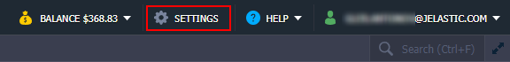
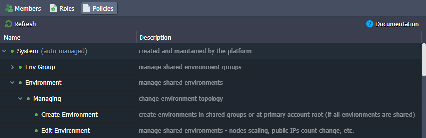
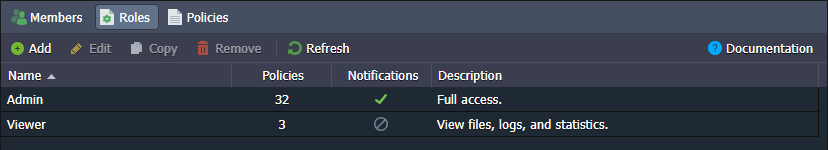
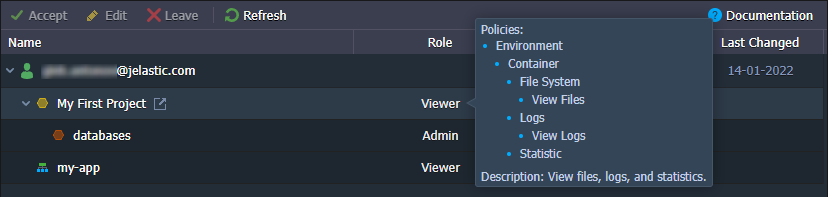
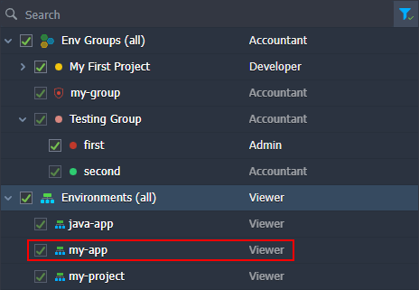
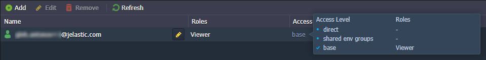
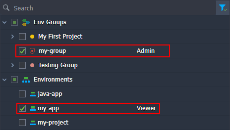
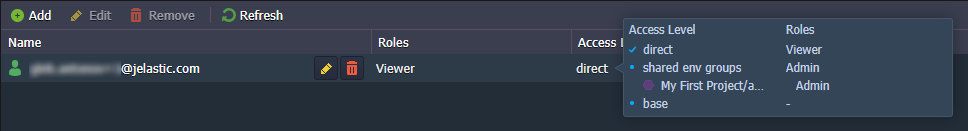

The defining characteristic of the platform’s [collaboration feature](/docs/Account&Pricing/Accounts%20Collaboration/Collaboration%20Overview) is its extreme flexibility. It is ensured through the **_roles and policies_** mechanic, which provides an ability to share the exact instances and permissions needed for a particular use case. This guide covers all the specifics of roles and policies configuration and provision.

Let’s start by defining what roles and policies are:

- **policies** are small API sets that allow specific operations
- **roles** are a combination of policies that create the required range of actions
  At the platform dashboard, these entities can be found and managed at the account **Settings > Shared by Me** section.

1. The **Policies** tab lists the actions that can be added to a role. By default, the platform provides a comprehensive list of System policies that can be combined for a great variety of roles, covering most of the possible collaboration cases.

2. The **Roles** tab allows you to create custom sets of actions that provide only the required permissions to the collaboration members.

When adding, editing, or copying a role, you need to provide the following data:

- **Name** - type any desired name for a role
- **Description** - provide custom description (optional)
- **Policies** - select actions allowed for a role; use search to quickly locate required policies and filter to review only selected ones
- **Receive Load Alerts Notifications** - enable to allow collaboration members with this role to receive load alert notifications about shared environments

No longer needed roles can be removed with the same-named button at the tools panel.

3. You can create as many roles as you need. Here are some generic examples that can be configured by selecting the appropriate policies:

- _viewer_ - just view logs and files
- _user_ - simple actions like environment start/stop and containers restart
- _developer_ - access to most features with some restrictions (e.g. create, delete, migrate, clone environments, change environment groups, change owner)
- _admin_ - full access with the ability to create new environments, install JPS packages, and access via SSH

Obviously, these are just examples to give you an idea of the feature possibilities. You can create your own roles to suit your specific use case the best.

## Roles Assigning Algorithm

The platform utilizes a special _access level_ algorithm when determining the exact roles for a specific environment. Based on the priority (from higher to lower), the three available access levels are ordered in the following way:

- **direct** - roles assigned directly to the environment. The “direct” roles override any of the roles from the levels below.
- **shared env groups** - mixed list of roles for all shared groups of the current environment. If a group does not have a specific role, the parent is checked. The nesting chain can be followed till the root Env Groups category (i.e. default role for all groups).
- **base** - default roles for all shared environments (roles assigned to the Environments category). The “base” roles are of the lowest priority and are applied only when there are no other roles.

:::danger Note

Only roles of the highest available access level are used.

:::

You can check the role and list of allowed policies for shared resources at the account **Settings > Shared with Me** section.

In order to check your roles for the specific [shared environment](/docs/EnvironmentManagement/Share%20Environment), go to its **Settings > Collaboration** section.

Let’s go through a few examples to better understand how roles are allocated.

<u>Example 1:</u> Environment is not a part of any groups and not shared directly. The default role for all environments is - **Viewer**.

Let’s determine the access level. The environment is not shared directly and is not a part of any shared env group. However, we have a **_base_** role (**Viewer**) assigned to all environments.

_Result:_ Environment has the **Viewer** role.

<u>Example 2:</u> Environment is shared with a **Viewer** role and belongs to the shared group with the **Admin** role. Environment is a part of the categories circled in the image below.

According to the algorithm, the environment has roles from two access levels: **_direct_** (**Viewer**) and **_shared env groups_** (**Admin**). However, only roles of the higher access level apply. The **_direct_** level has the highest priority, so roles of the **_shared env groups_** level are ignored.

_Result:_ Only the **Viewer** role is assigned.

<u>Example 3:</u>

The target environment belongs to two groups. The first one has the **Developer** and **Accountant** role (and its parent has the Admin role), while the second one has no roles. The default role for all groups is - Viewer. Environment is a part of the groups circled in the image below.

second example precondition

First, determine the access level. In our case, all roles are related to the shared groups and so are of the same shared env groups level. Next, check the roles for each group. The first one has direct roles (Developer and Accountant), which are selected straight away - the parent role is ignored. The second group has no role, so the parent is checked. If all parent groups don’t have roles as well, the default group role (Viewer) is selected.

second example result

Result: A combined list of policies from the Developer, Accountant, and Viewer roles.
