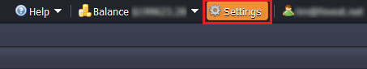

## Collaboration Management (Deprecated)

This information is relevant for the platforms prior the 7.0 release. See the up-to-date [account collaboration](/docs/Account&Pricing/Accounts%20Collaboration/Collaboration%20Overview) feature description.

Full access to collaboration management is available only for its creator. The owner of this **primary account** can:

- invite new or exclude existing users in the collaboration
- regulate the permissions of users within the collaboration
- manage account billing

A **user** added to the collaboration doesn’t have any special admin permissions for collaboration account management (only for [environments management](/docs/Account&Pricing/Accounts%20Collaboration/Collaboration%20User%20Experience)). This user can simply leave the collaboration when it is required.

To start managing your account collaboration, select the **Settings** button in the right top corner of your platform dashboard.

The next steps depend on your type of account (primary or user).

## Primary Account

If you are the owner of primary account, navigate to **Collaboration & Account Management**.
Here, you will see a list of accounts added to the collaboration.

Using the buttons at the panel you can:

- invite new users
- edit user’s Display name and permissions
- delete a user from the collaboration

1. The process of a new user **invitation** is described in the [Create Collaboration](/docs/Account&Pricing/Accounts%20Collaboration/Create%20Collaboration) document.

2. To edit a user’s **Display name** and **permissions**, follow these steps:

Choose a user in the member’s list and select the **Edit** button.

In the opened window, you can specify user’s name, which will be displayed in the members list, alongside the email address.

Provide or cancel permission to create environments using the option “Allow user to create new environments”.

Click the **Apply** button to save the changes.

3. In order to **exclude** the user from your collaboration, choose the required account in the members list and click **Unlink** button.

Click **Yes** in the confirmation window.

After that, this user will no longer be displayed on your collaboration’s list of members and won’t be able to view/manage any environments you’ve shared previously.

A user will be notified about the exclusion from the collaboration via email. In the case a user leaves your collaboration, you’ll also receive an email notification.

In both cases, all of the environments created by a user on the primary account, will remain at this account and their creator won’t have access to them anymore.

## User Account

You can be invited to one or even several collaborations. To see which accounts you have access to and their permissions, navigate to the **Collaboration & Shared with Me** section.

1. Here, you can see the list of users (primary accounts), which included you in their collaborations. In addition, a separate **Allowed to create environments** column is displayed if you have permission to create environments on these accounts (green tick or prohibitory sign).

2. You can edit the **_Display Name_** for any primary account you have access to:

- Choose the particular primary user
- Click the **Edit Name** button in the panel above
- Specify the **_Display Name_** for this account and **Save**.

The stated name will be displayed alongside the primary user’s email in parentheses at your dashboard:

- in the **Shared with Me** list
- in the **Owner** column of environments' status panel

3. In the case you would like to exit the collaboration, select the appropriate primary user in the list and click the **Leave** button. Confirm your decision.

After that, a primary user will receive the email notification that you’ve unlinked from the account. All of the environments you’ve created on the primary account will remain at that account, and you won’t be able to access them anymore.
