## Environments in Collaboration (Deprecated)

_This information is relevant for the platforms prior the 7.0 release. See the up-to-date [account collaboration](/docs/Account&Pricing/Accounts%20Collaboration/Collaboration%20Overview) feature description._

Within a collaboration, there is the possibility to create, share and manage environments available at the primary account. The permissions for performing appropriate actions differ based on the type of account you have - primary or user.

The owner of the primary account can:

- create new environments
- share available environments with all members of the collaboration
- manage the access rights of the collaboration members to each particular environment

A member of collaboration with the user account can:

- create a new environment if such permission is granted by the primary account
- manage environments shared by the primary account
- change topology of environments, access these environments via SSH and delete them if such permission is granted by the primary account

And now, let’s see how to perform all of these actions within collaboration:

- [Create environment](/docs/Account&Pricing/Accounts%20CollaborationD/Environments%20in%20Collaboration#create-a-new-environment-in-collaboration)
- [Share environment](/docs/Account&Pricing/Accounts%20CollaborationD/Environments%20in%20Collaboration#share-environment-with-collaboration-users)
- [Use shared environment](/docs/Account&Pricing/Accounts%20CollaborationD/Environments%20in%20Collaboration#use-shared-environments)

## Create a New Environment in Collaboration

You can create a new environment in a collaboration account in two cases:

- if you are a primary account owner
- if a primary account owner permitted you this action by ticking Allow user to create new environments option

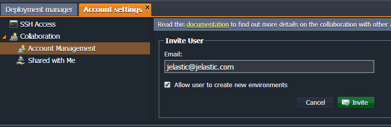

In the first case (when you own the **primary account**), the environment is created the usual way, as it is described in the [Setting Up Environment](/docs/EnvironmentManagement/Setting%20Up%20Environment) document.

When you are a **user with permission** to create an environment, then this process is slightly different. Let’s consider the steps in this case:

1. Firstly, check if you have permission to create an environment on the primary account:

- click **Settings > Collaboration > Shared with Me**
- find the required primary account in the list (if you have access to several)
- check the **Allowed to create environments** column

If this option is marked with a green tick, you can proceed to environment creation.

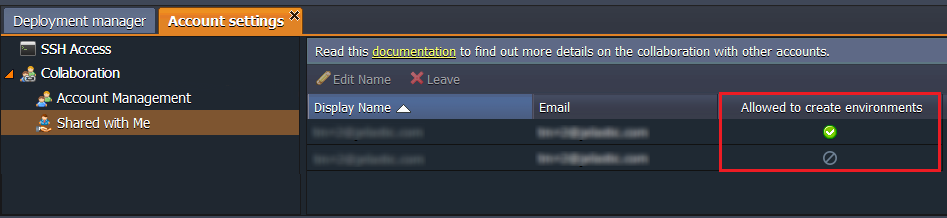

2. After clicking the **Create environment** button, you should choose the primary account in the appeared window.

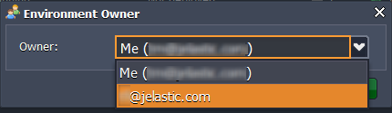

:::tip Note

if you were registered at the platform by means of confirming the invitation for collaboration via email, you can be included in a custom group of users without the ability to create your own environments. In this case, you can create new environments only on the primary account. This option is defined by your hosting provider.

:::

3. Now, you can set up an environment based on your requirements.

:::tip Note

that a primary account is billing by default, so you won’t meet any restrictions, even if you are a trial user (e.g. number of cloudlets, servers, High availability etc.)

:::

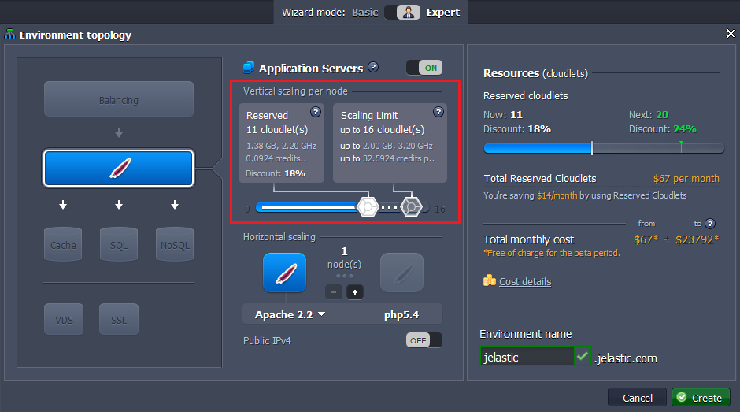

4. The newly created environment will appear at your dashboard.
   It will be marked as shared with this custom icon. 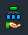

A new **Owner** status column will appear, with the primary account email stated.

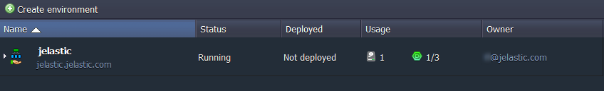

5. Now, you can start working with the created environment as if with your own.
   The only restriction is that you cannot clone it. This action can be performed only by a primary account.

## NOTE

- Primary account owner receives the email notification about all environments created and can fully manage them, e.g. modify topology, configurations, clone, delete environment etc.
- You can view the extended information on the environment’s creation: **owner** (you or primary user), **creator** (anyone from the collaboration) and **date/time** when it was created.

To do this, click the **Settings** button next to the desired environment and navigate to the Info option.

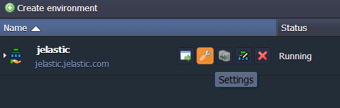

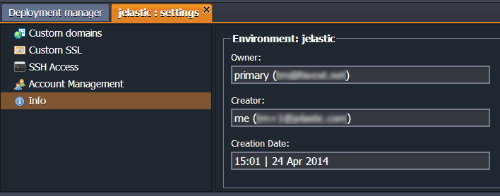

## Share Environment with Collaboration Users

A **Primary account** owner can make the necessary environment available for other users in collaboration and define the level of access to each environment.

1. Navigate to **Settings > Collaboration >; Account Management** and choose the user in the member’s list.

2. In the **Shared Environments** panel, you can see the list of already shared environments with this user (if there are any).

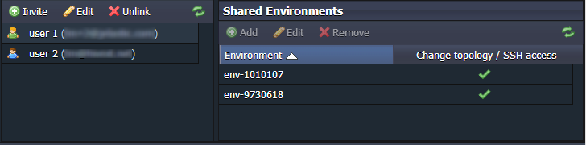

3. Click the **Add** button.

In the opened panel, you can choose all environments or a particular one to be shared.

You can also tick the **_Change topology / SSH access_** checkbox in order to give such permissions. Select **Save**.

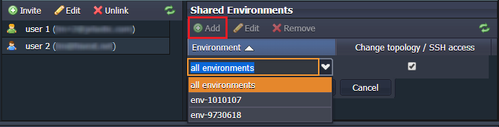

4. A collaboration user with access to the chosen environments will receive a corresponding email notification.

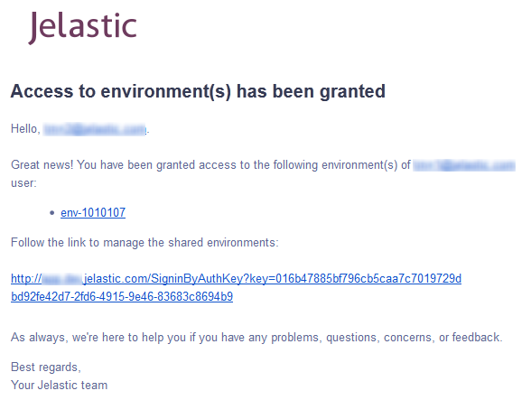

5. The permissions to edit topology or access an environment via SSH can be removed by selecting the **Edit** button for a particular environment and unticking the **_Change topology / SSH access_** option.

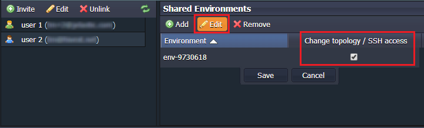

6. To unshare any environment from a user, select it and click the **Remove** button in the panel above. Confirm your decision.

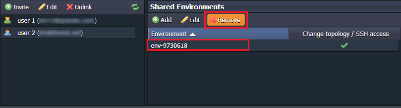

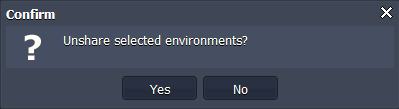

After that, the chosen environment won’t be displayed at user’s dashboard and a user will receive an email notification.

## Use Shared Environments

Being a member of an account collaboration, you can have access to all or to separate environments available at the primary account. They will be shown at your dashboard alongside your own environments.

You can work with shared environments as with your own, being able to deploy applications, change configurations, read log files, view statistics and so on. The only exception is that you cannot clone environments (this can only be done by the primary account).

The primary account owner can also grant you the permission to change the environment topology or to access this environment via SSH.

Shared environments are marked in the list with this custom icon 

An additional **_Owner_** column appears in the panel of environments' statuses. It shows the owners of the listed environments:

- _me sign_ for your environments
- emails for primary accounts

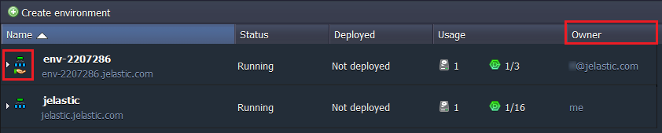

If any user in the collaboration changed the topology of the shared environment by adding the node that requires admin credentials (e.g. database server), all users with access to this environment will receive an email notification with appropriate login and password.
