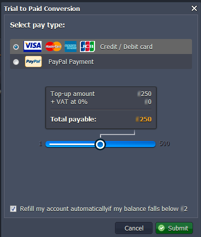
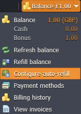
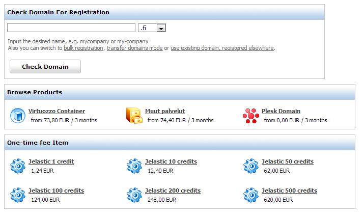
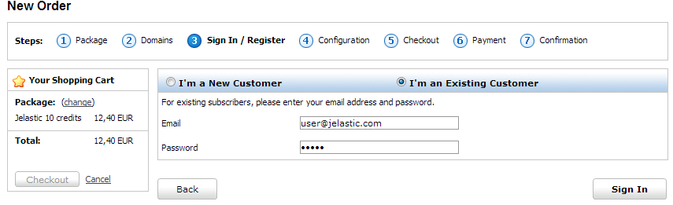

## Billing via OBAS

This step-by-step instruction shows you how to convert and refill your account if your hosting provider uses **OBAS (Odin Business Automation Standard)** system.

At the moment OBAS system is used by **[Layershift](https://cloudmydc.com/)**, **[Cloudplatform](https://cloudmydc.com/)**, **[Elastx](https://cloudmydc.com/)**, **[DOCKTERA](https://cloudmydc.com/)** and **[Axarnet](https://cloudmydc.com/)**.

- [Conversion](https://hostbillapp.com/feature/jelastic/)
- [Refilling](/docs/Account&Pricing/Billing%20Systems/OBA%20Billing%20System#refilling)

## Conversion

1. At the dashboard click the button **Upgrade trial account** in the drop-down menu.

2. Fill out the required fields in the opened window and confirm your agreement with Terms of service. Click **Next**.

3. Select the payment method (Credit/Debit card or Paypal) and state the sum using the slider. Click **Next** and then confirm your choice.

:::tip Note

Some hosters provide the additional payment methods alternative to the given by default. In this case you’ll be offered to contact the hoster to be able to use some other ways of funding.

:::

## Card Payment Method

Enter your card details and click **Proceed**.

After that **Purchase Authentication** window will be opened. Enter the password for full authentication.

## PayPal Payment Method

- **_with PayPal account_**

Click **Log In** button and state your email and password of your PayPal account to make the purchase.

After conversion you’ll get emails with information about the state of your account converting and refilling. Also such information will appear in the message at the dashboard.

:::tip Tip

If you would like to use auto-refill option in the platform dashboard, you should tick the “_I’d like to use PayPal for future payments to {hoster’s name}_” line as it is shown below:

:::

- **_without PayPal account_**
  You can use PayPal payment method even if you don’t have the PayPal account. For that click the **Buy as a guest** button. In the opened window enter your billing information.

Fill in all the required fields and press **Continue** button. After that enter your debit/credit card details in the appeared window.

You’ll get emails with information about the state of your account converting and refilling. Also such information will appear in the message at the dashboard.

:::tip Note

Using this method of payment you won’t be able to use auto-refill option in the platform dashboard.

:::

## Refilling

You can order recharge cards (One-Time Fee service plans) both from OBAS online store and the platform dashboard.

## Through Platform Dashboard

1. If you need to replenish your account click **Balance > Refill balance**. State the sum using slider and click **Submit Payment**.

2. <u>If you use <b>card</b> as a payment method:</u>

Enter card details and click <b>Proceed</b>. Then enter the password for the full authentication.

:::tip Tip

If you have already refilled account with this card earlier you won’t need to enter card details one more time. You just need to confirm refilling and that’s all.

:::

3. <u>If you use <b><i>PayPal</i></b> as a payment method:</u>

Log in to your PayPal account and complete the purchase.

After replenishment you’ll get emails with information about the state of your account refilling. Also such information will appear in the message at the dashboard.

4. Also you can set auto-refill due to your demands. Click **Configure auto-refill** button in the drop-down menu.

In the opened tab specify the amount you want to put on your account and choose the frequency of refilling:

- _weekly_ (every Monday)
- _monthly_ (1st of each month)
- when _balance less_ than the stated sum (up to your choice)

**Confirm** your choice.

If you want to switch **Auto refill** off click the link to disable it.

5. Using **Payment methods** button in the drop-down list you can choose your default payment method which will be used automatically while refilling.

6. Click **View invoices** to open Odin Business Automation Control Panel with your Billing history which includes all financial documents issued for your Account (namely, Invoices, Orders, Payments, and Adjustments).

7. Click **Billing history** to view the data about consuming the resources of your balance by the platform.

## Through OBAS Store

**Prerequisites\***: Your account need to be converted to billing.\*

List of PaaS One-Time Fee service plans is displayed in the main page of OBAS Online Store. You may choose and buy one of them.

1. Choose the required **One-time fee item** and follow the steps of the wizard.

2. State whether you are a new customer of OBAS or an existing one:

- **_I’m an Existing Customer_** - in this case you just need to enter your email address and password. Click **Sign In**.

- **_I’m a New Customer_** - if you don’t have OBAS account yet, you have to perform trial-to-paid conversion process as listed in **Conversion** section.

3. Your order has been prepared. Review the order details and click **Place Order** to proceed to the payment page.

4. Select a payment method.

5. Enter card details and click **Proceed** to complete the payment.

