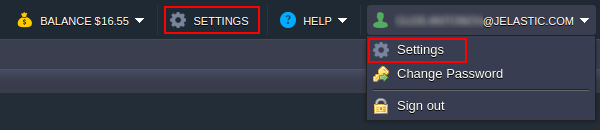

**Personal Access Tokens** are an alternative approach to authenticate API requests in the platform, which, in comparison to the default session-based method, provides greater versatility and reliability.

Among advantages of tokens, the following ones can be highlighted:

- multiple tokens can be generated at once to support different tasks

 

- simplified authentication with tokens (no need to perform additional request(s) to get a session) ensures smaller code-base and quicker response when using automation scripts
- your credentials (login and password) are not exposed within scripts
- tokens can authenticate just a specified part of the account functionality, so you can share them with co-workers and third-party assistants without creating a security breach
- tokens can be supplemented with the expiration date or manually revoked at any time

The platform provides a fully functional visual interface for tokens management directly in the dashboard (starting with the 5.5 version), which makes it the preferable way to authenticate any API integration (especially on accounts with the [two-factor authentication](https://cloudmydc.com/) enabled):

- [Managing Access Tokens](/docs/Account&Pricing/Personal%20Access%20Tokens#managing-access-tokens)
- [Using Access Tokens](/docs/Account&Pricing/Personal%20Access%20Tokens#using-access-tokens)

## Managing Access Tokens

Below, we’ll overview the process of personal access tokens management using the dashboard UI:

1. Go to the **Settings** section by clicking on the same-named button at the top-right corner of the dashboard.

2. In the opened frame, select the **Access Tokens** tab to view the list of all tokens on the account. The tools panel above the list provides access to the following buttons:

- **Generate** - creates a new token by providing the description, expiration date and selecting the required API methods (either from predefined sets or manually)
- **Edit** - adjusts the existing token or regenerates it (i.e. sets a new name, while maintaining all other parameters)
- **Copy** - creates a new token using parameters of the existing one as a basis
- **Remove** - deletes selected token
- **Refresh** - displays the most recent changes to the list

3. While creating a new or adjusting the existing token, the following frame is displayed, allowing to adjust:

- **Description** - custom description provided for token
- **Expires At** - the date in the dd-mm-yyyy format this token is valid till (can be regenerated after expiration)
- **API** - the name of the API requests set: predefined (Extended Access, IDE Plugins, Marketplace, Maven Plugin) or Custom (with manually selected methods)
- use the Search field, the Only Checked filter and links to the API Docs (displayed upon hovering over the particular method) to configure required permissions for token

4. All the token changes on account require an obligatory confirmation with the password before being applied.

5. Next, you’ll see the access token value. Ensure you’ve saved it (use the **Download/Copy** buttons), as it won’t be displayed anywhere ever again.

:::tip Tip

If you forget or lost your token value, it is possible to generate a new one by accessing the **Edit Access Token** frame and clicking the appropriate link at the bottom.

Herewith, the old value becomes invalid, so any existing automation with this token should be updated.

:::

6. You can **Remove** no longer required tokens (use **Shift** and **Ctrl** to select multiple ones) with the same-named button at the tools panel.

Confirm in a pop-up and provide the password to proceed. Now, you know how to manage personal access tokens on the account and can use them in your API requests.

## Using Access Tokens

The usage of access tokens majorly simplifies API requests authentication, as it allows skipping session generation step and ensures greater reliability compared to the short-term validity of sessions.

1. Just execute the required API method, specifying your **_token_** within the **_session_** parameter.

For example, you can [stop an environment](https://docs.jelastic.com/api/#!/api/environment.Control-method-StopEnv) by entering the following URL into a browser:

https://app.
**$**
**_[{platformDomain}](/docs/QuickStart/Hosters%20List%20&%20Info)_**
/1.0/environment/control/rest/stopenv?envName=
**${envName}**
&session=
**${token}**

Here:

- **_${platformDomain}_** - platform URL (domain name)
- **_${envName}_** - name of the target environment (e.g. _my-project_)
- **_${token}_** - value of the token (ensure it has a permission for the called operation)

For the successful operation, you should get a “result”:0 in response (any non-zero value stands for error).

2. Now, if you return to the dashboard, you’ll see the appropriate environment stopped.

That’s it! API management with tokens is that simple!
