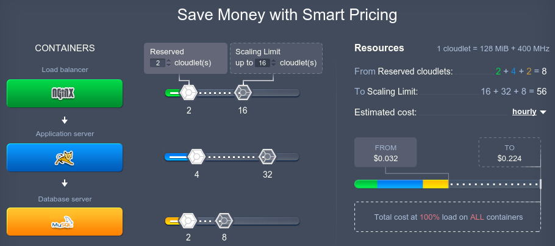
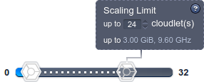

!incomplete

## Platform Usage-Based Pricing (Pay-per-Use)

The platform provides a versatile pricing model, that can be adjusted to meet the requirements of the most demanding customers due to the number of awesome features:

- The resources are provisioned with granular units - [cloudlets](/docs/PlatformOverview/Cloudlet) (128MiB of RAM and 400MHz of CPU). This allows to allocate exactly the needed amount of resources.
- Fully automatic _[vertical](/docs/ApplicationSetting/Scaling%20And%20Clustering/Automatic%20Vertical%20Scaling)_ and _[horizontal](/docs/ApplicationSetting/Scaling%20And%20Clustering/Automatic%20Horizontal%20Scaling)_ scaling assure that you’ll be provided only with the required capacities without overpaying for unused resources.
- The system of _[automatic discounts](/docs/Account&Pricing/Automatic%20Discounts)_ makes the platform usage even more beneficial when the volume of ordered resources grows.

In contrast to the majority of other vendors, all of these features allow providing a truly user-oriented **_Pay-per-Use_** charging approach:

The video below will help you to catch the key points of the platform pricing system flexibility and the problems it helps to solve:

## How It Works

With automatic scaling you don’t need to guess or predict the incoming load. The platform will automatically adjust the amount of allocated to environment resources (within the stated scaling diapason) according to its current requirements.

The **_Scaling Limit_** sets a maximum number of cloudlets that can be allocated for each server, so you can use it to define a maximum possible budget for your project. Subsequently, cloudlets will be automatically added to your servers based on application resource consumption. These are called **_Dynamic Cloudlets_** because they’re dynamically added (as your resource usage increases) and removed (as your resource usage decreases). So, you pay based on the actual hourly usage.

Since most applications need a certain amount of resources just to be loaded and ready to run, you’ll always consume a particular number of cloudlets regardless the load level. Therefore, you can allocate them beforehand with **_Reserved Cloudlets_** and benefit on [automatic discounts](/docs/Account&Pricing/Automatic%20Discounts).

These scaling ranges are configured individually for each server instance, so you can specify different limits for each container depending on your needs and preferences.

:::tip Tips

- when calculating your cloudlet consumption, we only consider the larger of RAM or CPU usage per hour (i.e. not both combined). Learn more with the [Charged Resources](/docs/Account&Pricing/Resource%20Charging/Charged%20Resources) doc
- learn how to track your hosting spends via the platform dashboard with [this](https://www.youtube.com/watch?v=eCiXPx3nkro) video

:::

## Setting Up Usage-Based Pricing

In order to apply such a usage-based pricing model to your environment, perform the following steps:

1. Set the **Scaling Limit** slider (the transparent one to the right) to your desired maximum resource limit.

:::danger Warning

Setting Scaling Limit too low for highly-loaded applications may cause their instability.

:::

Since usage is calculated hourly, your cloudlet (RAM & CPU) consumption can go up and down throughout the day depending on application needs - so you automatically pay a lower price when you’re using fewer resources (e.g. during low traffic periods), and only pay more when additional resources are really needed (e.g. during high traffic periods).

2. Set the **Reserved Cloudlets** slider (the left white-colored one)  to the desired value in order to commit the minimum amount of RAM & CPU that you expect to always need and get the discount for them. The exact discount size can vary by hosting provider and the overall number of Reserved Cloudlets in your environment (i.e. their sum for all nodes).

## Example

In our example, the server has 4 **Reserved cloudlets** and a maximum limit of 24 **Dynamic Cloudlets**. With this configuration, the payment will be done as follows:

- if you use 4 cloudlets or less, you pay for 4 cloudlets based on discounted Reserved cloudlets price
- if you use e.g. 16 cloudlets, you pay for 4 cloudlets based on Reserved price (as they are already allocated) and for 12 cloudlets based on Dynamic price

Combining the Reserved and Dynamic cloudlets usage enables you to save your costs whilst remain prepared for the unexpected surges in application demands. Such an approach allows to handle all of the incoming requests during load peaks, and, at the same time, not to overpay for the unused resources.

## More Useful Links

- [How much PaaS costs](https://www.youtube.com/watch?v=yg_fVjCbyuw&list=PLkntuNwly7TcU_IAoiZhxxQuq9nUsQQ5r&index=8) - learn how to track your hosting spends
- [PaaS vs Amazon Pricing](https://cloudmydc.com/) - get insights on dynamic pricing benefits
- [Charged Resources](/docs/Account&Pricing/Resource%20Charging/Pricing%20FAQ) - learn what is charged at the platform
- [Monitor Consumed Resources](/docs/Account&Pricing/Resource%20Charging/Monitoring%20Consumed%20Resources) - check the current load and consumed resources history
- [Save Your Cloud Money](https://cloudmydc.com/) - see some tips on how to decrease the consumption
- [Cloud Union](https://cloudmydc.com/) - compare the prices at different hosting provider’s platforms and choose the most suitable one
