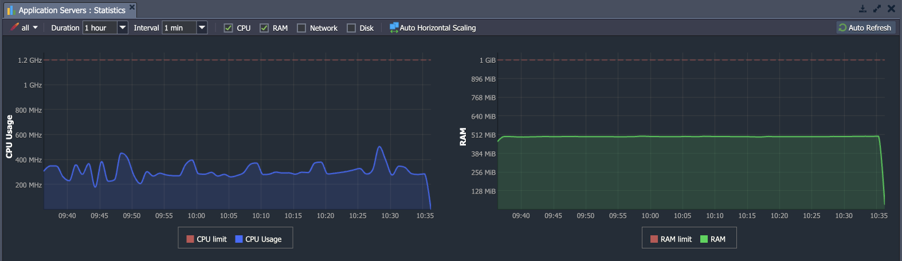

Resource consumption for each environment is charged to the account owner on an hourly basis.

- [Primary Chargeable Resources](1)
- [Provider-Dependent Charges](1)
- [Optional Extras](1)

You can track resource usage (_CPU, RAM, Network, Disk_) in real time via built-in [statistics monitoring](1).

:::tip Note

Resources consumed by environments provided based on the subscriptions are considered free of charge by default.

:::

## Primary Chargeable Resources
### RAM & CPU

RAM & CPU are measured in a platform resource unit called a [Cloudlet](1). One **Cloudlet** is equivalent to 128 MiB RAM and 400MHz CPU.

Resources are charged on an hourly basis:

- **RAM** usage: the peak RAM usage over the hour
- **CPU** usage: the average CPU usage over the hour

When calculating your cloudlet usage, we only consider the larger of RAM or CPU usage each hour (not both combined). E.g. if during one hour your average CPU usage is 2400MHz (6 cloudlets), and your peak RAM usage is 1024MiB (8 cloudlets), you pay for 8 cloudlets - not the combined total (14 cloudlets).

There are two types of cloudlets:

- *Reserved cloudlets* are reserved in advance (using the topology wizard).
- *Dynamic cloudlets* are scaled dynamically for your application.

:::danger Note

You are not charged for the RAM used for disk cache and buffers.

:::

More details about cloudlet charges and the differences between Reserved / Dynamic cloudlets can be found in the [Pricing System](1) and [Automatic Discounts](1) documents.

## Provider-Dependent Charges
The following resources are charged at some hosting providers, but others include a free amount.

## Disk Space
**Disk Space** usage is measured in GB. Like all platform resources, you only pay for your actual consumption (you do not need to buy extra space “just in case” you need it). More details about charging disk space can be found in the [Pricing System](1) and [Automatic Discounts](1) documents.

:::tip Tip

If facing a need to store data in a [separate storage node](1), consider using [Master](1) or [Compound](1) data containers to lower disk space consumption and reduce overall environment cost.

:::

## Traffic
**Traffic** usage is measured in GB. Only <u>external traffic</u> is charged - the sum of incoming and outgoing traffic between your environment and the Internet. <u>Internal traffic</u> is absolutely free - traffic within your environment or between environments within the same hosting provider. More details about charging traffic can be found in the [Pricing System](1) and [Automatic Discounts](1) documents.

## Optional Extras
With the platform you can add the following optional services to your environment:

- **Public IPv4** is an external IP address which is directly accessible from outside of the cluster. This allows you to form direct connections between the Internet and specific servers within your environment. Otherwise (without buying a Public IPv4 address), traffic is routed from the Internet to your environment via the platform resolver (SLB).

- **Built-in SSL** is a protocol which establishes a secure connection between your client and your environment (some hosting providers offer this service free of charge).

More details about charges for optional services can be found in the [Pricing System](1) and [Automatic Discounts](1) documents.
