

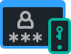

The platform allows configuring a **two-factor authentication** (2FA) to add an extra security layer for your account. With this feature enabled, in addition to username and password, you are required to enter the code randomly generated in the authenticator application on your phone to access PaaS account.

Below, we’ll go step-by-step on the two-factor authentication feature management:

- [enable 2FA](https://cloudmydc.com/)
- [manage recovery codes](https://cloudmydc.com/)
- [deactivate 2FA](https://cloudmydc.com/)
- [working with API](https://cloudmydc.com/)

## Enable Two-Factor Authentication

In order to secure your account with the 2FA follow the next steps:

1. Go to the **Settings** section by clicking on the same-named button at the top-right corner of the dashboard.

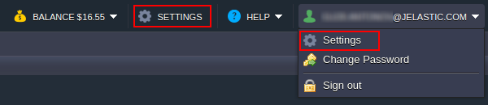

2. Within the opened frame, switch to the **_Account_** tab and click **Set Up Two-Factor Authentication**.

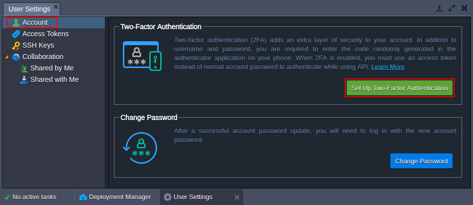

You need to confirm your password via the appeared pop-up to proceed.

3. Next, you need to interconnect your PaaS account with the [Google Authenticator](https://cloudmydc.com/) application on your mobile phone (if needed, follow the linked guide to help you with installation). Open the app on your device and add the account by either scanning the displayed QR code or manually typing the provided data.

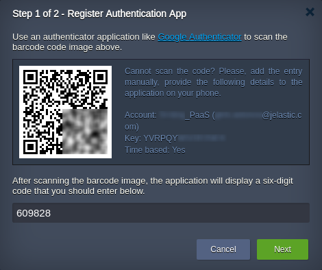

As a result, you’ll see the six-digit code (automatically refreshed every 30 seconds), type it into the dashboard frame and click **Next** to verify.

4. In the second step, you’ll see the recovery codes, which can be used as a one-time alternative to the generated authentication codes.

:::danger Note

Ensure your recovery codes are saved. Otherwise, in case of your phone unavailability, you won’t be able to connect to your account. Also, they are <u>the only option</u> to restore access upon device loss.

:::

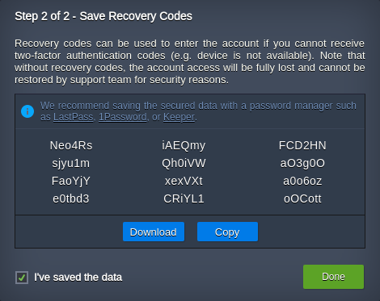

You need to tick the I’ve saved the data checkbox (automatically checked after using the **Download** or **Copy** buttons) to be able to close this window by clicking **Done**.

5. Now, to login into account, you’ll need to provide the login/password credentials (as usual) and enter a code from the authentication application on your device (or the recovery code).

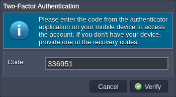

That’s it! Your account is now protected with two-factor authentication.

## Manage Recovery Codes

On the accounts with already enabled 2FA, it is possible to view/regenerate recovery codes:

1. Go to the **Settings > Account** section and click the **View Recovery Codes** button.

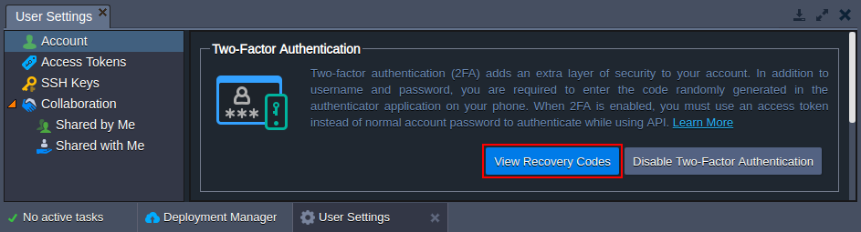

Confirm the password for your account to continue.

2. Here, you can see your current recovery codes and, if necessary, **Download/Copy** them with the appropriate buttons.

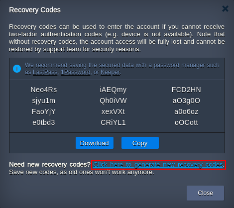

If you ran out of the recovery codes (as each one can be used just once) or if you consider them compromised, click the link at the bottom of the frame (circled in the image above) to generate new ones.

3. In the appeared pop-up, confirm the operation and, in a moment, you’ll get new codes.

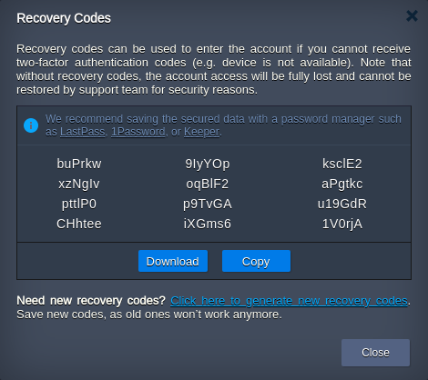

Don’t forget to save the displayed recovery codes with the **Download/Copy** buttons, as the old ones won’t work anymore.

## Disable Two-Factor Authentication

If you need to disable the 2FA for your account, follow the next steps:

1. Navigate to the **_Settings > Account_** section and click the **Disable Two-Factor Authentication** button.

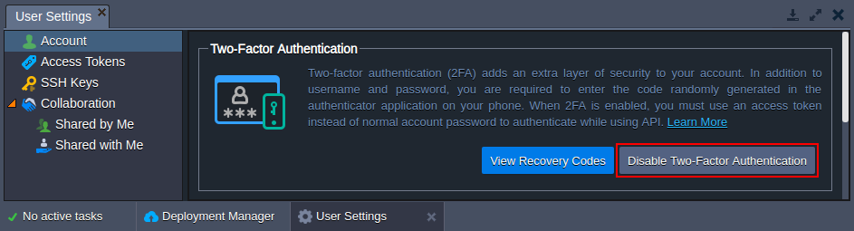

:::tip Tip

In case you want to disable/rebind two-factor authentication due to device loss, use one of the recovery codes to log into the dashboard.

:::

2. Confirm your decision through the appropriate pop-up and provide a password in the next one.

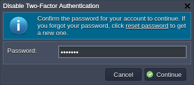

That’s it! Your account is now accessible with just the login/password credentials.

## Using API with Two-Factor Authentication

In order to get a valid session for the [API requests](https://cloudmydc.com/) on accounts with enabled 2FA, you need to call an additional **_Verify2FACode_** method after the **_SignIn_** one. In such a way, you’ll be able to provide a six-digit authentication code from the appropriate application on your device.

To avoid such complexity, it is recommended generating and using [personal access tokens](https://cloudmydc.com/) in your API requests and custom automation scripts.
