## How to Manage Application Lifecycle

Complex applications with highly customized logic and user interfaces take time to develop and require more formal practices to ensure that they work as intended and meet users' needs. Your project might not be so large, but you can still benefit from using development and test environments, where you can develop and test your code without affecting end users. Building your own applications requires a thorough understanding of the issues that can take place during the app lifecycle, from development to the production stage.

<div style={{
    display:'flex',
    justifyContent: 'center',
    margin: '0 0 1rem 0'
}}>

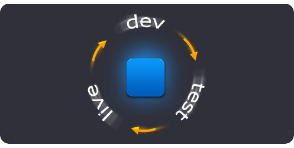

</div>

Application lifecycle management becomes a lot easier thanks to the automation of routine operations (creating environments, building and deploying projects, binding and swapping domains, etc.). One of the best practices is to make your test environment look like your production environment and to periodically synchronize the test database with the data from production, and both of environments will look at one database. Also we’ll show how to use separate building environments to build all your projects with the embedded Maven tool.

<div style={{
    display:'flex',
    justifyContent: 'center',
    margin: '0 0 1rem 0'
}}>

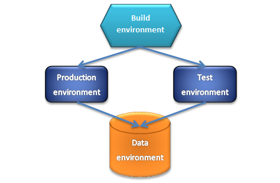

</div>

To realize the schema above we’ll come through the next steps:

- [Create the production environment](/docs/ApplicationSetting/Application%20Lifecycle%20Management#create-the-production-environment)
- [Create the build environment](/docs/ApplicationSetting/Application%20Lifecycle%20Management#create-the-build-environment)
- [Build and deploy the project](/docs/ApplicationSetting/Application%20Lifecycle%20Management#build-and-deploy-the-project)
- [Create database environment](/docs/ApplicationSetting/Application%20Lifecycle%20Management#create-database-environment)
- [Create the test environment](/docs/ApplicationSetting/Application%20Lifecycle%20Management#create-the-test-environment)
- [Upgrade application](/docs/ApplicationSetting/Application%20Lifecycle%20Management#upgrade-application)

Also here is a video version of the same procedure:

[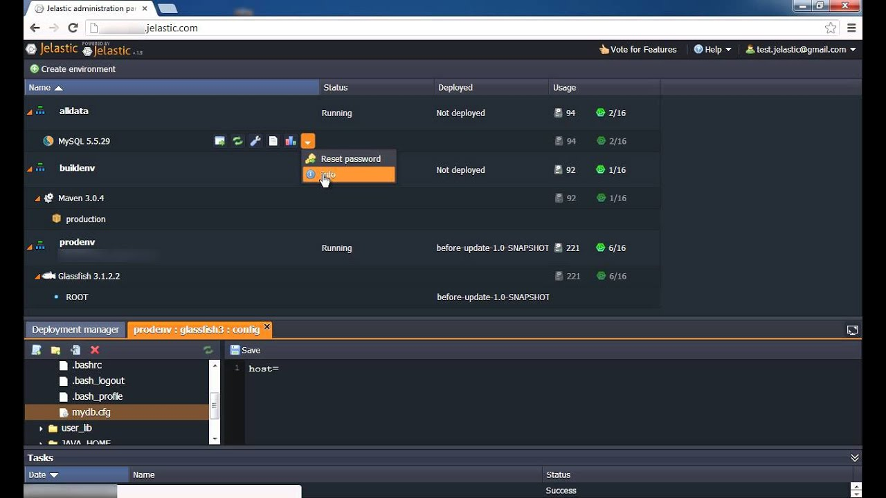](https://youtu.be/JLCBjkWY4s8)

Let’s get started!

## Create the Production Environment

1. Log into the platform dashboard.

2. Create a new environment.

<div style={{
    display:'flex',
    justifyContent: 'center',
    margin: '0 0 1rem 0'
}}>

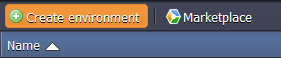

</div>

3. Select the application server you want to use (for example _GlassFish_), set the cloudlets limit and type the name of your first environment, for example, _prodenv_. Then click **Create**.

<div style={{
    display:'flex',
    justifyContent: 'center',
    margin: '0 0 1rem 0'
}}>

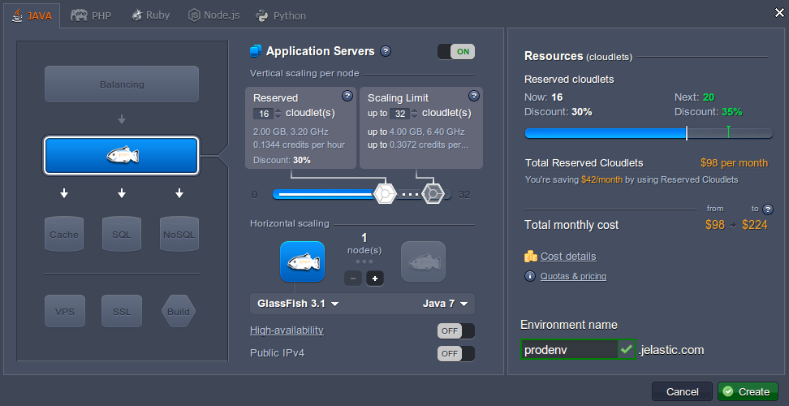

</div>

Wait just a minute for your environment to be created.

<div style={{
    display:'flex',
    justifyContent: 'center',
    margin: '0 0 1rem 0'
}}>

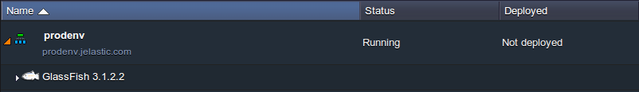

</div>

## Create the Build Environment

You can build applications in the platform instead of building your projects locally and uploading WAR archives. It is faster and takes less time and bandwidth, you get the efficiency of the cloud and can continue to use your computer without extra loads. The platform can take application source code directly from your version control repositories (via Git or SVN protocol).

The next step is to create a building environment.

1. Create a new environment, pick **Maven** as your building tool, set the cloudlets limit and type the environment name, for example: _buildenv_. You can create environment without a compute node. No need to have separate building tools for each of your environments.

<div style={{
    display:'flex',
    justifyContent: 'center',
    margin: '0 0 1rem 0'
}}>

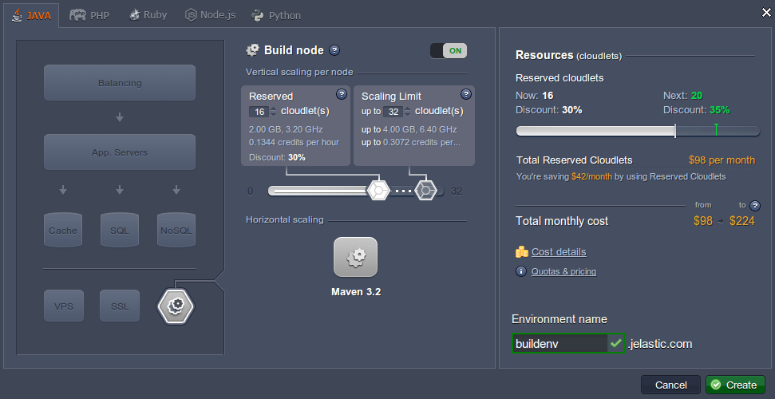

</div>

2. In just a couple of minutes your environment will be created.

<div style={{
    display:'flex',
    justifyContent: 'center',
    margin: '0 0 1rem 0'
}}>

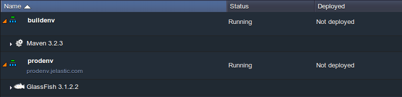

</div>

## Build and Deploy the Project

Now we can easily build our first project and deploy it to the production environment.

1. Add your project to Maven.

<div style={{
    display:'flex',
    justifyContent: 'center',
    margin: '0 0 1rem 0'
}}>

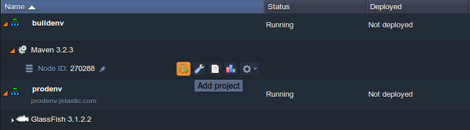

</div>

In the dialog, navigate to the **Git** tab (or SVN) if you want to use Git as your revision control system. Specify your project name, **Path** to your project, **Branch**, **Login** and **Password** of your repository, name of your **Environment**, **Context** in which you will deploy your project, and click **Add**.

<div style={{
    display:'flex',
    justifyContent: 'center',
    margin: '0 0 1rem 0'
}}>

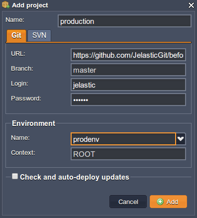

</div>

2. Click **Buid and deploy** button for your project.

<div style={{
    display:'flex',
    justifyContent: 'center',
    margin: '0 0 1rem 0'
}}>

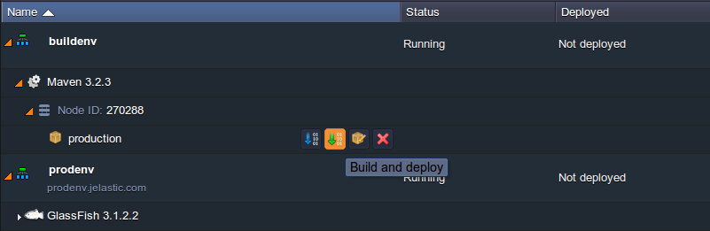

</div>

## Create Database Environment

Let’s create one more environment with the database without a compute node. This allows you to store all your applications' data there.

1. Click on **Create environment** and pick the database (for example MySQL) that you want to use.

<div style={{
    display:'flex',
    justifyContent: 'center',
    margin: '0 0 1rem 0'
}}>

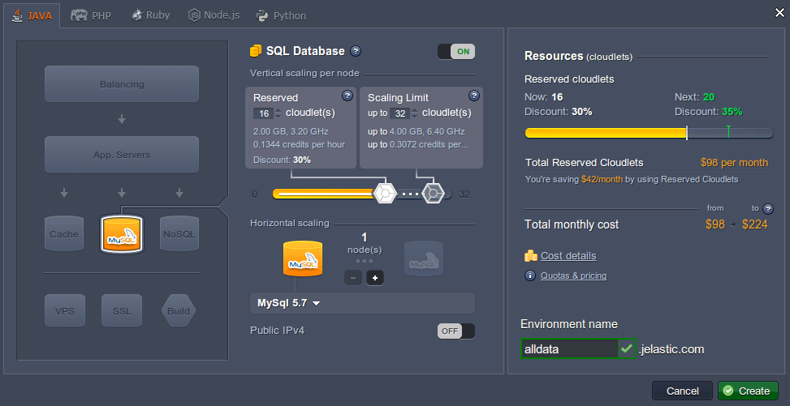

</div>

2. When your environment is successfully created, click the **Open in Browser** button for **MySQL**. The platform have sent you an email with credentials to the database. Create an account and the database with the application using these credentials.

<div style={{
    display:'flex',
    justifyContent: 'center',
    margin: '0 0 1rem 0'
}}>

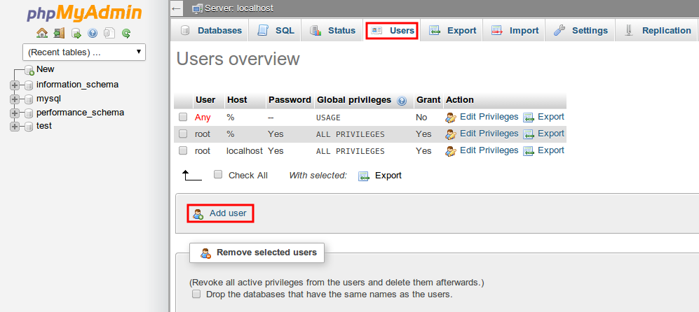

</div>

<div style={{
    display:'flex',
    justifyContent: 'center',
    margin: '0 0 1rem 0'
}}>

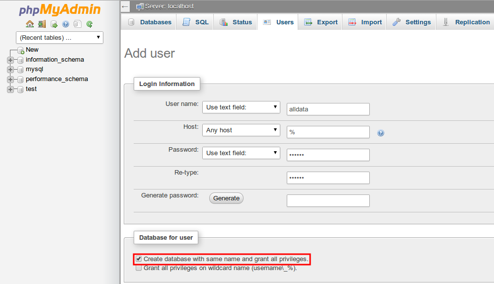

</div>

# Configure Database Connection

1. Click the button **Config** next to the application server of your production environment.

<div style={{
    display:'flex',
    justifyContent: 'center',
    margin: '0 0 1rem 0'
}}>

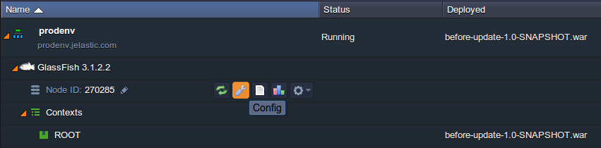

</div>

2. In the opened tab create a **_mydb.cfg_** file in the **/opt/glassfish3/temp** directory and add there all necessary configurations:

```bash
host=jdbc:mysql://mysql{node_id}-{your_env_name}.{hoster_domain}/{db_name}
username={get in the email}
password={get in the email}
driver=com.mysql.jdbc.Driver
```

<div style={{
    display:'flex',
    justifyContent: 'center',
    margin: '0 0 1rem 0'
}}>

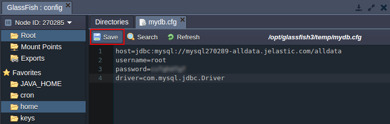

</div>

:::tip Note

You can mention all connection settings in your code (application). In the given example, we put all the settings in the file, which is read by our application.

:::

3. Upload MySQL connector to the **/opt/glassfish3/glassfish/domains/domain1/lib** directory of GlassFish.

<div style={{
    display:'flex',
    justifyContent: 'center',
    margin: '0 0 1rem 0'
}}>

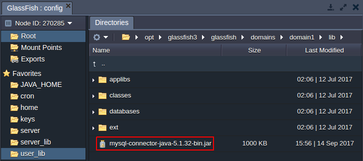

</div>

4. Restart GlassFish and open your app in a web browser.

<div style={{
    display:'flex',
    justifyContent: 'center',
    margin: '0 0 1rem 0'
}}>

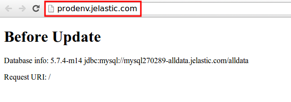

</div>

5. With the platform, you have the ability to set your own domain name for your URL instead of using your hoster domain name. So, buy a domain name for your production environment. In this case, we recommend you to set your own custom domain by adding a CNAME record. Click the **Settings** button (the wrench icon) for your environment and bind the domain. In our case the URL is _production.com_.

<div style={{
    display:'flex',
    justifyContent: 'center',
    margin: '0 0 1rem 0'
}}>

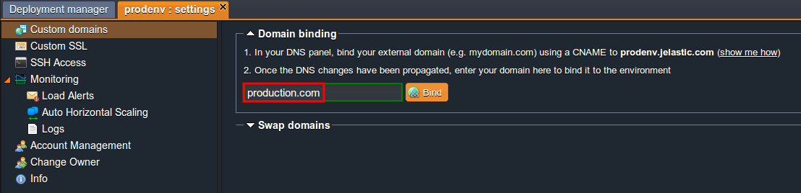

</div>

<div style={{
    display:'flex',
    justifyContent: 'center',
    margin: '0 0 1rem 0'
}}>

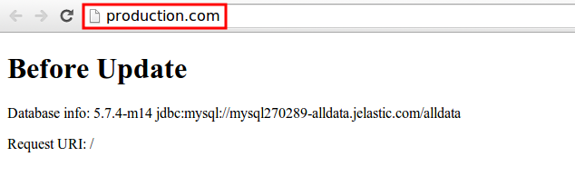

</div>

:::tip Note

In this example we use DNS names (production.com, test.com) that were previously added to local DNS-server (file hosts).

:::

## Create the Test Environment

It’s time to create our test environment now. For this purposes you can easily clone your production environment. That lets you work with multiple versions of the same environment and branch your environments as needed. The cloned environment is identical to the original environment and includes all data in its databases, deployed _.WAR and _.JAR packages.

1. Clone your production environment to get the exact copy of it for adding some new features and testing them.

<div style={{
    display:'flex',
    justifyContent: 'center',
    margin: '0 0 1rem 0'
}}>

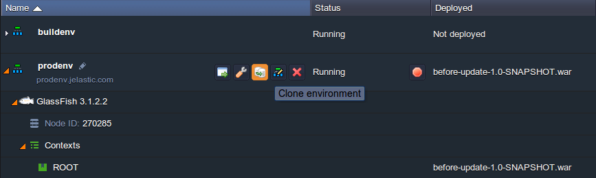

</div>

Let’s call it _testenv_.

<div style={{
    display:'flex',
    justifyContent: 'center',
    margin: '0 0 1rem 0'
}}>

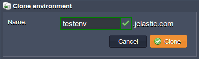

</div>

2. You can open it in a browser just to ensure that everything is ok.

<div style={{
    display:'flex',
    justifyContent: 'center',
    margin: '0 0 1rem 0'
}}>

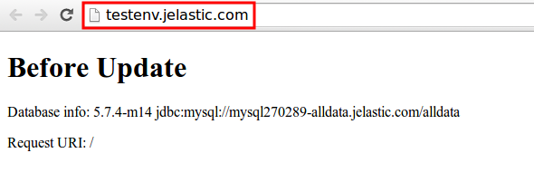

</div>

## Upgrade Application

If, for example, you need to make some changes to your application:

1. Add your new project to Maven.

<div style={{
    display:'flex',
    justifyContent: 'center',
    margin: '0 0 1rem 0'
}}>


</div>

2. Click **Buid and deploy** button for the new project. Your project must appear in the context that you have specified.

<div style={{
    display:'flex',
    justifyContent: 'center',
    margin: '0 0 1rem 0'
}}>

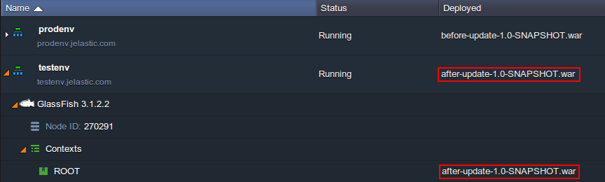

</div>

3. Click the **Settings** button for your environment and bind the domain (e.g. test.com) that you have bought earlier.

<div style={{
    display:'flex',
    justifyContent: 'center',
    margin: '0 0 1rem 0'
}}>

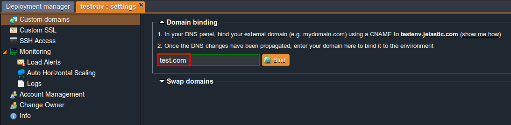

</div>

4. Let’s open our new application in a web browser to see the changes.

<div style={{
    display:'flex',
    justifyContent: 'center',
    margin: '0 0 1rem 0'
}}>

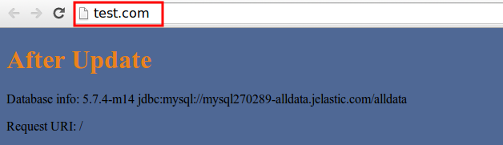

</div>

After you have tested your new features you can just swap domains. With this functionality, your application’s end users will not experience downtime when you deploy a new application version. You can stage your new application version in a test environment and swap the URLs with the production environment in just a few clicks.

5. Open the settings for one of your environments and in the “Custom domains” section, choose the other environment for swapping and click **Swap**.

<div style={{
    display:'flex',
    justifyContent: 'center',
    margin: '0 0 1rem 0'
}}>

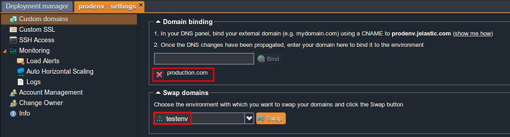

</div>

Now you can go to _production.com_ and you’ll see that your application has been already updated.

<div style={{
    display:'flex',
    justifyContent: 'center',
    margin: '0 0 1rem 0'
}}>

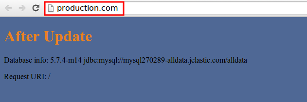

</div>
