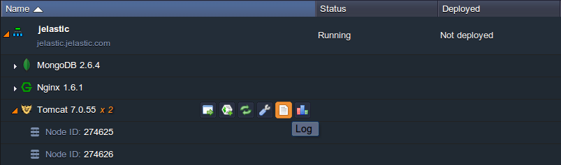
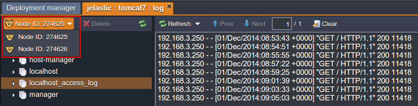
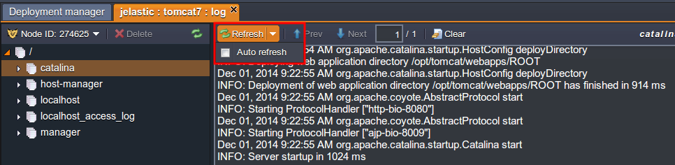
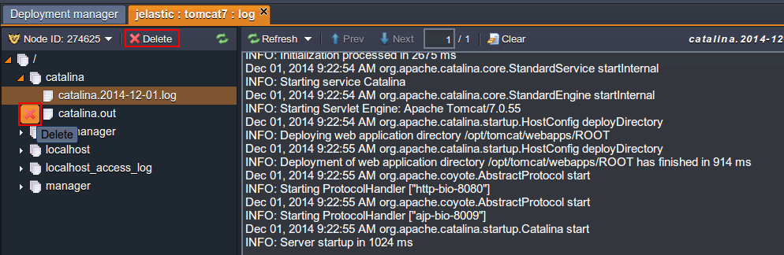
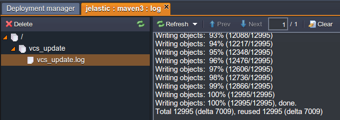

import obj from './LogFiles.json'

## View Log Files

Log files are the main source of the most important information regarding what has happened to your environment. For example, any development or testing task requires access to this crucial information.

So, to view your node’s logs, follow these steps:

1. Log into the platform dashboard with your credentials.

2. Click the **Log** icon for the required node.

3. The logs tab will appear at the bottom of your dashboard. If your environment contains several [nodes of the same type](/docs/ApplicationSetting/Scaling%20And%20Clustering/Horizontal%20Scaling), you can choose the one you want to see the logs for in the drop-down list.

Using the buttons above the log text you can **Clear** the log or **Refresh** it. Use **Prev** and **Next** buttons for navigating through the log body if it is large.

:::tip Tip

In order to make the logs monitoring even more convenient, the _Auto refresh_ feature is used, which is enabled by default. It makes the currently opened log file to be refreshed every 3 seconds and thus removes any delay or necessity to refresh them manually in order to get the up-to-date information, allowing to track real time processes like installation or updating with ease.

If some issue happens you can disable _Auto refresh_ to concentrate on that information rather than on a new one. For that, uncheck the appropriate option in the **_Refresh_** drop-down list above the log output window.

In just the same way, you can enable the _Auto refresh_ option again.

:::

4. Every log file in the folder can be easily deleted directly from the log list. To perform this, hover over the required server log and click the appeared cross button or select it and press **Delete** at the top tools panel.

5. Logs can also be downloaded via FTP. To learn more about the FTP module’s installation and usage, see the [FTP/FTPS Support](/docs/Deployment%20Tools/FTP-FTPS%20Support) document.

6. Here is a list of available log files you can view depending on the node:

    

        

            

                Node
            

              

               Available log files
            

        

        {obj.data1.map((item, idx) => {
            return 

            

                <a href="/">
                    {item.Node} 
                </a>
            

            

                {item.AvailableLogFiles}
            

        

        })}
    

:::tip Tip

If you use the remote [GIT/SVN](/docs/Deployment/Deployment%20Guide) repository for deploying your application, a new **vcs_update** pull log file is added to your [Maven](/docs/Java/Build%20Node/Java%20VCS%20Deployment%20with%20Maven) node (for Java) or [Apache](/docs/PHP/PHP%20App%20Servers/Apache%20PHP/)/[NGINX](/docs/PHP/PHP%20App%20Servers/NGINX%20PHP/) application server (for PHP), which contains the information on your project’s building and deploying.

:::
