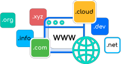
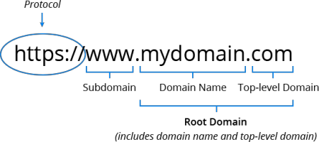
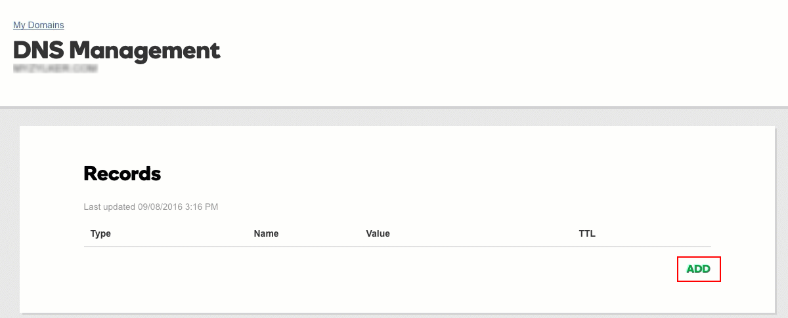

## Custom Domain Name

<!-- Image Url changes -->

<!-- Content changes -->

With the platform, you have a possibility to set an external domain address for your site, instead of the default environment URL (_i.e. {env_name}_.[_hoster_domain_name_](https://cloudmydc.com/)). The custom domain allows promoting your unique branding and improves your web application recognition over the Internet.

Before diving in, let’s deal with some basic concepts for better understanding:

- **Domain** is the name you specify within a browser to access a website. The part of the name to the far right (for example _.com or .org_) is known as the _top-level domain_ (TLD), and the part before it - the _second-level domain_ (SLD). Subdomain is an optional part, which is placed in front of the SLD and is separated with a period. See the image below for example.

- **Root Domain** is a combination of the _second-_ and _top-level domain names_ without the subdomain. Such an address represents a whole website instead of a particular web page. Each site has a unique root domain, which is included in all its pages and subdomains.

- **DNS** is a system that converts textual domain names into numerical IP addresses, which are needed to locate and identify web services. For example, when you type *www.mydomain.com* into the browser address bar, it looks for the actual IP address of the server that hosts this page, e.g. 209.50.246.12. If you type *https://209.50.246.12/*, you will arrive at the exact same site.

:::tip Tip

The platform also provides the full [gTLD + IDN Domain Names](https://cloudmydc.com/) support so that you can use both internationalized and generic top-level names for your external domains.

:::

To attach the custom domain you should follow the next steps:

- [purchase custom domain](https://cloudmydc.com/)
- [configure DNS record](https://cloudmydc.com/)
- [bind domain name](https://cloudmydc.com/) (if needed)

## How to Buy a Domain Name?

The exact steps vary based on your particular domain registrar. As an example, we use [GoDaddy](https://cloudmydc.com/).

1. Log into your account or sign up a new one. Expand the **Sign In** option at the top and click the same-named button.

2. Switch to your account management page by clicking the **Visit My Account** button.

3. In case you don’t have any domain yet, click the **_Get one now_** link and follow the provided steps to select and purchase a domain.

## How to Configure DNS Record?

Once you have your [own domain](https://cloudmydc.com/), the flow to add a new DNS record is simple ([GoDaddy](https://cloudmydc.com/) example):

There are [various types of DNS records](https://cloudmydc.com/), which can be used to point to your environment:

- [**_CNAME_**](https://cloudmydc.com/) - maps your custom domain to environment domain (requires additional [domain binding](https://cloudmydc.com/) via the platform dashboard)
- [**_ANAME_**](https://cloudmydc.com/) (if supported by your DNS server) - maps whole [root domain](https://cloudmydc.com/) (e.g. example.com) to your environment domain or other root domain
- **_A Record_** - maps your custom domain to a public IP (requires external IP address attached to the environment)

:::tip Note

The **_CNAME/ANAME_** DNS records can be used with [Shared Load Balancer](/docs/ApplicationSetting/External%20Access%20To%20Applications/Shared%20Load%20Balancer) (i.e. without public IP). However, for the production environments, it is recommended to attach [public IP](/docs/ApplicationSetting/External%20Access%20To%20Applications/Public%20IP) and configure **_A Record_**.

In case of a _Private Cloud_ setup, when the platform owner controls all the environments, the Shared Load Balancer limitations can be disabled, making the CNAME usage a production-ready option.

:::

Below, we’ll provide step-by-step instructions to configure a record for your domain name.

1. Find the required domain in your domain registrar, and click on **Manage DNS** for it.

2. At the bottom of the **_Records_** section, click the **Add** button.

3. Within the shown **Add Zone Record** frame, select the [required option](https://cloudmydc.com/) from the **Type** drop-down list (e.g. A Record).

4. Complete the selecter record addition.

In our case, for the A Record:

- **Host** - enter hostname the A Record is linked to - in our case, just type @ to point the record directly to your domain name
- **Points to** - specify the external IP address of your environment entry point

:::tip Tip

To get this IP, expand your application server (load balancer) node to see your public IP address.

:::

- **TTL** - select for how long the DNS server should keep your A Record information cached (i.e. the delay before new settings for it will be applied in case of their further change)

Click **Save**.

:::tip Note

Any DNS changes you make can take up to 48 hours to be reflected throughout the Internet.

:::

## Which DNS Record to Use?

Check the following general rules and examples:

- use **A Record** if your environment is working over [public IP](/docs/ApplicationSetting/External%20Access%20To%20Applications/Public%20IP)

_name1.mydomain.com > 111.111.111.111_

_name2.mydomain.com > 111.111.111.112_

- use **CNAME** if you want to alias custom domain to environment name (requires [domain binding](https://cloudmydc.com/))

_name1.mydomain.com > env1.hosterdomain.com_

_name2.mydomain.com > env2.hosterdomain.com_

- use **ANAME** if you need to redirect one DNS zone ([root domain](https://cloudmydc.com/)) to another with all of its subdomains being resolved over the same subdomains

**mydomain.com > hosterdomain.com**
As a result, any subdomain on your domain will be pointed to the appropriate one on the service hosting provider: _{subdomain}.mydomain.com > {subdomain}.hosterdomain.com._

**mynewcompany.com > myoldcompany.com**
As a result, you can point all traffic from your old domain to a new one keeping all the subdomains the same: _{subdomain}.mynewcompany.com > {subdomain}.myoldcompany.com._

**mydomain.com > env1.hosterdomain.com** (requires [domain binding](https://cloudmydc.com/))
As a result, subdomains of your custom domain will point to the appropriate ones within the target environment: _{subdomain}.mydomain.com > {subdomain}.env1.hosterdomain.com._

## How to Bind Domain to Environment?

When working **without public IP** addresses attached (i.e. DNS record points to the environment name via [CNAME or ANAME](https://cloudmydc.com/)), you need to **bind** the appropriate domain name. It is necessary for the Shared Load Balancers to correctly route traffic to the target environment.

:::tip Note

Custom domain binding via the platform dashboard is unnecessary if public IP is enabled for the environment, as incoming traffic bypasses SLBs.

:::

1. Within the platform dashboard, click the **Settings** button (the wrench icon) for the environment you need to bind a domain name.

2. Within the automatically selected **_Custom Domains_** menu tab, use the Domain Binding section to specify your domain name (e.g. *www.myexternaldomain.com or myexternaldomain.com*) and **Bind** it with the corresponding button.

:::tip Note

It may take up to several minutes until the new URL settings will take effect.

:::

Great! Your environment is now accessible under its unique domain name.
