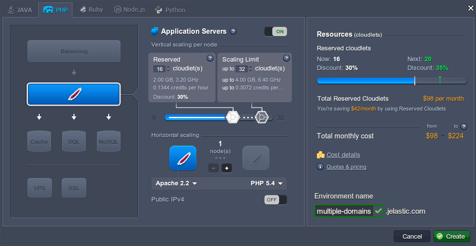
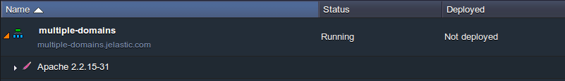
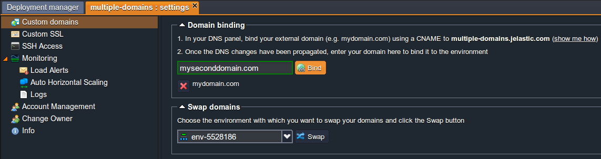
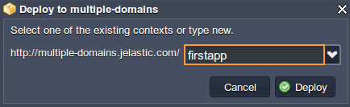
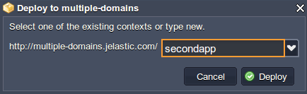
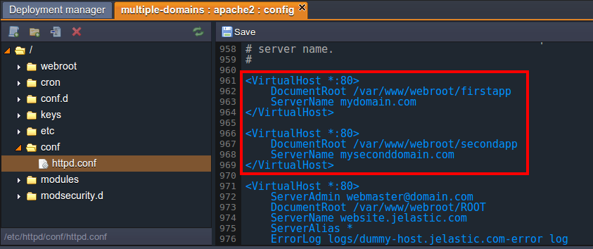
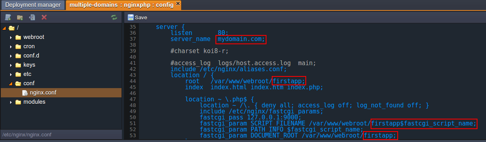
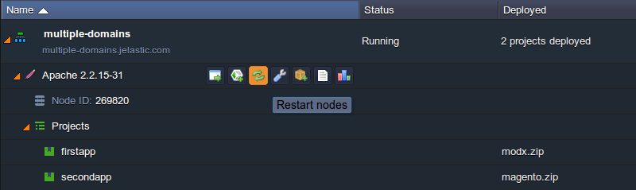
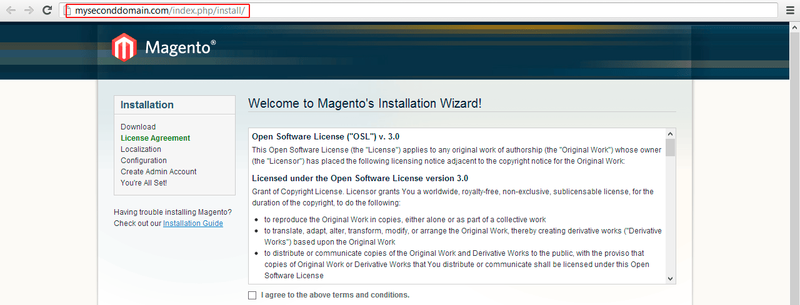

## Running Multiple Domain Names on PHP Server

Using multiple domains provides you with ability to increase the usability, efficiency and scalability of your PHP application and of course saves your money without necessity to set up separate instances.

So, let’s see how to run multiple domains on PHP application server to make your PHP application even more scalable and effective.

1. Log in to PaaS account.
2. Click **Create environment** at the top left corner of the dashboard.
3. In the opened wizard navigate to PHP tab, pick application server and specify the number of resources your application needs. After that enter the name for environment and click **Create** button.

<div style={{
    display:'flex',
    justifyContent: 'center',
    margin: '0 0 1rem 0'
}}>



</div>

In some seconds your environment will appear on the platform dashboard.

<div style={{
    display:'flex',
    justifyContent: 'center',
    margin: '0 0 1rem 0'
}}>



</div>

4. You need to have the names in DNS, resolving to your IP address. So, buy domain names for your environment. It can be done in two ways: by adding CNAME record or by setting A Records. You can read more [here](http://localhost:3000/docs/ApplicationSetting/Domain%20Name%20Management/Custom%20Domain%20Name).

5. After that click the **Settings** button for your environment and bind your domains. As an example we use the following URLs: _mydomain.com_ and _myseconddomain.com_.

<div style={{
    display:'flex',
    justifyContent: 'center',
    margin: '0 0 1rem 0'
}}>



</div>

:::tip Note

In this case we put entries in our hosts file for local testing and it will work only from the machine with those hosts entries.

:::

6. Now you can upload **zip** packages with your apps to the Deployment manager and deploy them to the environment you’ve created earlier.

<div style={{
    display:'flex',
    justifyContent: 'center',
    margin: '0 0 1rem 0'
}}>



</div>

<div style={{
    display:'flex',
    justifyContent: 'center',
    margin: '0 0 1rem 0'
}}>



</div>

7. Once your applications are successfully deployed you need to specify your virtual host configurations.

- **for Apache**

Click **Config** button next to the Apache server and open the httpd.conf file (in **conf** directory). Set VirtualHost parameters for two domain names separately by specifying the paths to the deployed contexts and the names of domains:

```bash
Listen 80
<VirtualHost *:80>
    DocumentRoot /var/www/webroot/firstapp
    ServerName mydomain.com
    ...
</VirtualHost>
<VirtualHost *:80>
    DocumentRoot /var/www/webroot/secondapp
    ServerName myseconddomain.com
    ...
</VirtualHost>
```

<div style={{
    display:'flex',
    justifyContent: 'center',
    margin: '0 0 1rem 0'
}}>



</div>

- **for NGINX**
  Click **Config** button next to the NGINX server and open the nginx.conf file in the **conf** directory.

Specify your settings in the **_server_** block

- server_name (your domain)
- ROOT (the context you stated while deploying)

Note that you need to have a separate **_server_** block with its own settings for each domain which you bind.

```bash
    server {
        listen       80;
        server_name  localhost;

include /etc/nginx/aliases.conf;
        location / {
            root   /var/www/webroot/ROOT;
            index  index.html index.htm index.php;

            location ~ \.php$ {
                location ~ /\. { deny all; access_log off; log_not_found off; }
            include /etc/nginx/fastcgi_params;
            fastcgi_pass 127.0.0.1:9000;
            fastcgi_param SCRIPT_FILENAME /var/www/webroot/ROOT$fastcgi_script_name;
            fastcgi_param PATH_INFO $fastcgi_script_name;
            fastcgi_param DOCUMENT_ROOT /var/www/webroot/ROOT;
            }

        }
        index  index.php index.html index.htm;

error_page   500 502 503 504  /50x.html;
        location = /50x.html {
            root   html;
        }

location ~ /\. { deny all; access_log off; log_not_found off; }

location ~ \.php$ {
        location ~ /\. { deny all; access_log off; log_not_found off; }
            include /etc/nginx/fastcgi_params;
            fastcgi_pass 127.0.0.1:9000;
            fastcgi_param SCRIPT_FILENAME /var/www/webroot$fastcgi_script_name;
            fastcgi_param PATH_INFO $fastcgi_script_name;
            fastcgi_param DOCUMENT_ROOT /var/www/webroot;
        }

    }
```

In our case the settings will be following:

```bash
        server {
        listen       80;
        server_name  mydomain.com;

    include /etc/nginx/aliases.conf;
        location / {
            root   /var/www/webroot/firstapp;
            index  index.html index.htm index.php;

            location ~ \.php$ {
                location ~ /\. { deny all; access_log off; log_not_found off; }
            include /etc/nginx/fastcgi_params;
            fastcgi_pass 127.0.0.1:9000;
            fastcgi_param SCRIPT_FILENAME /var/www/webroot/firstapp$fastcgi_script_name;
            fastcgi_param PATH_INFO $fastcgi_script_name;
            fastcgi_param DOCUMENT_ROOT /var/www/webroot/firstapp;
            }

        }
        index  index.php index.html index.htm;

        error_page   500 502 503 504  /50x.html;
        location = /50x.html {
            root   html;
        }

            location ~ /\. { deny all; access_log off; log_not_found off; }

        location ~ \.php$ {
        location ~ /\. { deny all; access_log off; log_not_found off; }
            include /etc/nginx/fastcgi_params;
            fastcgi_pass 127.0.0.1:9000;
            fastcgi_param SCRIPT_FILENAME /var/www/webroot$fastcgi_script_name;
            fastcgi_param PATH_INFO $fastcgi_script_name;
            fastcgi_param DOCUMENT_ROOT /var/www/webroot;
        }

    }


server {
        listen       80;
        server_name  myseconddomain.com;

            include /etc/nginx/aliases.conf;
        location / {
            root   /var/www/webroot/secondapp;
            index  index.html index.htm index.php;

            location ~ \.php$ {
                location ~ /\. { deny all; access_log off; log_not_found off; }
            include /etc/nginx/fastcgi_params;
            fastcgi_pass 127.0.0.1:9000;
            fastcgi_param SCRIPT_FILENAME /var/www/webroot/secondapp$fastcgi_script_name;
            fastcgi_param PATH_INFO $fastcgi_script_name;
            fastcgi_param DOCUMENT_ROOT /var/www/webroot/secondapp;
            }

        }
        index  index.php index.html index.htm;

        error_page   500 502 503 504  /50x.html;
        location = /50x.html {
            root   html;
        }

    location ~ /\. { deny all; access_log off; log_not_found off; }

    location ~ \.php$ {
        location ~ /\. { deny all; access_log off; log_not_found off; }
            include /etc/nginx/fastcgi_params;
            fastcgi_pass 127.0.0.1:9000;
            fastcgi_param SCRIPT_FILENAME /var/www/webroot$fastcgi_script_name;
            fastcgi_param PATH_INFO $fastcgi_script_name;
            fastcgi_param DOCUMENT_ROOT /var/www/webroot;
        }

    }
```

<div style={{
    display:'flex',
    justifyContent: 'center',
    margin: '0 0 1rem 0'
}}>



</div>

8. Don’t forget to **Save** the changes and **Restart** application server in order to apply new settings.

<div style={{
    display:'flex',
    justifyContent: 'center',
    margin: '0 0 1rem 0'
}}>



</div>

9. Now you can check the results to ensure that all works properly.

<div style={{
    display:'flex',
    justifyContent: 'center',
    margin: '0 0 1rem 0'
}}>



</div>

Hope this instruction will be useful for you. Domain names are very crucial pieces of your online identity so don’t forget to protect them. With PaaS it takes just a few minutes. Enjoy!
