## Multiple Domain Names on Tomcat Server

Set up multiple domain names on the Tomcat server in order to increase the usability, efficiency and scalability of your application, as well as save your costs without having to configure separate instances. For this, make some minor adjustments within Tomcat configuration files as described below.

1. Log into the platform dashboard and click the **New Environment** button:

<div style={{
    display:'flex',
    justifyContent: 'center',
    margin: '0 0 1rem 0'
}}>


</div>

2. In the **Environment Topology** dialog, pick your application server (e.g. [Tomcat 9](http://localhost:3000/docs/Java/Java%20App%20Servers/Tomcat%20and%20TomEE/Tomcat%20Server)), and type your environment name, for example, _multibinding_.

<div style={{
    display:'flex',
    justifyContent: 'center',
    margin: '0 0 1rem 0'
}}>

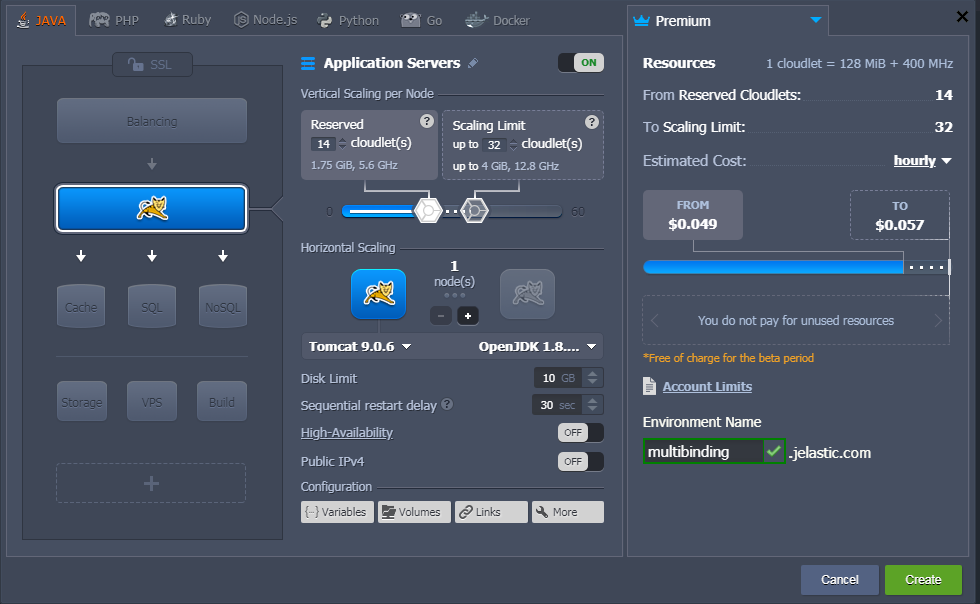

</div>

In a minute your environment will be successfully created.

<div style={{
    display:'flex',
    justifyContent: 'center',
    margin: '0 0 1rem 0'
}}>

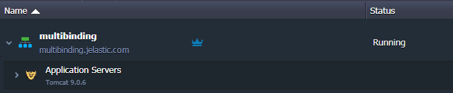

</div>

3. You can buy and set up your own domain names instead of default ones by adding CNAME record or by setting A Records. Read more in the [Custom External Domain Name Binding](http://localhost:3000/docs/ApplicationSetting/Domain%20Name%20Management/Custom%20Domain%20Name) document.

4. Go back to the platform dashboard, click the **Settings** button for your environment and bind your domains.

<div style={{
    display:'flex',
    justifyContent: 'center',
    margin: '0 0 1rem 0'
}}>

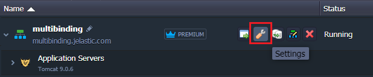

</div>

In our example, we’ll use **_tomcatfirst.tk_** for the first domain name, and **_tomcatsecond.tk_** for the second.

<div style={{
    display:'flex',
    justifyContent: 'center',
    margin: '0 0 1rem 0'
}}>

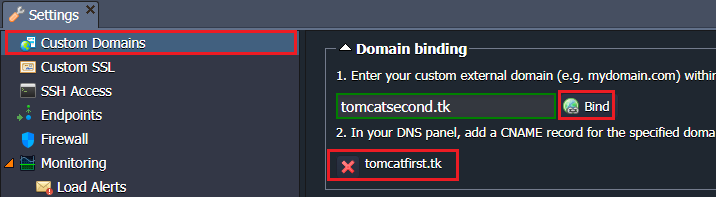

</div>

5. Now you need to deploy the projects.

- Upload the application file to the **Deployment Manager** and press **Deploy to** button.

As an example, we use _Hello World_ which is available in Deployment Manager by default.

<div style={{
    display:'flex',
    justifyContent: 'center',
    margin: '0 0 1rem 0'
}}>

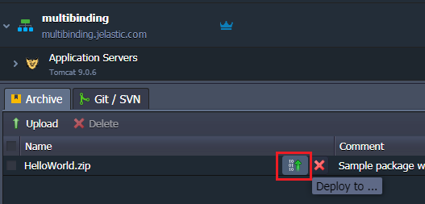

</div>

When the **Deploy** form appears choose your environment and assign the context (**tomcatfirst**, in our case). Then press **Deploy** button.

<div style={{
    display:'flex',
    justifyContent: 'center',
    margin: '0 0 1rem 0'
}}>

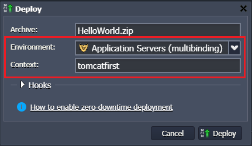

</div>

- Upload the second application archive. We will use modified _Hello World_ (the words “You did it!” are recolored in red) just to see the difference at the final steps.

Then deploy this application to the same environment but with different context, (e.g. **tomcatsecond**).

<div style={{
    display:'flex',
    justifyContent: 'center',
    margin: '0 0 1rem 0'
}}>

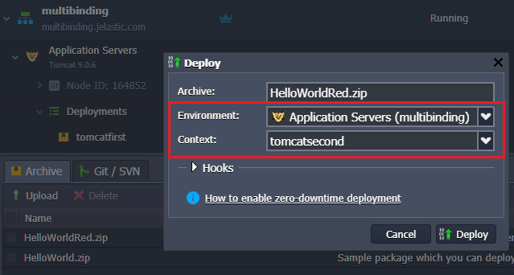

</div>

When deployment is finished you have two applications deployed in your environment.

<div style={{
    display:'flex',
    justifyContent: 'center',
    margin: '0 0 1rem 0'
}}>

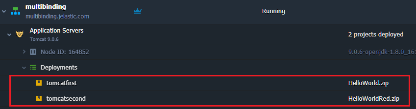

</div>

6. Now click on **Сonfig** button for Tomcat and navigate to **_server.xml_** file (the **/opt/tomcat/conf** directory).

<div style={{
    display:'flex',
    justifyContent: 'center',
    margin: '0 0 1rem 0'
}}>

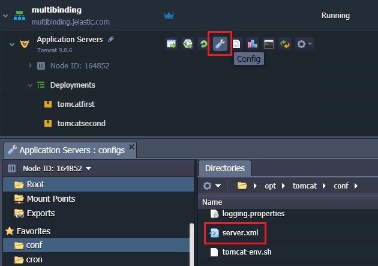

</div>

Add **Host** tags for each domain you want to bind:

```bash
<Host name="external.domain.tld" appBase="webapps/context_name" autoDeploy="true">
    <Alias>external.domain.tld</Alias>
    <Context path="" docBase="${catalina.base}/webapps/context_name"/>
</Host>
```

In our sample, we add the following code to **_server.xml_** file:

```bash
<Host name="tomcatfirst.tk" appBase="webapps/tomcatfirst" autoDeploy="true">
<Alias>tomcatfirst.tk</Alias>
<Context path="" docBase="${catalina.base}/webapps/tomcatfirst"/>
</Host>
<Host name="tomcatsecond.tk" appBase="webapps/tomcatsecond" autoDeploy="true">
<Alias>tomcatsecond.tk</Alias>
<Context path="" docBase="${catalina.base}/webapps/tomcatsecond"/>
</Host>
```

<div style={{
    display:'flex',
    justifyContent: 'center',
    margin: '0 0 1rem 0'
}}>

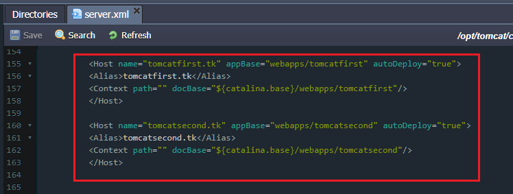

</div>

7. **Save** the changes and **restart** Tomcat.

<div style={{
    display:'flex',
    justifyContent: 'center',
    margin: '0 0 1rem 0'
}}>

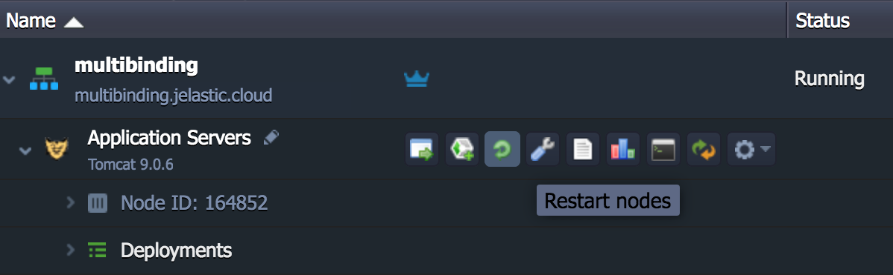

</div>

8. Now you can check the results. Both your applications will be available through the specified domain names running on a single Tomcat server.

<div style={{
    display:'flex',
    justifyContent: 'center',
    margin: '0 0 1rem 0'
}}>

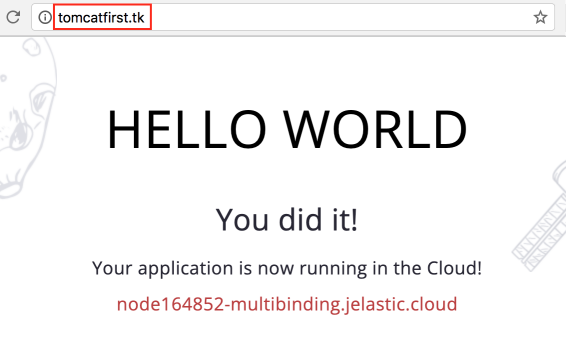

</div>

<div style={{
    display:'flex',
    justifyContent: 'center',
    margin: '0 0 1rem 0'
}}>

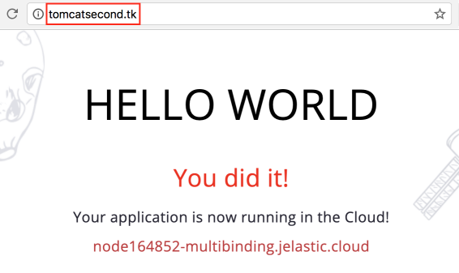

</div>

:::danger Note

If you want to redeploy an application to the Tomcat instance with already configured _server.xml_, you need to comment < _Host_ > block before redeploying and uncomment it afterwards.

:::
