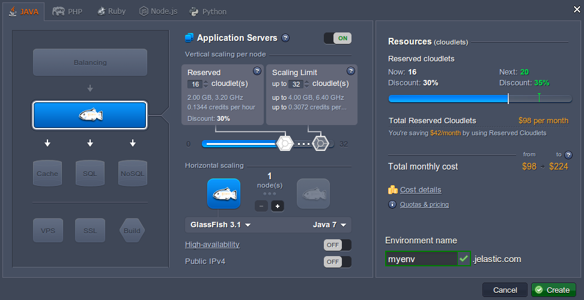
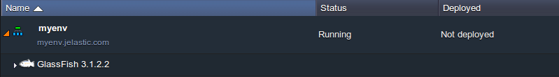
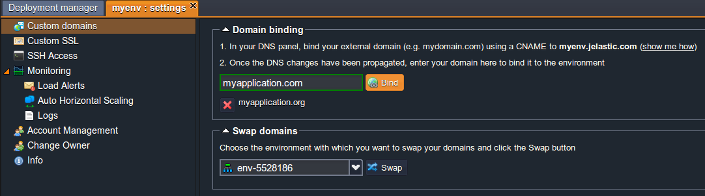
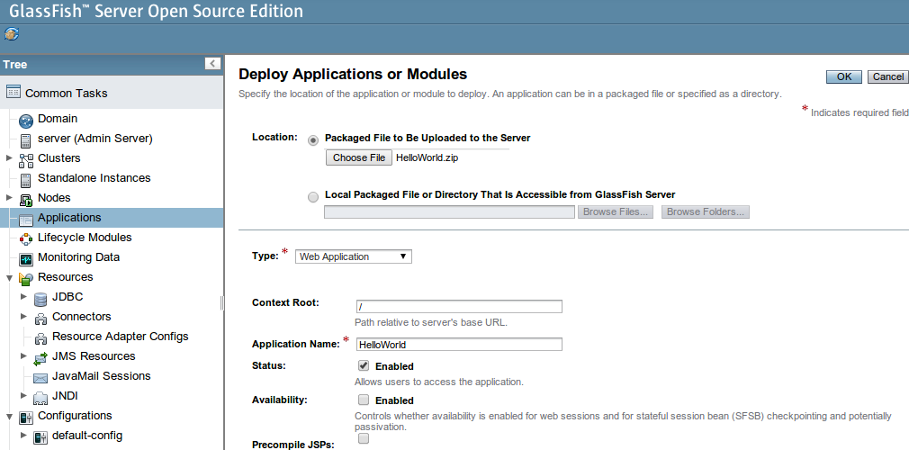
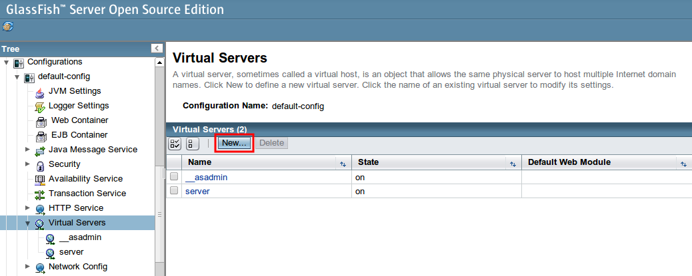
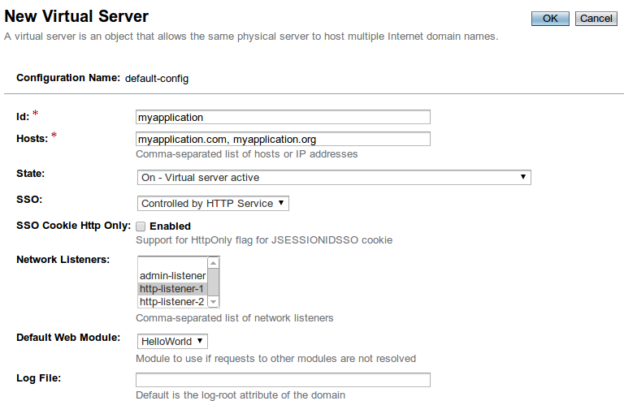
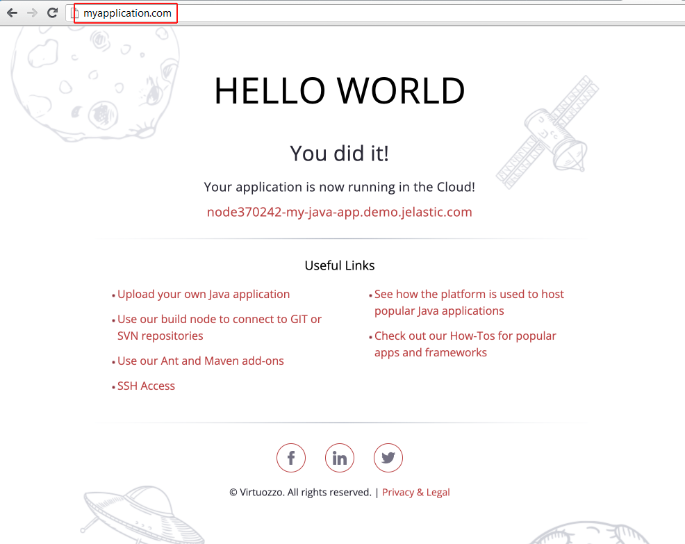

## Running Multiple Custom Domains on GlassFish Server

Let’s see how to easily set up a few domain names for Java application hosted with GlassFish container servlet, which combines enterprise-class facilities and open-source cost efficiency. It’s an enterprise-ready application server with true interoperability and a wide range of features including superior documentation, configuration and administration.

To run multiple domains for your Java site on GlassFish server just follow the next simple steps.

1. Log into the platform dashboard and click **Create environment** button.

2. Pick **GlassFish** as an application server and specify the cloudlet limits for it. Then type your environment name and click **Create** button.

3. In a matter of seconds your environment will be successfully created and appears on the dashboard in the list of environments.

4. After that you need to add a CNAME record or set an A Record, as it is described in [Custom Domains](/docs/ApplicationSetting/Domain%20Name%20Management/Custom%20Domain%20Name) document.

5. For binding your custom domain names click the **Settings** button next to your environment and choose the Custom domains setting. Then enter your domains in the appropriate field (we will use _myapplication.com_ and _myapplication.org_ as examples) and click **Bind** button.

:::tip Note

We’ve put entries into our hosts file for local testing so this will work only from our machine, which has those hosts' entries.

:::

6. When you created the environment, the platform sent you the link and credentials to GlassFish DAS node. Log in to the admin panel using these credentials and navigate to the **Applications** tab in order to deploy your application.

7. After your application is successfully deployed navigate to **_Configurations > default-config > Virtual Servers_** block and click **New** button in order to create a new virtual server.

8. Enter the ID for new server, in the **Hosts** field specify bounded to your environment custom domains separated by commas, then select the suitable http listener and pick the necessary web module.

9. Save the changes and voilà! Now you can ensure that your application is available via the all specified domain names.

As you can see, it’s very easy to manage application custom domains with the platform’s rich set of tools. Enjoy!
