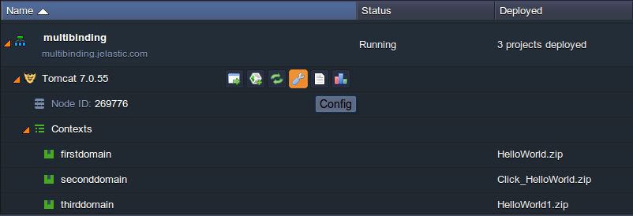

## Setting Up Multiple Domains with Public IP

## The Benefits of Having Multiple Domains

- **_Usability_**

One of the main benefits of having multiple domain names is that it gives you _multiple points of entry_: this can be useful if, for example, you want different domains leading to differently themed sites for different marketing campaigns or user experiences.

- **_Cost Saving_**

Another benefit that you can take advantage of is the ability to have _more than one domain running on a single environment_. For example, you can have two different applications with two different domains running on a single Tomcat instance.

## Setting Up Multiple Domains

_In order to use a domain name for your application, you need to register it or have administrative access to it._

1. Log into the PaaS account.

2. While in the platform dashboard, click the **Create environment** button:

<div style={{
    display:'flex',
    justifyContent: 'center',
    margin: '0 0 1rem 0'
}}>


</div>

3. In the **Environment Topology** dialog, pick your application server (for example, [Tomcat](http://localhost:3000/docs/Java/Java%20App%20Servers/Tomcat%20and%20TomEE/Tomcat%20Server)), switch on **Public IPv4** for your server and type your environment name, for example, _multibinding_.

<div style={{
    display:'flex',
    justifyContent: 'center',
    margin: '0 0 1rem 0'
}}>


</div>

In a minute your environment with **Tomcat** will be successfully created.

<div style={{
    display:'flex',
    justifyContent: 'center',
    margin: '0 0 1rem 0'
}}>


</div>

4. Bind your **domain names** to the Tomcat’s Public IP address, which you can find in the drop-down list for the server. The binding procedure depends on the hosting company, where you bought domains.

<div style={{
    display:'flex',
    justifyContent: 'center',
    margin: '0 0 1rem 0'
}}>


</div>

5. Upload your war files/file to the **Deployment manager** and deploy them to different contexts.

<div style={{
    display:'flex',
    justifyContent: 'center',
    margin: '0 0 1rem 0'
}}>


</div>

6. Click on **Config** button for Tomcat.

<div style={{
    display:'flex',
    justifyContent: 'center',
    margin: '0 0 1rem 0'
}}>



</div>

7. Navigate to **server.xml** file (server directory) and set the configuration for host multiple domains (add _Host tags_ for each domain you want to host).

For example:

```bash
<Host name="firstdomain.com" appBase="webapps/firstdomain">
<Alias>firstdomain.com</Alias>
<Context path="" docBase="."/>
</Host>

<Host name="seconddomain.com" appBase="webapps/seconddomain">
<Alias>seconddomain.com</Alias>
<Context path="" docBase="."/>
</Host>

<Host name="thirddomain.com" appBase="webapps/thirddomain">
<Alias>thirddomain.com</Alias>
<Context path="" docBase="."/>
</Host>
...
```

<div style={{
    display:'flex',
    justifyContent: 'center',
    margin: '0 0 1rem 0'
}}>


</div>

8. **Save** the changes and **Restart** Tomcat.

9. Now you can check the results. You application/s will be available through the specified domain names.

<div style={{
    display:'flex',
    justifyContent: 'center',
    margin: '0 0 1rem 0'
}}>


</div>

<div style={{
    display:'flex',
    justifyContent: 'center',
    margin: '0 0 1rem 0'
}}>


</div>

<div style={{
    display:'flex',
    justifyContent: 'center',
    margin: '0 0 1rem 0'
}}>


</div>

:::tip Note

If you want to redeploy an application to the Tomcat instance with already configured _server.xml_, you need to comment < _Host_ > block before redeploying and uncomment it afterwards.

:::
