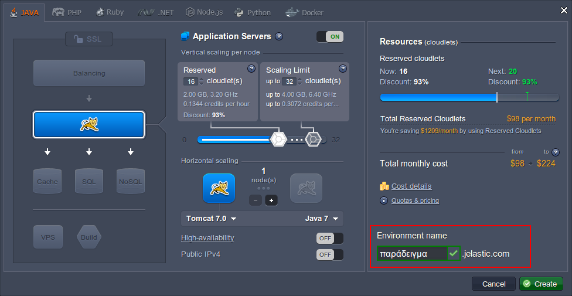
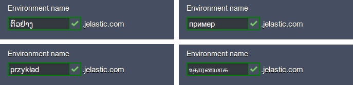
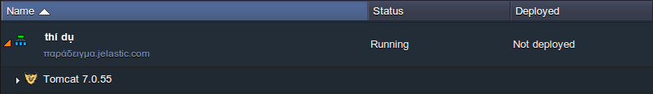
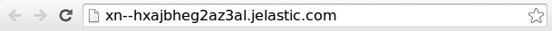
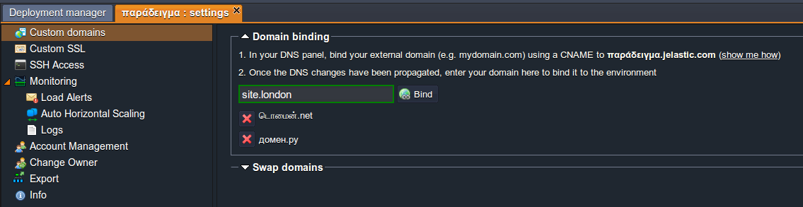
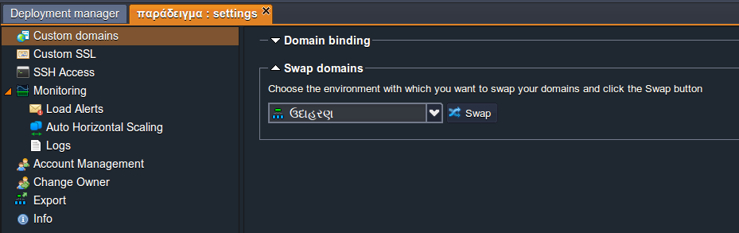

## gTLD + IDN Domain Names Support

<!-- Image Url changes -->

Many efforts were involved in the Internet community to make domain names available in many languages other than those based on the Latin script. And now with the help of **IDN (Internationalized Domain Name)** technology, almost any Unicode character, which amount is considerably bigger than the traditionally used ASCII ones, can be added to the domain name.

This is made possible by implicit conversion of such characters to the standard view, with the help of [Punycode](https://cloudmydc.com/).

The platform supports such intentions and allows users from all over the world to use their native language (i.e. a variety of symbols besides the previously available Latin characters, e.g. Cyrillic letters or Chinese hieroglyphs) while setting the environment names and [aliases](https://cloudmydc.com/). Such names will be correctly displayed throughout the dashboard and while accessing an account via the [SSH console](https://cloudmydc.com/). In addition, you can easily bind the external IDN to your environment, following the same [workflow](https://cloudmydc.com/) as for the usual custom domain names.

One more specific domain names' category is **gTLD (Generic Top-Level Domains)** - subtype of TLDs, maintained by the Internet Assigned Numbers Authority (IANA) and originally intended for being used by particular types of organizations and companies. Herewith, “generic” refers to the fact that such names are not tied to any specific country and theoretically can be used by anyone on the Internet anywhere in the world. gTLD integration to the platform provides users with the possibility to bind such domain names (visible to Internet users as the suffix at the end of address, like ._org, .academy, .best, etc_.) to their environments.

So let’s discover how to operate with such specific domain names within the platform.

## Default Environment IDN Domain

1. Firstly, you can gain the advantage of IDN usage while setting the name of your environment via the topology wizard.
   [Preconfigure your environment](https://cloudmydc.com/) settings and enter the desired appellation in any language to the **Environment name** field below (the only limitation - it must be longer than 5 symbols) and click **Create**.

Here are a few more examples:

:::danger Note

Your environment name cannot start with “**xn–**”, because such a combination at the beginning of the address is reserved for displaying IDNs in ASCII characters.

:::

2. The process of such environments' creation is performed in a usual way, so in a minute your new environment will be added to the dashboard.

3. If you **Open in browser** your environment, that uses IDN, the URL would be similar to the one you can see in the image below:

This is how the domain name of our example environment is shown in a Punycode (a way to represent Unicode with the limited characters subset of ASCII standard).

To avoid such an awkward link view, you can bind a [custom domain name](https://cloudmydc.com/) to your environment (including the IDN one).

4. Also, you can [set an alias](https://cloudmydc.com/) for your environment (or for the separate nodes within it) in your native language, in order to make your work easier and even more familiar.

## Custom IDN/gTLD Domain Name

Both internationalized and generic top-level domain names can be easily bounded to your environment in just the same manner as it is done for other custom domains. The appropriate workflow, described in our [documentation](https://cloudmydc.com/), is fairly simple, so just follow it to attach one or even several domains to your app.

The [Swapping Domains](https://cloudmydc.com/) feature can also be used for operating with these specific domain types:

More useful platform features can be found within our [Developer’s Center](https://cloudmydc.com/).
