## Container Firewall Rules Management

The platform **Container Firewall** feature provides a possibility to control your nodes availability both from inside and outside of the PaaS. It analyzes various parameters (e.g. incoming request source, protocol, target node port, etc.) to flexibly manage access to your containers through setting the necessary connection rules.

<div style={{
    display:'flex',
    justifyContent: 'center',
    margin: '0 0 1rem 0'
}}>

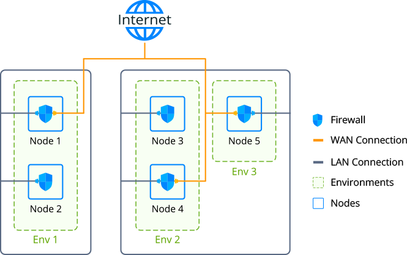

</div>

:::tip

If you want to restrict access between the environments on a single account, it can be automatically configured via the [Network Isolation](/docs/EnvironmentManagement/Environment%20Isolation) feature.

:::

## Container Firewall Management via Platform UI

Each node at the platform (excluding custom [Docker](/docs/Container/Container%20Types)- and [Windows](/docs/Windows&.NET/DOT%20NET%20Core)-based containers) is provisioned with a set of firewall rules, which can be reviewed and managed through an intuitive graphical user interface. The appropriate section can be accessed by clicking on the **Settings** button next to the required environment and selecting the **Firewall** menu item.

:::tip Note

The availability of the Container Firewall UI depends on your particular hosting provider settings. If you don’t have this section, please contact your platform support and request feature activation for your account.

:::

<div style={{
    display:'flex',
    justifyContent: 'center',
    margin: '0 0 1rem 0'
}}>

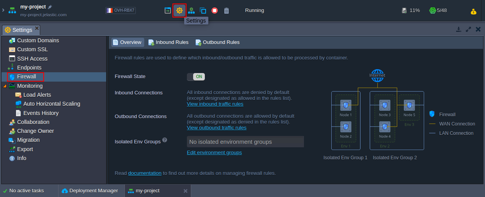

</div>

Here, the following tabs are available:

- **_Overview_** - provides general information on the feature, allows to change _Firewall State_ (which is enabled for all containers by default) and shows _Isolated Env Groups_ the current environment is included to
- **_Inbound Rules_** - allows managing incoming requests (not listed ones are denied by default)
- **_Outbound Rules_** - allows controlling outgoing connections (not listed ones are allowed by default)

## Default Firewall Rules

When you create a new container, the platform automatically fills the _Inbound_ and _Outbound Rules_ sections with some records, required for the proper container operability.

:::tip

These rules are automatically fetched based on the **_EXPOSE_** ports from the same-named variable in the [image’s dockerfile](/docs/Container/Building%20Custom%20Container), check the linked guide for more details on building Docker images for the platform.

:::

<div style={{
    display:'flex',
    justifyContent: 'center',
    margin: '0 0 1rem 0'
}}>

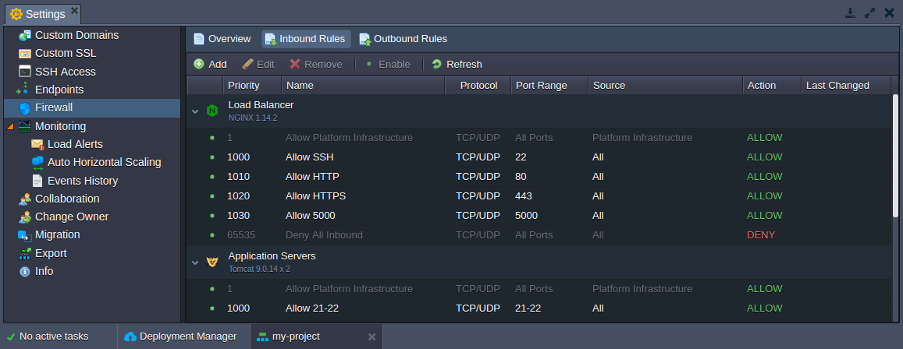

</div>

Here, rules are grouped by layers and have the next structure:

- the very first record is gray-colored (i.e. non-editable/obligatory), has the highest priority (1) and allows platform infrastructure to access container(s) from:

  - _platform orchestrator_ to manage all operations inside (password reset, configs generation, CS scripts execution, SSH key generation, etc.)
  - _SSH Gate_ and _Web SSH_ to provide access to the appropriate services
  - _Shared Load Balancers_ to allow connection to the container without public IP

- the default (stack-related) and user-added (either by an environment owner or collaborators) rules

:::tip Note

Apply changes to the default rules only in case you know exactly what you are doing, since these records are required to ensure proper stack-specific functionality and to provide particular features support (e.g. to allow _SSH, HTTP, HTTPS_ or _FTP_ connections).

:::

- another non-editable gray record (always the last one due to the lowest priority of _65535_) blocks any incoming connection, which is not allowed via the above-mentioned rules

While working with the container (e.g. adding mount points, installing FTP add-on, etc.), the list of default firewall rules can be automatically complemented by the platform according to the new requirements. Herewith, each default record is added with a 10-points priority step, allowing to insert custom rules in between.

## Adding Container Default Rules

If needed (e.g. for the [automation solutions](/docs/Deployment%20Tools/Cloud%20Scripting%20&%20JPS/JPS%20Overview)), you can use the **_OPEN_INBOUND_PORTS_** [environment variable](/docs/EnvironmentManagement/EnvironmentVariables/Environment%20Variables) to define custom ports, which should be opened via container firewall during the appropriate nodes' creation.

1. Click **New Environment** in the dashboard, select the required software stack, and navigate to the [**Variables**](/docs/Container/Container%20Configuration/Variables) configuration frame.

<div style={{
    display:'flex',
    justifyContent: 'center',
    margin: '0 0 1rem 0'
}}>

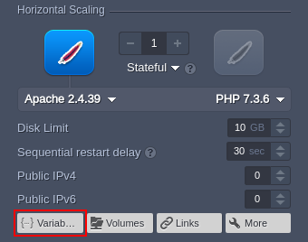

</div>

2. Provide a new **_OPEN_INBOUND_PORTS_** variable in the following format:

```bash
"OPEN_INBOUND_PORTS": "{port1}, {port2}, ... , {portN}"
```

Here, **_{portN}_** is a particular port (_1234_) or range (_33062-34000_), which will be exposed within the inbound firewall rules (via both _tcp_ and _udp_ protocols) after container creation.

<div style={{
    display:'flex',
    justifyContent: 'center',
    margin: '0 0 1rem 0'
}}>

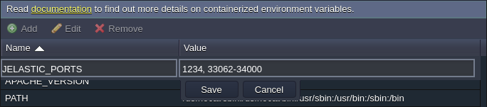

</div>

:::tip Note

Changes due to the **_OPEN_INBOUND_PORTS_** variable are applied just once during nodes' installation. Consequently, the [firewall rules](/docs/ApplicationSetting/External%20Access%20To%20Applications/Container%20Firewall) should be managed manually.

:::

3. You can check your firewall rules after creation.

<div style={{
    display:'flex',
    justifyContent: 'center',
    margin: '0 0 1rem 0'
}}>

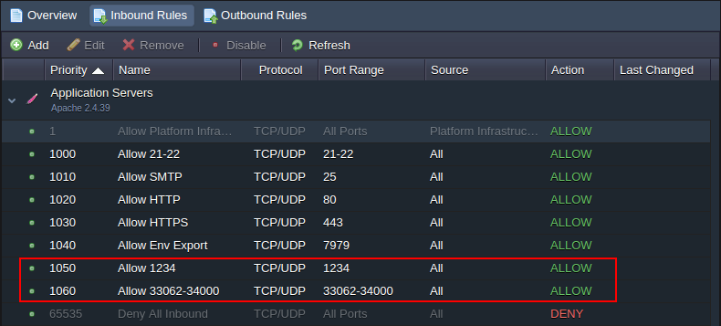

</div>

:::tip

Below, you can check an example on how to set this variable via [Cloud Scripting](https://docs.cloudscripting.com/creating-manifest/basic-configs/#environment-variables):

```bash
jpsType: install
name: OPEN_INBOUND_PORTS env variable
nodes:
nodeType: apache2
nodeGroup: cp
env:
OPEN_INBOUND_PORTS: 3306, 33061, 33062
```

:::

### Rules Management

For convenient management of the already existing firewall rules and providing the new ones, the tools panel above the list contains a set of buttons, namely: _Add, Edit, Remove, Disable (Enable)_ and _Refresh_.

<div style={{
    display:'flex',
    justifyContent: 'center',
    margin: '0 0 1rem 0'
}}>


</div>

When adding a new firewall rule, the following parameters should be defined:

- **Nodes** - to select the required environment layer
- **Name** - to provide a name for this record (can be expanded to select from the commonly used presets)
- **Protocol** - to set the required protocol type (_TCP, UDP_ or _TCP_/_UDP_)
- **Port Range** - to define a particular port (e.g. _80_) or their range (e.g. _1024-2048_) to be opened/closed for connection; leave this field blank to apply the rule to all ports
- **Source** - to select the request source:
  - _Custom IP Address(es)_ - a comma-separated list of IPv4/IPv6 addresses and CIDR blocks (e.g. _10.0.0.1,10.0.0.0/24_)
  - _predefined ranges_ - _All, All IPv4, All IPv6, Local Network, Internet (Public Access)_
  - _Environment Nodes_ - node type (layer) from any environment on an account (subsequently, this rule is automatically complemented/diminished with the required IPs when the appropriate layer is scaled in/out)
- **Priority** - to set a rule priority (where rules with lower values are applied first)
- **Action** - to define the required action upon receiving the matching request (either _allow_ or _deny_)

<div style={{
    display:'flex',
    justifyContent: 'center',
    margin: '0 0 1rem 0'
}}>

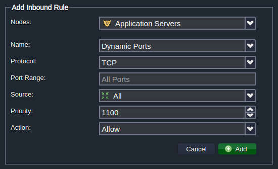

</div>

Subsequently, if meeting the necessity to **Edit** any default or custom rule, you’ll be able to adjust all of the above-described parameters except the Nodes field (i.e. target layer cannot be switched). Also, for the testing purposes, you can temporarily disable particular rules and reapply them later on with the appropriate **Disable/Enable** buttons. The **Refresh** button can come in handy to update the list of rules after some server adjustment (e.g. its topology change) without the necessity to restart the whole server.

## Firewall Use Cases

Access to your nodes can be controlled based on such request parameters as its source node’s IP address, connection protocol, port and so on. In the guide below, we’ll consider a simple example of blocking access to a container for a particular IP address, applied via either:

- [User Interface](/docs/ApplicationSetting/External%20Access%20To%20Applications/Container%20Firewall#restrict-access-via-user-interface)
- [SSH connection](/docs/ApplicationSetting/External%20Access%20To%20Applications/Container%20Firewall#restrict-access-via-ssh)

:::tip Note

Before following this instruction, ensure that the appropriate container is provided with a [public IP](/docs/ApplicationSetting/External%20Access%20To%20Applications/Public%20IP) address.

:::

Also, when preparing some container lifecycle automation solution, you may need to apply the required firewall changes via [platform API](/docs/ApplicationSetting/External%20Access%20To%20Applications/Container%20Firewall) - examine the list of the appropriate methods within the linked reference.

## Restrict Access via User Interface

So, as it was partly shown above, the platform provides a pretty easy-to-use and powerful GUI to manage container firewall directly via the dashboard.

1. To access the appropriate control panel, click the **Settings** button next to the required environment and switch to the **Firewall** section within the opened tab.

<div style={{
    display:'flex',
    justifyContent: 'center',
    margin: '0 0 1rem 0'
}}>

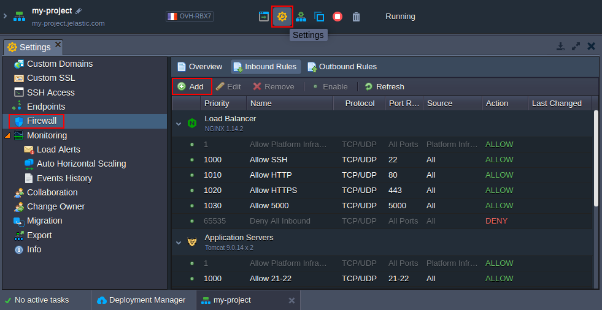

</div>

Select the **Inbound Rules** tab and click on the **Add** button (obviously, to manage external container traffic, you need to choose the **Outbound Rules** tab instead; herewith, all rule parameters are similar to the ones described below).

2. In the opened **_Add Inbound Rules_** form you can configure a new condition for the incoming requests' processing by a container.

<div style={{
    display:'flex',
    justifyContent: 'center',
    margin: '0 0 1rem 0'
}}>

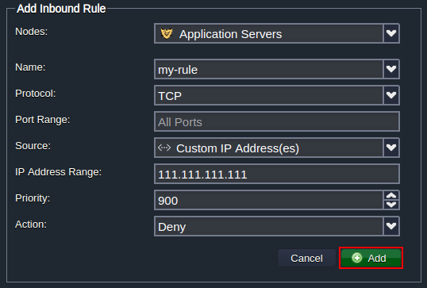

</div>

To deny a connection from a particular IP (according to our suggested use case example), fill in the fields as follows:

- **Nodes** - chose a container to restrict access to (_tomcat_ in our case)
- **Name** - input any desired rule name (e.g. _my-rule_)
- **Protocol** - select a required protocol (_TCP_)
- **Port Range** - deny access to all ports by leaving this field _blank_
- **Source** - choose the _Custom IP Address(es)_ option and type the necessary IP in the appeared **IP Address** Range field (_111.111.111.111_)
- **Priority** - set the appropriate priority for this record (e.g. _900_ to be applied before the default rules)
- **Action** - select the _Deny_ option

Click **Add** to save and automatically apply your rule.

3. Now, when trying to connect to your node from the specified _111.111.111.111_ IP address, a user will be shown the following page:

<div style={{
    display:'flex',
    justifyContent: 'center',
    margin: '0 0 1rem 0'
}}>

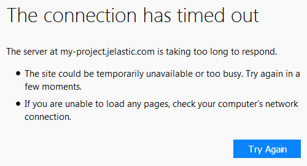

</div>

This way you can deny access to your containers from any IP address.

## Restrict Access via SSH

Alternatively, you can configure firewall rules for your container via terminal when accessing the node through [SSH Gate](/docs/Deployment%20Tools/SSH/SSH%20Overview).

:::tip Note

Although most of the firewall configurations can be performed via the dedicated user interface, management via SSH is more flexible (for example, allows configuring NAT redirects). Herewith, such rules won’t be displayed in the UI list but will be of higher priority.

:::

1. The simplest way to access node via SSH is to call the appropriate [Web SSH](/docs/Deployment%20Tools/SSH/SSH%20Access/Web%20SSH) option directly from the platform dashboard - click the same-named button next to the required node. Once connected, check the /**_etc/jelastic/metainf.conf_** file to ensure that container firewall is turned on:

```bash
cat /etc/jelastic/metainf.conf
```

<div style={{
    display:'flex',
    justifyContent: 'center',
    margin: '0 0 1rem 0'
}}>

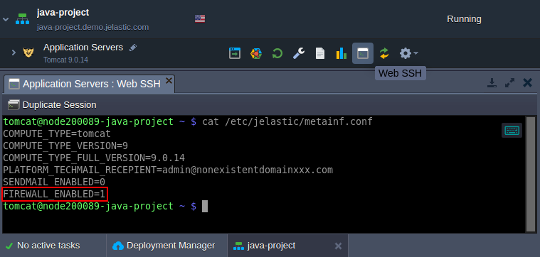

</div>

Here, the **_FIREWALL_ENABLED_** parameter should be equal to _“1”_. If not, contact your hosting provider and request enabling of firewall protection for your account.

2. Next, you need to modify the **_/etc/sysconfig/iptables-custom_** file (e.g. with a _vim_ editor):

<div style={{
    display:'flex',
    justifyContent: 'center',
    margin: '0 0 1rem 0'
}}>

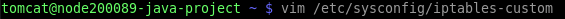

</div>

:::tip Note

The **_/etc/sysconfig/ip6tables-custom_** file should be used when working with the IPv6 rules.

:::

3. Declare the required firewall rules using the iptables-save tool format. For example, the following code should be used to deny access from a particular IP (e.g. _111.111.111.111_):

```bash
filter
:INPUT DROP [0:0]
:FORWARD DROP [0:0]
:OUTPUT ACCEPT [0:0]
-I INPUT -s 111.111.111.111 -p tcp -m state --state NEW -m tcp --dport 1111 -j DROP
COMMIT
\#
```

<div style={{
    display:'flex',
    justifyContent: 'center',
    margin: '0 0 1rem 0'
}}>

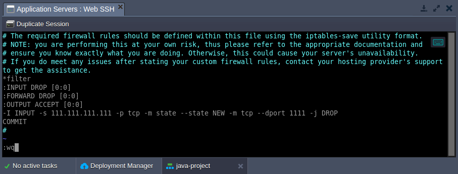

</div>

4. Use the next command to apply your custom firewall settings to the list of container default rules:

```bash
sudo /usr/bin/jem firewall fwstart
```

<div style={{
    display:'flex',
    justifyContent: 'center',
    margin: '0 0 1rem 0'
}}>

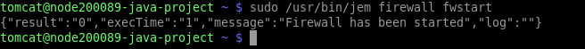

</div>

5. Now, you can check the list of the currently operating firewall rules for your container by executing the following command:

```bash
sudo jem firewall list {table} {options}
```

Here:

- **{table}** - specifies the target iptable (filter, nat, mangle, raw)
- **{options}** - lists [iptable parameters](https://linux.die.net/man/8/iptables), which should be applied

<div style={{
    display:'flex',
    justifyContent: 'center',
    margin: '0 0 1rem 0'
}}>

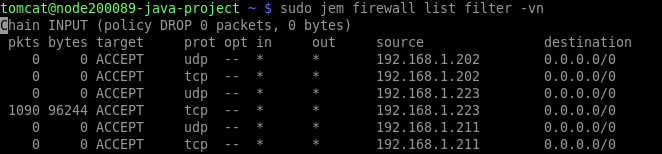

</div>

Your custom rule is placed after the default ones, denying access to your node from the _111.111.111.111_ IP address.

## Setting Rules via Platform API

In some cases (e.g. for custom scripts, automatizations, etc.), you may need to configure firewall rules through the code. To do this, you can use the appropriate methods from the **environment > Security** section in the platform API documentation:

- **_AddRule_** - creates a new rule
- **_AddRules_** - adds several rules
- **_EditRule_** - changes parameters of an existing rule
- **_GetRules_** - shows a list of rules for the environment
- **_RemoveRule_** - deletes a rule
- **_RemoveRules_** - removes several rules
- **_SetFirewallEnabled_** - switches on the firewall
- **_SetRuleEnabled_** - enables an existing rule
- **_SetRules_** - replaces existing rules

This way, managing your _Сontainer Firewall_ allows you to control the availability of nodes on your account effectively and to increase applications security significantly (by filtering desired and undesired connections).
