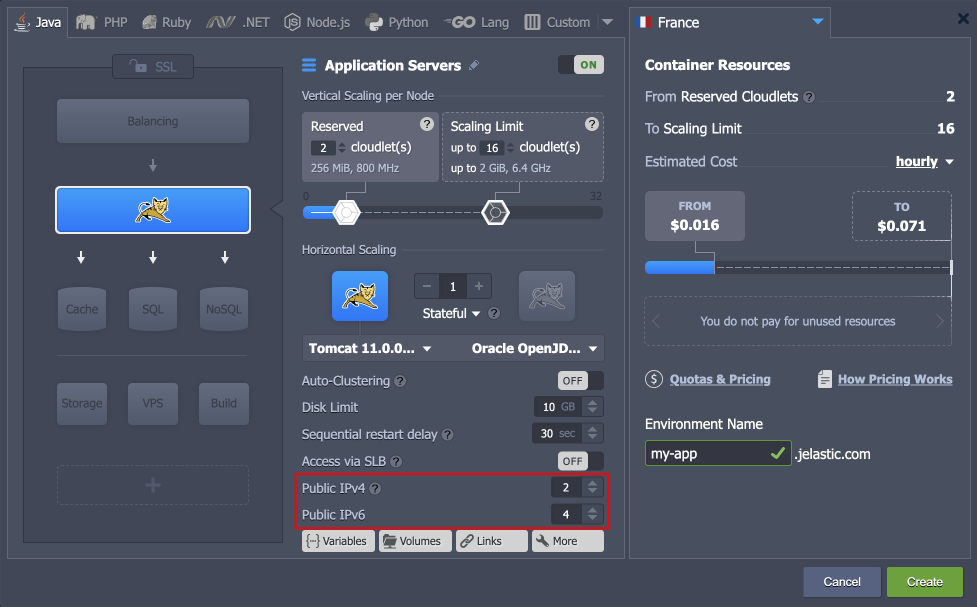
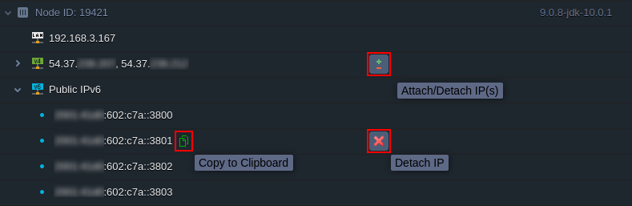

## Public IP

The platform provides users with [Shared Load Balancer](https://cloudmydc.com/) (SLB) as a default single entry point for all of the hosted applications, located on the hardware nodes. However, for the production environments, it is recommended receiving and processing the requests via **Public IP** address(es) that form a direct connection between the Internet and a specific container. Compared to the access over SLB, such approach ensures more secure and effective interaction.

Public IP can be attached to any software stack in your environment (except, [Memcached](https://cloudmydc.com/) node), representing a more stable solution with less risk to be affected by other applications. Also, it opens access to such features as [FTP add-on](https://cloudmydc.com/), [Custom SSL](https://cloudmydc.com/), [remote debugging](https://cloudmydc.com/) from IDE, [WebSockets](https://cloudmydc.com/), etc.

The platform supports two versions of the [Internet Protocol](https://cloudmydc.com/):

- **_Internet Protocol version 4 (IPv4)_** is the fourth revision in the development of the IP and the first version of the protocol to be widely deployed
- **_Internet Protocol version 6 (IPv6)_** is the most recent IP version, which is an evolutionary upgrade of IPv4 and is designed to fulfill the need of more addresses, provide better multicast routing and simplify processing by routers

In order to bind an external IP address to the required node, you need to enable (or [set the required number](https://cloudmydc.com/) of) _Public IPv4 / Public IPv6_ within the central part of the **topology wizard** window.

:::danger notes

- Enabling Public IPv4 turns off the [Access via SLB](https://cloudmydc.com/) option by default. It may cause a temporary (a few minutes) disruption in environment access due to the DNS cache.
- In case of attaching external IPs for the [horizontally scaled](https://cloudmydc.com/) nodes, each container within the layer will be supplied with its own set of addresses.

:::

To find and manage the allocated IPs in the existing environment, expand the appropriate **_node_** string in the environment topology list.

Here, upon hovering over IPs, you can get access to the following functionality:

- **Copy to Clipboard** - copies the appropriate address in one click
- **Attach/Detach IP(s)** - allows adjusting a number of public IPs (both IPv4 and IPv6)
- **Detach IP** - removes a particular address

:::note

- The public IP is a paid option, which is charged for every hour of its usage. The exact price is defined by your particular hosting service provider and can be found at the **[Quotas & Pricing](https://cloudmydc.com/) > Pricing > Options** frame of the dashboard.
- If you have public IP enabled for any node in your environment, you can’t use the [swap domains](https://cloudmydc.com/) functionality for it. Consider utilizing the [swap Public IPs](https://cloudmydc.com/) API instead.
- If working with [multiple public IPs](https://cloudmydc.com/), the very first external address attached (of each IPv4 and IPv6 types) is considered a **_primary_** one and can only be deleted last. It is used for both incoming and outgoing traffic, while the rest of IPs can only receive it.

:::
