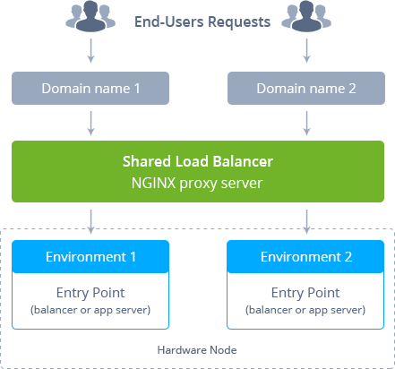
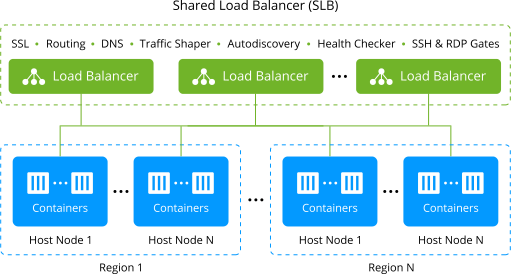
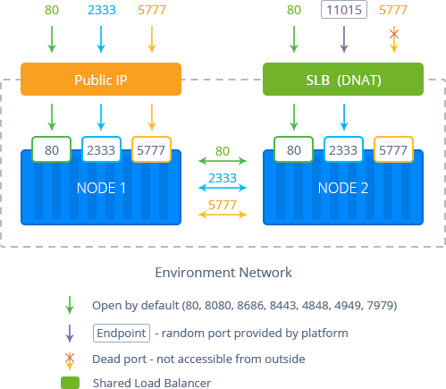
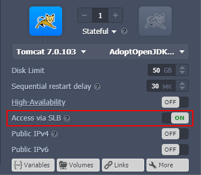
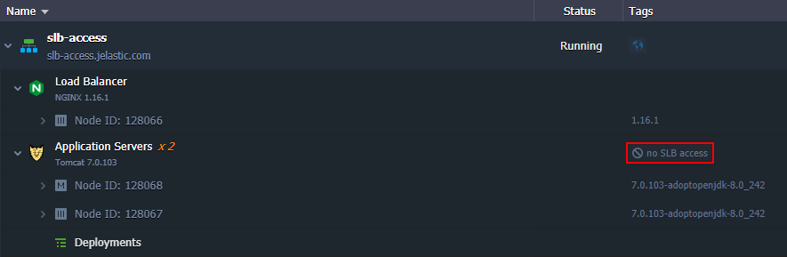
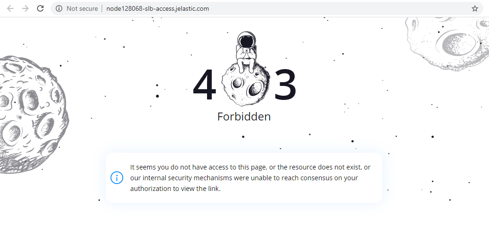

## Shared Load Balancer

The platform utilizes several **Shared Load Balancer** (SLB) infrastructure components to process all incoming requests (except direct connections via [public IP](/docs/ApplicationSetting/External%20Access%20To%20Applications/Public%20IP)) sent to the hosted environments. SLB is an **NGINX proxy server** that connects the client-side (browser, for example) and your applications deployed to the platform.

<div style={{ 
    display:'flex',
    justifyContent: 'center',
    margin: '0 0 1rem 0'
}}>



</div>

So, Shared Load Balancers process requests from outside the platform and navigate them over the internal network to connect to the required applications. SLB is also limited to 50 simultaneous connections per the request’s source address to prevent _DDoS attacks_.

To ensure the platform’s high availability, it uses **several synchronized Shared Load Balancers** (placed at different hosts) for handling requests simultaneously. All of them work with the same data storage so that they are fully interchangeable if one of the instances goes down.

<div style={{
    display:'flex',
    justifyContent: 'center',
    margin: '0 0 1rem 0'
}}>



</div>

As a result, there can be several entry points for users' environments, and the incoming load can be efficiently distributed.

:::tip Note

We recommend using **SLB** for your **_dev_** and **_test_** environments. As for **_production_** environments, which are intended to handle high traffic, it is more appropriate to use your own [**public IP**](/docs/ApplicationSetting/External%20Access%20To%20Applications/Public%20IP) for getting and processing the requests. Also, it allows you to apply several additional options to your application, making it more secure (e.g. with [Custom SSL](/docs/ApplicationSetting/SSL/Custom%20SSL)) and responsive (through attaching [Custom Domain](/docs/ApplicationSetting/Domain%20Name%20Management/Custom%20Domain%20Name)).

<div style={{
    display:'flex',
    justifyContent: 'center',
    margin: '0 0 1rem 0'
}}>



</div>

:::

## Backend Health Check with Shared Load Balancer

The platform **Shared Load Balancer** performs constant servers' health checkups, utilizing the [NGINX upstream check module](https://github.com/yaoweibin/nginx_upstream_check_module) with the following settings for that:

```bash
    check interval=15000 rise=2 fall=3 timeout=2000 default_down=false;
```

In such a way, all containers are considered “up” after SLB starts. Then the system verifies nodes' availability every 15 seconds. If no response is received from a container within 2 seconds, such checkup is regarded as failed. Three consecutive fails mark a node as “down” and two successful checks in a row - as “up”.

:::tip

If an environment has several backends (application servers), the [dedicated load balancer nodes](/docs/Load%20Balancers/Load%20Balancing) are automatically added to manage traffic and perform health checks.

:::

## Deny Access via Shared Load Balancer

The platform provides a predefined option to disable external access to environment nodes from SLB. It prohibits access to containers over their default domain names with a single click (without public IP addition and firewall adjustment). An option is available as the **Access via SLB** toggle in the topology wizard.

<div style={{
    display:'flex',
    justifyContent: 'center',
    margin: '0 0 1rem 0'
}}>



</div>

:::tip Note

The platform automatically disables **Access via SLB** for the layer after adding a **Public IP**. Such configs are recommended to provide the highest security level for your application. However, in case of necessity, you can re-enable _Access via SLB_ to use both options simultaneously.

:::

The option is **_enabled_** for each layer by default, which ensures the following behavior:

- nodes are accessible from the Shared Load Balancer via environment domain names using the default ports (_80, 8080, 8686, 8443, 4848, 4949, 7979_)
- the **Open in Browser** button opens the appropriate service (e.g. database admin panel)
- nodes' links are present in the emails (if needed)

You can manually **_disable_** the Access via SLB feature:

- nodes are inaccessible from the Shared Load Balancer - layer is isolated from the SLB
- the pages accessible via the **Open in Browser** button in the dashboard return the 403 Forbidden error instead of the intended service
- nodes' links are excluded from the emails
- access via [SSH](/docs/Deployment%20Tools/SSH/SSH%20Overview) and through [endpoints](/docs/ApplicationSetting/External%20Access%20To%20Applications/Endpoints) is **_not affected_**

For better visibility, layers with the disabled SLB access are provided with the appropriate label in the dashboard.

<div style={{
    display:'flex',
    justifyContent: 'center',
    margin: '0 0 1rem 0'
}}>



</div>

Connecting to such nodes via the default URL will return the following error page instead of the default service:

<div style={{
    display:'flex',
    justifyContent: 'center',
    margin: '0 0 1rem 0'
}}>



</div>

Below, we’ve prepared some of the most frequent use case examples for the feature:

- close public access via SLB to nodes that are intended for internal access only (e.g. databases)
- forbid access via SLB to nodes with public IP address attached and custom domain configured
- configure topology that allows connection via environment load balancer but prohibits access via direct URL to containers

In general, you can use the _Access via SLB_ option for your **_development_** and **_testing_** environments. However, we recommend disabling the feature for the application in **_production_** and using [public IP](/docs/ApplicationSetting/External%20Access%20To%20Applications/Public%20IP) with a [custom domain](/docs/ApplicationSetting/Domain%20Name%20Management/Custom%20Domain%20Name) instead.
