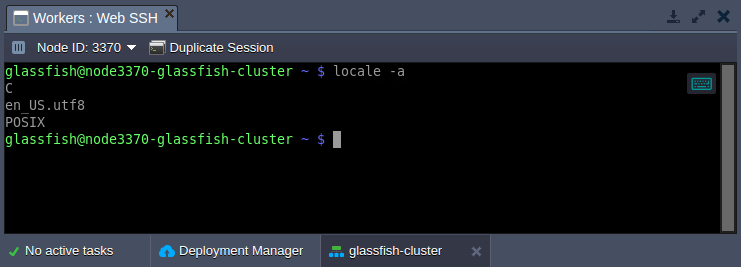
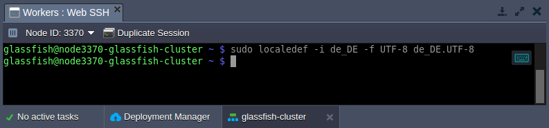
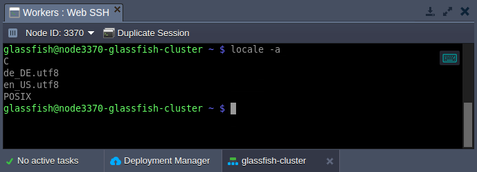

## Managing Locale Settings

A **locale** is a set of language and cultural rules, which define preferences that you want to see in your interface and applications. It covers aspects such as language for messages, different character sets, lexicographic conventions, and so on. Below, we’ll overview how to view and change the locale settings on your containers.

1. By default, all the platform-managed templates are provided with English language preferences. You can view the current [**_locale_**](https://cloudmydc.com/) settings on the container using the following command (e.g. can be run via [Web SSH](https://cloudmydc.com/)):

```bash
locale -a
```

<div style={{
    display:'flex',
    justifyContent: 'center',
    margin: '0 0 1rem 0'
}}>



</div>

2. To add a new language support, the [**_localedef_**](https://cloudmydc.com/) tool can be used:

```bash
sudo localedef -i {language}_{country} -f {codeset} {language}_{country}.{codeset}
```

<div style={{
    display:'flex',
    justifyContent: 'center',
    margin: '0 0 1rem 0'
}}>



</div>

here:

- **_{language}\_{country}_** - provides language and country code

:::tip Tip

Check the list of the locales available for generation by executing the ls **/usr/share/i18n/locales** command.

:::

- **_{codeset}_** - sets the character encoding identifier (e.g. UTF-8)

3. Verify the new locale addition by checking the list of all supported ones:

```bash
locale -a
```

<div style={{
    display:'flex',
    justifyContent: 'center',
    margin: '0 0 1rem 0'
}}>



</div>

As you can see, the new language was added and can be used by your applications.
