## Managing Timezone Data

All containers created within the platform utilize the UTC timezone by default. However, in case of necessity, you can easily change it to any preferable one with the help of the [**_TimeZone Change_**](https://cloudmydc.com/) add-on. Follow the steps provided within the linked section to switch timezones on any of your instances.

Alternatively, you can apply the changes manually. For example, all of the Java and PHP application servers at the platform are supplied with special timezone packages, which includes data about the history of local time in different locations around the globe and current timezone rules. This information is required for software, running inside the appropriate containers, and is regularly updated within the corresponding server builds in the confines of the newly released platform versions.

Besides that, you can instantly update the timezone rules manually if necessary, or change the currently used TZ, based on the preferred location. So, below we’ll reveal some specifics of the timezone data management at the platform for the application servers of the programming languagesmentioned above:

- [for Java](https://cloudmydc.com/)
- [for PHP](https://cloudmydc.com/)

## TimeZone Add-On

**_TimeZone Change_** add-on can be installed on top of any of your environments, changing the timezone for all of the comprised containers in a matter of minutes.

1. Before proceeding to installation, let’s check the timezone on our target container using the **_date_** command.

<div style={{
    display:'flex',
    justifyContent: 'center',
    margin: '0 0 1rem 0'
}}>

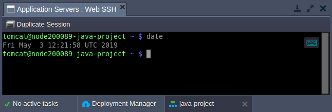

</div>

As you can see, the _UTC_ zone is used (default for all platform-managed containers).

2. Go to the [TimeZone Change](https://cloudmydc.com/) add-on repository within the JPS Collection at GitHub. Copy a link to the **_manifest.jps_** file and [import](https://cloudmydc.com/) it via the dashboard: [_https://github.com/jelastic-jps/time-zone-change/blob/master/manifest.jps._](https://cloudmydc.com/)

<div style={{
    display:'flex',
    justifyContent: 'center',
    margin: '0 0 1rem 0'
}}>

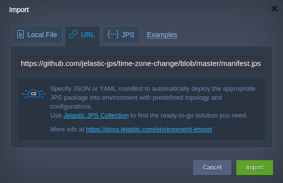

</div>

:::tip Tip

Based on your particular hosting provider settings add-on can be available via [platform Marketplace](https://cloudmydc.com/).

<div style={{
    display:'flex',
    justifyContent: 'center',
    margin: '0 0 1rem 0'
}}>

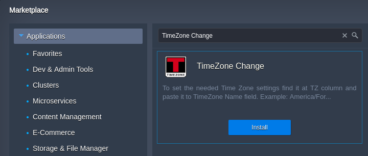

</div>

:::

3. Within the opened frame, select the target **_Environment_** and type the preferable **_TimeZone Name_** ([list of time zones](https://cloudmydc.com/)) for it.

<div style={{
    display:'flex',
    justifyContent: 'center',
    margin: '0 0 1rem 0'
}}>

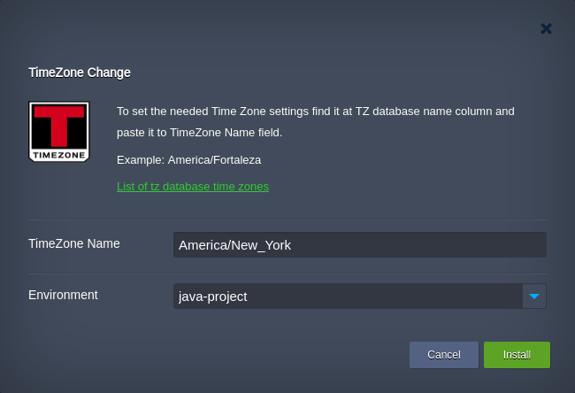

</div>

Click **Install** to apply changes.

4. After add-on installation, you can verify the timezone change by running the **_date_** command one more time.

<div style={{
    display:'flex',
    justifyContent: 'center',
    margin: '0 0 1rem 0'
}}>

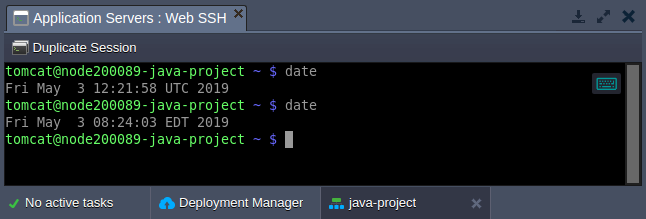

</div>

As you can see, the system time was successfully switched to the _EDT_ (Eastern Daylight Time).

## Timezone Rules for Java

The timezone rules within Java compute nodes are delivered by means of the dedicated **TZdata** package, comprised in each appropriate container. Follow the instructions below to:

- [update timezone data](https://cloudmydc.com/)
- [change current timezone](https://cloudmydc.com/)

## Updating Timezone Data

Despite the fact the newest TZdata package edition is integrated into a node during its creation, after some time it becomes outdated due to periodical changing of the intrinsic data. Thus, old containers may require the corresponding updating from time to time (particularly, in order not to be recreated each time this is needed). For that, a special embedded **TZUpdater** tool is used, intended for keeping your timezone data accurate and up-to-date. It is fairly simple to use and can be run with a single-line command; you just need to:

1. Connect to your Java environment via SSH, e.g. using the embedded [Web SSH](http://localhost:3000/docs/Deployment%20Tools/SSH/SSH%20Access/Web%20SSH) client:

<div style={{
    display:'flex',
    justifyContent: 'center',
    margin: '0 0 1rem 0'
}}>

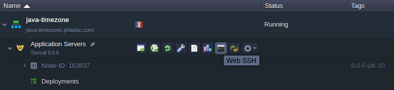

</div>

2. Once inside, you can check the currently used **TZdata** version by executing the following string:

```bash
java -jar /usr/java/utils/tzupdater.jar -V
```

<div style={{
    display:'flex',
    justifyContent: 'center',
    margin: '0 0 1rem 0'
}}>

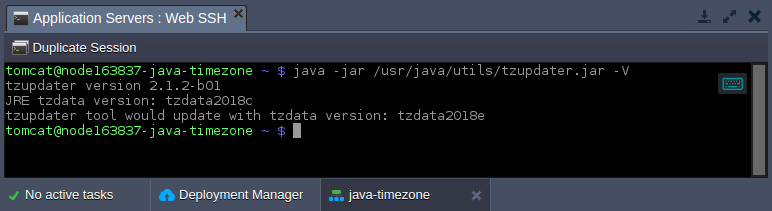

</div>

3. If you’ve observed the corresponding package in the chosen container is outdated, you can update the timezone information using the embedded **TZUpdater** tool:

```bash
java -jar /usr/java/utils/tzupdater.jar -u
```

<div style={{
    display:'flex',
    justifyContent: 'center',
    margin: '0 0 1rem 0'
}}>

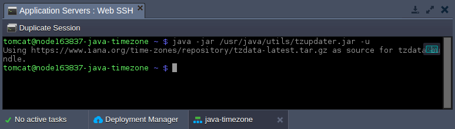

</div>

As you can see, getting the latest timezone package version for Java-powered server is a really simple operation with the platform.

## Changing Timezone Java

Now, let’s discover how to check and change the application server’s local time - we’ll consider this on the example of a _Tomcat 9_ server.

1. Let’s set the current timestamp to be shown at the server start page - this will help to quickly ensure that new timezone settings have been successfully applied and are relevant for now.

For that, paste the code below instead of the **/opt/tomcat/webapps/ROOT/index.jsp** file default content (the easiest way is to use the inbuilt [File Manager](https://cloudmydc.com/) for that).

```bash
<%@page import="java.util.*"%>
<html>
   <head>
       <title>TZ Page</title>
   </head>
   <body>
       <%=new Date(System.currentTimeMillis()).toString()%>
   </body>
</html>
```

<div style={{
    display:'flex',
    justifyContent: 'center',
    margin: '0 0 1rem 0'
}}>

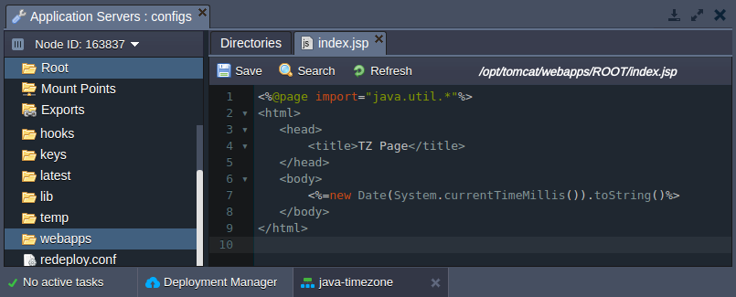

</div>

2. **Save** the changes and **Open** your environment **in browser** with the corresponding button to see the current server time, like:

<div style={{
    display:'flex',
    justifyContent: 'center',
    margin: '0 0 1rem 0'
}}>

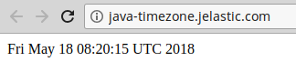

</div>

3. In order to change the actual timezone for a particular server, perform the following:

- for **Tomcat**, **TomEE**, **Payara**, **Spring Boot** and **Jetty**

Switch to the **_variables.conf_** configuration file and add the **_-Duser.timezone_** variable with the [required zone](https://cloudmydc.com/) as a value, for example:

_-Duser.timezone=US/Pacific_

:::tip Note

Depending on a particular application server used, the location of this file may vary:

- Tomcat 7, 8, 9, TomEE - _/opt/tomcat/conf/variables.conf_
- Jetty 9 - _/opt/jetty/etc/variables.conf_
- Payara 4, 5 - _/opt/payara/glassfish/domains/domain1/config/variables.conf_
- Spring Boot 1, 2 - _/opt/shared/conf/variables.conf_

:::

<div style={{
    display:'flex',
    justifyContent: 'center',
    margin: '0 0 1rem 0'
}}>

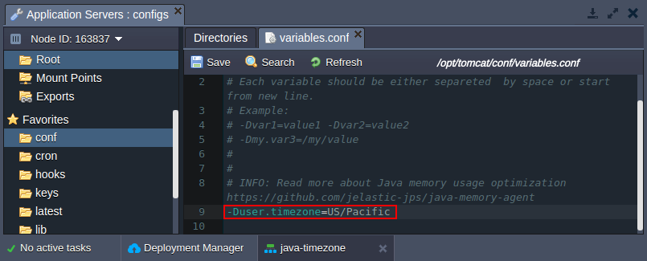

</div>

- for **GlassFish** Access the GF admin panel, go to the _Configurations > gfcluster-config_ (or _server-config_ for GF 4) > _JVM Settings > JVM Options_ section and click the **Add JVM Option** button. Paste the corresponding string (e.g. _-Duser.timezone=US/Pacific_) within the appeared input field:

<div style={{
    display:'flex',
    justifyContent: 'center',
    margin: '0 0 1rem 0'
}}>

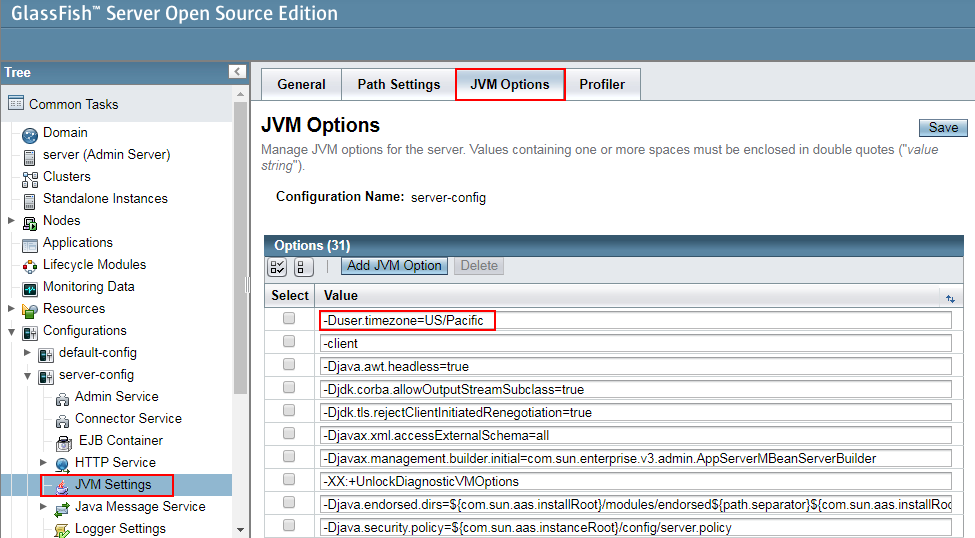

</div>

- for **WildFly** Switch to the **_/opt/wildfly/bin/standalone.conf_** file (or, if a server was [scaled horizontally](https://cloudmydc.com/), refer to the **_/opt/wildfly/bin/domain.conf_** config) and declare the corresponding variable using the following format: _export JAVA_OPTS="-Duser.timezone=US/Pacific"_

<div style={{
    display:'flex',
    justifyContent: 'center',
    margin: '0 0 1rem 0'
}}>

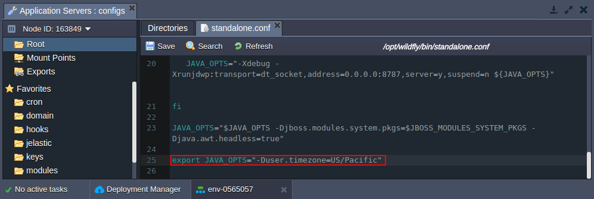

</div>

**Save** the made adjustment and **Restart** your application server in order to apply new settings.

4. Now, just refresh the server start page or click **Open in Browser** again to see the updated local time:

<div style={{
    display:'flex',
    justifyContent: 'center',
    margin: '0 0 1rem 0'
}}>

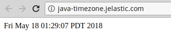

</div>

Great, new rules were applied successfully. In such a way, you can set any desired time location for your server without any problems, in a matter of minutes.

## Timezone Rules for PHP

Managing of the timezone settings at the platform PHP application servers (_Apache_ and _NGINX_) is performed within the **[date]** section of the main PHP configuration file - **_php.ini_**.

To access it, you need to click the **Config** button next to the required node. In the opened tab, locate the appropriate file within the file tree (or use the shortcut in the _Favorites_ list to the left) and find the above-mentioned section:

<div style={{
    display:'flex',
    justifyContent: 'center',
    margin: '0 0 1rem 0'
}}>

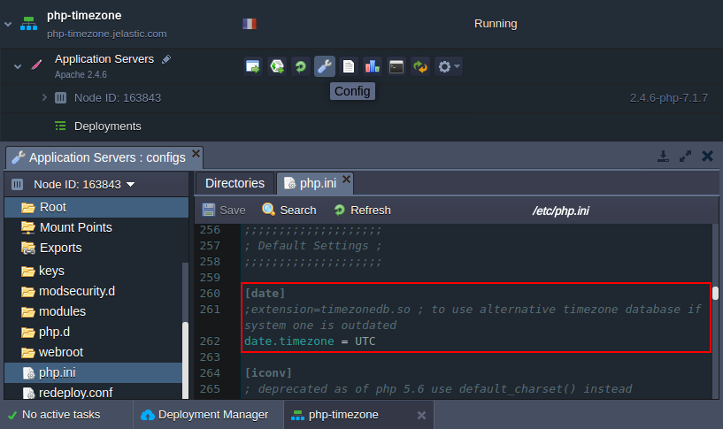

</div>

As you can see, this section comprises two options, which can be used to:

- [get the latest timezone data](https://cloudmydc.com/)
- [set custom timezone](https://cloudmydc.com/)

## Checking Timezone Data

The first setting allows you to use the alternative external timezone database (namely - the [Olson](https://cloudmydc.com/) one) in case the internal one is outdated.

<div style={{
    display:'flex',
    justifyContent: 'center',
    margin: '0 0 1rem 0'
}}>

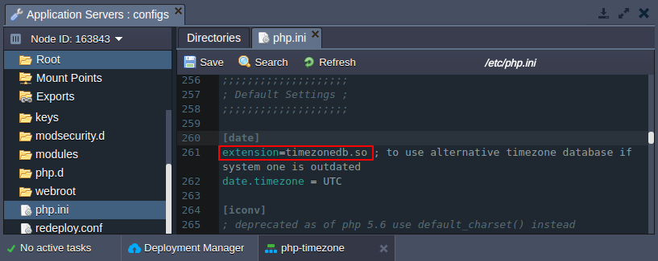

</div>

For that, simply uncomment the appropriate extension through removing the first semicolon symbol, **Save** the made alteration and **Restart** your app server.

Now, if you click **Open in browser** and scroll until the **_date_** section of the opened _phpinfo()_ page, you’ll see the latest timezone package version listed, with the denotation the external DB is used:

<div style={{
    display:'flex',
    justifyContent: 'center',
    margin: '0 0 1rem 0'
}}>

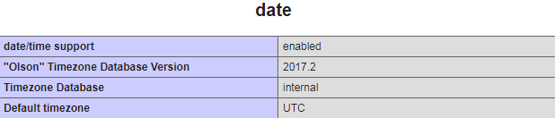

</div>

## Changing Timezone PHP

The second option in the **_[date]_** section is intended for defining the current timezone location (by default it points to the _UTC_ zone) of a node. For showing this on a real example, we’ll modify the default server’s start page (the **_/var/www/webroot/ROOT/index.php_** file) with the following code:

```bash
<?php
echo date("h:i:sa");
?>
```

<div style={{
    display:'flex',
    justifyContent: 'center',
    margin: '0 0 1rem 0'
}}>

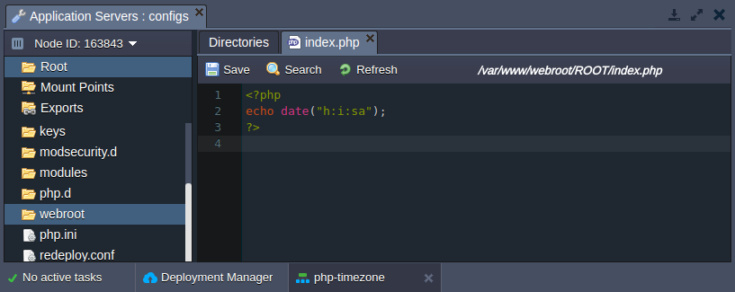

</div>

Now, if **Saving** the updated file and clicking **Open in browser**, you’ll see the timestamp output:

<div style={{
    display:'flex',
    justifyContent: 'center',
    margin: '0 0 1rem 0'
}}>

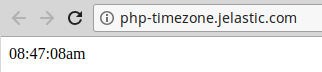

</div>

Return to the platform dashboard and specify the desired [timezone](https://cloudmydc.com/) as a value for the _date.timezone_ parameter within the **_php.ini_** file (e.g. _Australia/Sydney_ in our case).

<div style={{
    display:'flex',
    justifyContent: 'center',
    margin: '0 0 1rem 0'
}}>

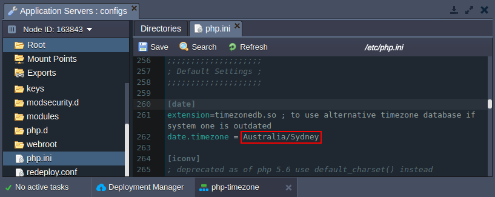

</div>

Again, **Save** your new configurations, **Restart** the corresponding PHP compute node and refresh the page with current time shown:

<div style={{
    display:'flex',
    justifyContent: 'center',
    margin: '0 0 1rem 0'
}}>

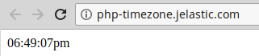

</div>

That’s it! As you can see, the timezone was successfully changed and now corresponds to a required location.
