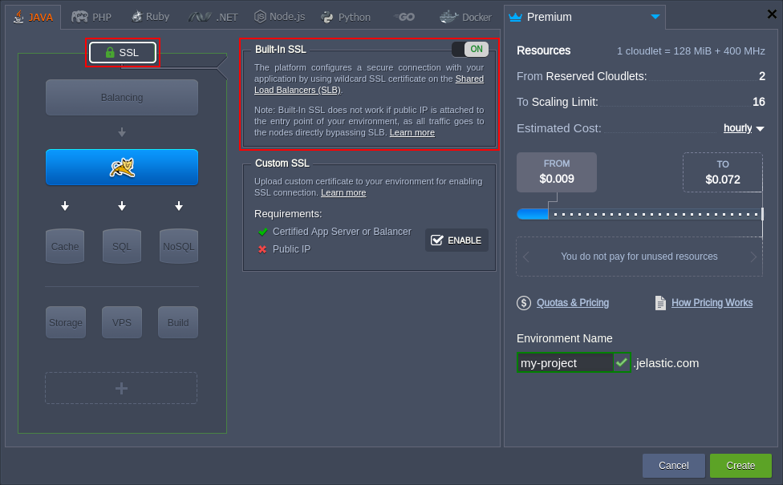

## Built-In SSL Certificates

**Built-in wildcard SSL** by the platform is an excellent solution for those who are searching for a quick and reliable way to secure their website.

The built-in SSL certificate (can be referred to as **_{hosterName} SSL_** in the dashboard) offers:

- **Convenient Management** - configured and working SSL with a single click in the topology wizard
- **Fast Validation** - domain level verification, including your site check and security seal issuing, is performed in a matter of minutes
- **Enterprise-Level Data Encryption** - the strength provided by built-in SSL certificates makes your customers feel comfortable with their security

So, to get the **built-in SSL certificate**, perform the following simple steps:

1. Log into your platform dashboard and open the topology wizard through clicking the **New Environment** button at the top-left corner (or by selecting the **Change Environment Topology** icon next to the existing environment).

2. In the opened topology wizard, [set up your environment](/docs/EnvironmentManagement/Setting%20Up%20Environment) up to your needs, then switch to the **SSL** section at the top-left part of the frame and enable the built-in SSL with the appropriate switcher.

:::danger note

Built-in SSL is not compatible with [public IP](/docs/ApplicationSetting/External%20Access%20To%20Applications/Public%20IP) address attached to your servers and is applied to the specified environment name domain only (e.g. my-project.jelastic.com for the image above).

:::

To initiate your environment installation, click the **Create** button (or **Apply** to adjust the existing one).

Now, upon clicking the **Open in Browser** button for this environment, you’ll see that communication with it is performed over the **HTTPS** protocol.
