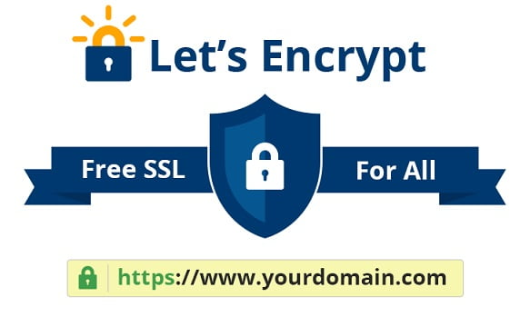
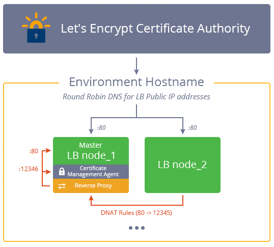
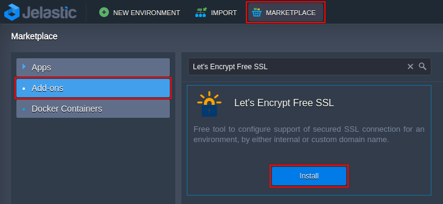
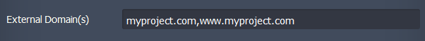
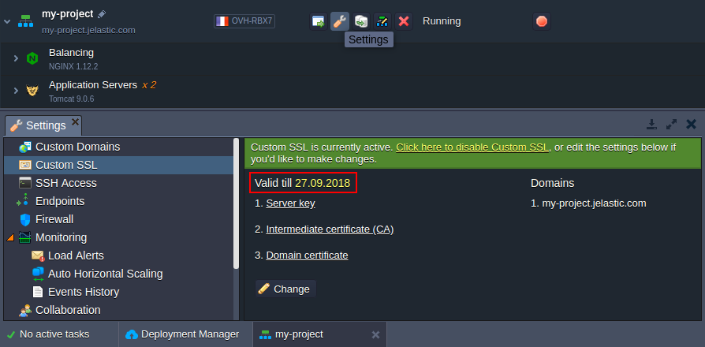
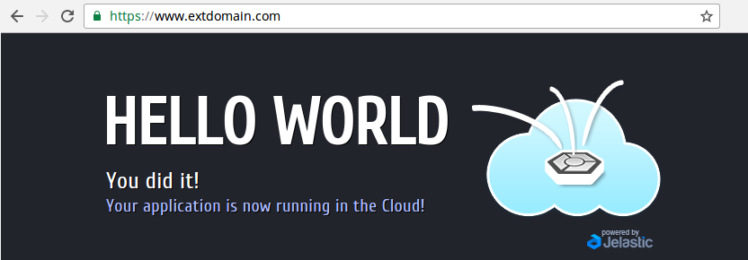
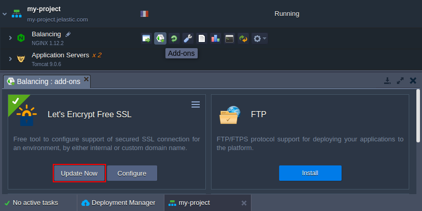
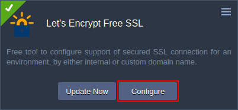
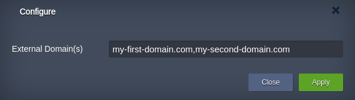
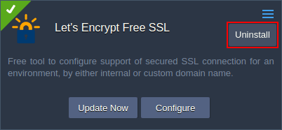

## Free Let’s Encrypt SSL Certificates: Out-of-Box Integration with the Most Popular Software Stacks

One of the key issues we should deal with while hosting production applications is to ensure its security. The very basic and commonly used approach for secure data exchange is encrypting the application traffic with HTTPS protocol.

Besides that, starting from January 1th, 2017 one of the most popular browsers - Google Chrome - have started marking all web-pages, that request specifying password or credit card details and aren’t secured with SSL, as non-secure. Such novelty makes the encryption integration even more essential.

However, issuing and configuring custom SSL certificate for a project can be a rather complicated and time-consuming task. [**Let's Encrypt**](https://cloudmydc.com/) (LE) is a free and open certificate authority, that allows to greatly simplify and automate the process of the trusted SSL certificates integration.

A general trend of moving Web to HTTPS implies the complete automation of custom SSL certificates issuing and appliance. Thus, Jelastic developers have made a great job on packaging Let's Encrypt service with [Cloud Scripting](https://cloudmydc.com/), to implement a solution that allows getting rid of carrying out regular certificates renewal.

The key advantage of this solution is a unique out-of-box integration with the most popular load balancer and application server stacks. In such a way, it gives a possibility to freely secure the majority of existing applications that are run in Jelastic.

Being provisioned as an add-on, this solution can be easily installed on top of any container with the [Custom SSL](http://localhost:3000/docs/ApplicationSetting/SSL/Custom%20SSL) support enabled, namely the following servers (the list is constantly extended):

- Load Balancers - NGINX, Apache LB, HAProxy, Varnish
- Java application servers - Tomcat, TomEE, GlassFish, Payara, Jetty
- PHP application servers - Apache PHP, NGINX PHP
- Ruby application servers - Apache Ruby, NGINX Ruby

If you require Let's Encrypt SSL for any other stack, just add a load balancer in front of your application servers and install the add-on. SSL termination at load balancing level is used by default in clustered topologies.

## How It Works

During the installation, the add-on downloads and configures Let's Encrypt client (so-called certificate management agent (CMA)), requests certificates from Let's Encrypt Certificate Authority (CA), applies issued certificates to running software stack according to its SSL integration specifics and adds a special cron job to initiate certificates update when the expiration date is close.

## Domain Control Validation

Upon the certificates issuing request, Let's Encrypt CA [checks the entry point](https://cloudmydc.com/) of the environment at _80_ port in order to prove that the given web-server controls the specified domains. Herewith, during the domain validation process, all incoming HTTP traffic will be internally routed to the custom _12345_ port where the corresponding CMA proxy is run.

In case a layer contains several same-type nodes, during the update period all incoming HTTP traffic will be additionally routed to the master node where the CMA proxy is run. This is achieved by setting special temporary DNAT routing rules so the domain validation request can be handled by the CMA.

Since such redirection is required only during domain validation, these special DNAT settings will be removed just after the hostname correspondence is confirmed.

After successful domain validation, CMA gets the ability to request, renew and revoke SSL certificates for specified domains, so it will automatically generate the appropriate SSL key pair. As a result, the issued certificates will be propagated to all nodes within the entry point layer via Jelastic API so the application will be properly configured for the further work via HTTPS.

Despite the long description, all of these operations are handled just in a matter of minutes. Now, let’s find out how to actually initiate the Let's Encrypt add-on installation.

## Let's Encrypt SSL Add-On Installation

To get SSL certificate for the environment hostname, perform the following:

1. Log into Jelastic dashboard and click [**Marketplace**](https://cloudmydc.com/) at the top of a page. Within the opened frame switch to the **Add-ons** tab and find the _Let's Encrypt Free SSL_ package.

:::tip

Alternatively you can Import the manifest.jps file from the appropriate Let's Encrypt add-on repository:
https://github.com/jelastic-jps/lets-encrypt/blob/master/manifest.jpsImporting add-on via JPS tab allows providing customization on a fly.

:::

Click **Install** to proceed.

2. After the required data is fetched, you’ll see the _Let's Encrypt SSL_ add-on installation window.

Here, you need to:

- provide **_External Domain(s)_** of the target environment, the possible options are:
  - leave the field blank to create a dummy SSL certificate, assigned to environment internal URL (_env_name.{[hoster_domain](https://cloudmydc.com/)}_), for being used in testing
  - insert the preliminary linked external domain(s) to get a trusted certificate for each of them; if specifying multiple hostnames, separate them with either space, comma, or semicolon

- select the corresponding **_Environment name_** within the expandable drop-down list
- select a _Nodes_ layer with your environment entry point (usually, it’s automatically detected and fetched by the add-on, but can be redefined manually)

Finally, click on **Install** to initiate installation of the appropriate SSL certificate(s).

:::tip Note

that the add-on requires [public IP](http://localhost:3000/docs/ApplicationSetting/External%20Access%20To%20Applications/Public%20IP) address for proper work. So in case, the environment entry point does not have such, it will be automatically attached during installation (be aware that Public IP is a paid option - the cost can be found within the [Quotas & Pricing](http://localhost:3000/docs/Account&Pricing/Resource%20Charging/Pricing%20FAQ#how-much-do-resources-cost) frame).

:::

3. The installation process may take up to several minutes in order to validate domain name ownage, issue certificates by Let's Encrypt and apply them.

When finished, you can access the environment **Settings > Custom SSL** section to check that the HTTPS support is active and find the certificate expiration date.

4. Also you can ensure everything works like intended by trying to open the application over _HTTPS_:

As you can see, the environment is accessible and the established connection is secure and browser-trusted.

## Add-On Installation via API

Alternatively add-on can be installed with Jelastic [API method install](https://cloudmydc.com/). Api call looks like:

\*https://[[hoster-api-host](https://cloudmydc.com/)]/1.0/marketplace/jps/rest/install?jps=letsencrypt-ssl-addon&session={**_session_**}&envName={**_your_env_name_**}&nodeGroup={**_your_node_group_**}&settings={**_your_addon_settings_**}\*

where:

**{session}** - user’s session or [authentication token ](https://cloudmydc.com/)

**{your_env_name}** - name of the target environment

**{your_node_group}** - unique identifier of the [nodeGroup](https://cloudmydc.com/)

**{your_addon_settings}** - list of add-on specific settings in JSON format (key:value pairs)

Available settings:

- **customDomains** - linked external domain(s) to get a trusted certificate for each of them; if specifying multiple hostnames, separate them with either comma or semicolon. Leave blank to create a dummy X1 SSL certificate, assigned to environment internal domain
- **nodeGroup** [*optional*] - environment node group where add-on must be installed. Defaults to: add-on’s nodeGroup
- **nodeId** [*optional*] - particular environment node where add-on cloud be installed
- **webroot** [*optional*] - use _“webroot”_ method instead of _“standalone”_ for domain validation by Let’s Encrypt certificate authority. Defaults to: **_false_**
- **webrootPath** [*optional*] - a directory (“web root”) containing the files served by your webserver to validate a domain (only applicable if “webroot=true”)
- **fallbackToX1** [*optional*] - obtain a test certificate from a staging server if issuing a trusted X3 certificate fails. Defaults to: **_false_**
- **deployHook** [*optional*] - a link or a body of script to invoke after obtaining a certificate
- **deployHookType** [*optional*] - **_bash_** or **_js_** (only applicable if deployHook parameter is not empty). Defaults to: **_js_**
- **undeployHook** [*optional*] - a link or a body of script to invoke after uninstalling add-on
- **undeployHookType** [*optional*]: **_bash_** or **_js_** (only applicable if undeployHook parameter is not empty). Defaults to: **js**
- **test** [*optional*] - obtain a dummy X1 certificate from a staging server. Defaults to: false
  For example:

**_curl -X POST 'https://app.demo.jelastic.com/1.0/marketplace/jps/rest/install' -d session=dedb4acdedb4acdedb4ac4dedb4ace370e0b03 -d jps=letsencrypt-ssl-addon -d envName=application -d nodeGroup=cp --data-urlencode settings='{"customDomains":"application.mycustom-domain.com"}'_**

## Let's Encrypt Certificates Update

Your Let's Encrypt SSL certificate(s) will remain valid for 90 days. After this period expires, they need to be renewed for the encryption to remain active.

By default, the required updated SSL certificates are requested and applied automatically 30 days before expiration (you'll get the appropriate email notification). Such a checkup is performed once per day based on the appropriate cron job. If needed, the exact time can be specified through adjusting the corresponding "cronTime": "\*_0 ${fn.random(1,6)}_ \* \* \*" setting within this package manifest file.

Also, this operation can be performed manually at any time. For that, click the **Add-ons** button next to the appropriate environment layer and use the **Update Now** button within add-on panel.

Also, your SSL certificates can be updated by add-on re-installation for the same domain name(s). Herewith, adding new or specifying different domain name(s) during this procedure will cause the complete replacement of used certificates.

## Certificates Update via API

Similar to Add-On installation the certificate can be forced to update via API call with method executeappaction:

\*https://[[hoster-api-host](https://cloudmydc.com/)]/1.0/marketplace/jps/rest/executeappaction?session=**_{session}_**&appUniqueName=**_{app_unique_name}_**&action=update\*

where:

- **{session}**- user’s session or authentication token
- **{app_unique_name}**- unique name of the installed add-on. Could be found as the value of the **_uniqueName_** key in the response of [GetEnvInfo](https://cloudmydc.com/) method.

For example:

**_curl -X POST_**
**_'https://app.demo.jelastic.com/1.0/marketplace/jps/rest/executeappaction' -d session=dedb4acdedb4acdedb4ac4dedb4ace370e0b03 -d appUniqueName=f56f5659-f4ff-42fd-8955-1f9a750abcd9 -d action=update_**

## Let's Encrypt Certificates Reconfiguration

In case of necessity, the already existing **Let’s Encrypt Free SSL** add-on can be adjusted to match new requirements. Just click the **Configure** button within Let’s Encrypt panel.

Then in the popup, you can change the _External Domain(s)_ or remove any of the listed (e.g. if you faced the issues with assigning SSL certificate to them).

:::tip Note

To avoid security issues, a new certificate will be issued, even in case of removing domain name(s) from the existing one.

:::

## Let’s Encrypt Certificates Reconfiguration via API

\*https://[[hoster-api-host](https://cloudmydc.com/)]/1.0/marketplace/jps/rest/executeappaction?session={session}&appUniqueName=**_{app_unique_name}_**&action=configure&params={"customDomains":"**_{your_new_domain_list}_**"}

- where:

* **{session} **- user’s session or authentication token
* **{app_unique_name}** - unique name of the installed add-on. Could be found as the value of the **_uniqueName_** key in the response of [GetEnvInfo](https://cloudmydc.com/) method
* **{your_new_domain_list}** - new list of linked external domain(s) to get a SSL certificate for each of them; if specifying multiple hostnames, separate them with either comma or semicolon

Example:

**_curl -X POST_**

**_'https://app.demo.jelastic.com/1.0/marketplace/jps/rest/executeappaction' -d session=dedb4acdedb4acdedb4ac4dedb4ace370e0b03 -d appUniqueName=f56f5659-f4ff-42fd-8955-1f9a750abcd9 -d action=configure --data-urlencode params='{"customDomains":"sub.example.com"}':_**

## Let's Encrypt SSL Add-On Removal

If necessary, the Let's _Encrypt SSL_ add-on can be easily removed from your environment. Just go to the **Add-ons** tab, expand the options list in the top-right corner of the _Let's Encrypt SSL_ plank and select **Uninstall**:

After confirmation, the add-on will be removed and attached certificates will be deactivated.

That’s it! Now you know how to install and manage Let's Encrypt add-on for automatic custom SSL configuration of your environment so you can protect almost any application in no time, completely for free and without hardly any efforts. Get started now at one of the [Jelastic PaaS service providers](https://cloudmydc.com/).
