!Content Code

## Auto-Clustering of Instances via Topology Wizard

The platform provides an on-demand automatic clusterization for some of the managed templates. Such automation significantly simplifies and speeds up the creation of a reliable production-ready cluster for your project.

Below, we’ll consider the following points:

- [supported stacks](https://cloudmydc.com/) (with clusterization specifics)
- [auto-clustering management](https://cloudmydc.com/)
- [cloud scripting usage](https://cloudmydc.com/)

## Templates with Supported Auto-Clustering

Currently, the following templates support the newly added clustering feature (with even more stacks to be added in the future):

- **application servers** - [_Tomcat/TomEE, GlassFish, Payara, Jenkins, WildFly_](https://cloudmydc.com/)
- **SQL databases** - [_MySQL, MariaDB, Percona, PostgreSQL_](https://cloudmydc.com/)
- **NoSQL database**- [_Couchbase, MongoDB, Redis, OpenSearch_](https://cloudmydc.com/)
- **storage server** - [_Shared Storage Container_](https://cloudmydc.com/)

:::tip

Your particular service hosting provider can configure and implement auto-clustering for some additional stacks, which are not defined in the list.

:::

## Tomcat/TomEE

A highly available Tomcat/TomEE cluster that can balance the load across compute nodes to enhance performance and resilience. The implementation provides session replication, context attribute replication, and cluster-wide WAR file deployment.

:::danger note

The **Auto-Clustering** feature for Tomcat and TomEE is available since the following stack versions:

- **Tomcat** - _10.0.5; 9.0.45; 8.5.64; 7.0.108_
- **TomEE** - _9.0.0-M3; 8.0.5_

:::

<div style={{
    display:'flex',
    justifyContent: 'center',
    margin: '0 0 1rem 0'
}}>


</div>

[Learn More »](https://cloudmydc.com/)

## GlassFish

Interconnection of the GlassFish servers with pre-configured session replication and load balancing.

<div style={{
    display:'flex',
    justifyContent: 'center',
    margin: '0 0 1rem 0'
}}>

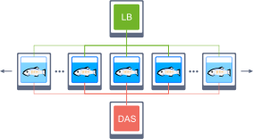

</div>

[Learn More »](https://cloudmydc.com/)

## Payara

Interconnection of the Payara servers with pre-configured session replication and load balancing.

<div style={{
    display:'flex',
    justifyContent: 'center',
    margin: '0 0 1rem 0'
}}>

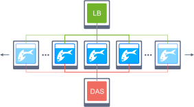

</div>

[Learn More »](https://cloudmydc.com/)

## Jenkins

A master Jenkins node in the master-slave mode with auto-scalable Java Engine workers and pre-installed plugins to support building and deployment automation for organizing continuous integration (CI) and continuous delivery (CD) pipelines.

<div style={{
    display:'flex',
    justifyContent: 'center',
    margin: '0 0 1rem 0'
}}>

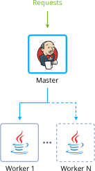

</div>

[Learn More »](https://cloudmydc.com/)

## WildFly

WildFly nodes in _Domain Mode_ with enabled clustering to get high availability and guarantee the continuous performance of a deployed Java EE application.

<div style={{
    display:'flex',
    justifyContent: 'center',
    margin: '0 0 1rem 0'
}}>


</div>

[Learn More »](https://cloudmydc.com/)

## MySQL

_Auto-Clustering is provided for the 5.7.x and 8.x MySQL versions only._

Automatic clusterization of the databases with pre-configured replication and auto-discovery of the nodes.

Based on your requirements, you can select **_Scheme_** of the following types:

- **Primary-Primary** with Extra Secondaries

Pre-configured replication with two interconnected primary databases. During the horizontal scaling, the cluster is extended with additional secondary nodes.

<div style={{
    display:'flex',
    justifyContent: 'center',
    margin: '0 0 1rem 0'
}}>

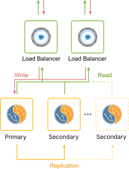

</div>

- **Primary-Secondary** with Extra Secondaries
  Pre-configured replication with one primary and one secondary database. During the horizontal scaling, the cluster is extended with additional secondary nodes.

<div style={{
    display:'flex',
    justifyContent: 'center',
    margin: '0 0 1rem 0'
}}>

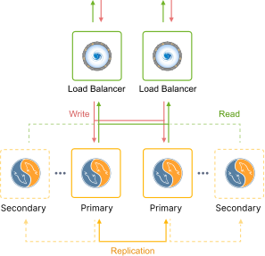

</div>
[Learn More »](https://cloudmydc.com/)

## MariaDB

_Auto-Clustering is provided for the 10.x MariaDB versions only._

Automatic clusterization of the databases with pre-configured replication and auto-discovery of the nodes.

Based on your requirements, you can select **Scheme** of the following types:

- Primary-Primary with Extra Secondaries
  Pre-configured replication with two interconnected primary databases. During the horizontal scaling, the cluster is extended with additional secondary nodes.

<div style={{
    display:'flex',
    justifyContent: 'center',
    margin: '0 0 1rem 0'
}}>

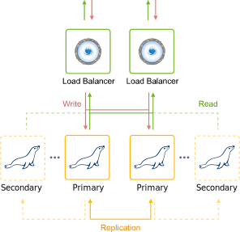

</div>

- Primary-Secondary with Extra Secondaries
  Pre-configured replication with one primary and one secondary database. During the horizontal scaling, the cluster is extended with additional secondary nodes.

<div style={{
    display:'flex',
    justifyContent: 'center',
    margin: '0 0 1rem 0'
}}>

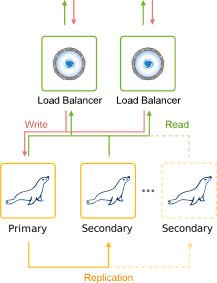

</div>

- Galera Cluster
  All servers can accept updates even if being issued concurrently.

<div style={{
    display:'flex',
    justifyContent: 'center',
    margin: '0 0 1rem 0'
}}>

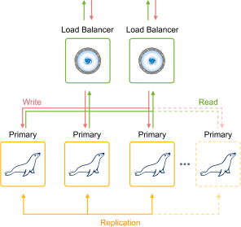

</div>

[Learn More »](https://cloudmydc.com/)

## Percona

Automatic clusterization of the databases with pre-configured replication and auto-discovery of the nodes.

Based on your requirements, you can select **Scheme** of the following types:

- **Primary-Primary** with Extra Secondaries
  Pre-configured replication with two interconnected primary databases. During the horizontal scaling, the cluster is extended with additional secondary nodes.

<div style={{
    display:'flex',
    justifyContent: 'center',
    margin: '0 0 1rem 0'
}}>


</div>

- **Primary-Secondary** with Extra Secondaries
  Pre-configured replication with one primary and one secondary database. During the horizontal scaling, the cluster is extended with additional secondary nodes.

<div style={{
    display:'flex',
    justifyContent: 'center',
    margin: '0 0 1rem 0'
}}>

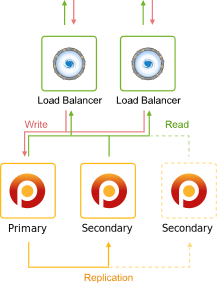

</div>

## XtraDB Cluster

A database clustering solution that ensures high availability, prevents downtime and data loss, and provides linear scalability for a growing environment.

<div style={{
    display:'flex',
    justifyContent: 'center',
    margin: '0 0 1rem 0'
}}>

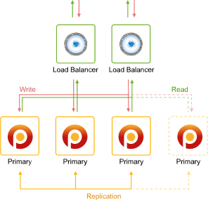

</div>

[Learn More »](https://cloudmydc.com/)

## PostgreSQL

Pre-configured PostgreSQL database cluster with asynchronous primary-secondary replication and automatic addition of the new nodes into the cluster (as secondaries).

<div style={{
    display:'flex',
    justifyContent: 'center',
    margin: '0 0 1rem 0'
}}>


</div>

[Learn More »](https://cloudmydc.com/)

## Couchbase

Automatically interconnected Couchbase servers with the pre-configured auto-scaling and rebalancing to provide a single highly available data storing system.

<div style={{
    display:'flex',
    justifyContent: 'center',
    margin: '0 0 1rem 0'
}}>


</div>

[Learn More »](https://cloudmydc.com/)

## MongoDB

Automatic configuration of a highly-available and reliable MongoDB replica set with auto-discovery of the new nodes.

<div style={{
    display:'flex',
    justifyContent: 'center',
    margin: '0 0 1rem 0'
}}>

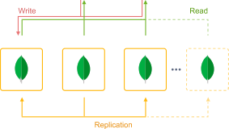

</div>

[Learn More »](https://cloudmydc.com/)

## Redis

Automatization for a distributed implementation of Redis Cluster - an open-source, in-memory data structure store. It is usually used for caching, data storing, as a message broker, and for other tasks. The provided topology consists of at least three Primary servers, each with a Secondary node to ensure the read load distribution and auto-recovery if the Primary goes down.

<div style={{
    display:'flex',
    justifyContent: 'center',
    margin: '0 0 1rem 0'
}}>

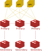

</div>

[Learn More »](https://cloudmydc.com/)

## OpenSearch

Automatic clusterization of a community-driven, open-source search engine that provides a distributed, multitenant-capable full-text search. Solution provides built-in settings to add the _OpenSearch Dashboards_ for data visualization and _Logstash_ for processing logs.

<div style={{
    display:'flex',
    justifyContent: 'center',
    margin: '0 0 1rem 0'
}}>


</div>

[Learn More »](https://cloudmydc.com/)

## Shared Storage Container

Automatically configured, reliable storage cluster (replicated volume) based on the [Gluster](https://cloudmydc.com/) solution, which ensures data safety. In case of failure of one or several nodes, the _AutoFS_ client automatically switches to the working instances, providing storage high-availability.

<div style={{
    display:'flex',
    justifyContent: 'center',
    margin: '0 0 1rem 0'
}}>


</div>

[Learn More »](https://cloudmydc.com/)

## Auto-Clustering Management

1. The **Auto-Clustering** feature can be enabled for the node group through the same-named switcher in the central part of the topology wizard (if available for the [selected stack](https://cloudmydc.com/)).

<div style={{
    display:'flex',
    justifyContent: 'center',
    margin: '0 0 1rem 0'
}}>


</div>

:::tip

Based on the specific implementation, the **_Auto-Clustering_** option can be:

- mandatory enabled (e.g. for the _Couchbase database_)

<div style={{
    display:'flex',
    justifyContent: 'center',
    margin: '0 0 1rem 0'
}}>


</div>

- provided with some additional settings (e.g. cluster scheme and ProxySQL load balancer for the _MySQL_ database)

<div style={{
    display:'flex',
    justifyContent: 'center',
    margin: '0 0 1rem 0'
}}>


</div>

- restricted by the minimum/maximum nodes count and/or scaling mode (e.g for the _MariaDB_ Galera type)

<div style={{
    display:'flex',
    justifyContent: 'center',
    margin: '0 0 1rem 0'
}}>


</div>

:::

2. Herewith, to get additional information on the cluster to be created, you can hover over the question mark next to the switcher. Within the appropriate pop-up frame, you can find a short description, which is usually supplemented with a topology scheme and a link to the more detailed overview.

<div style={{
    display:'flex',
    justifyContent: 'center',
    margin: '0 0 1rem 0'
}}>


</div>

:::tip

Additional info on the various database cluster types can be viewed by hovering over the appropriate **Scheme**:

<div style={{
    display:'flex',
    justifyContent: 'center',
    margin: '0 0 1rem 0'
}}>


</div>

:::

3. The other settings can be [configured](https://cloudmydc.com/) just as for any regular environment.

<div style={{
    display:'flex',
    justifyContent: 'center',
    margin: '0 0 1rem 0'
}}>


</div>

:::danger note

After being configured, auto-clustering cannot be disabled from the topology wizard.

:::

4. If needed, you can track the cluster configuration logs via the platform console:

https://app.{platformDomain}/console

<div style={{
    display:'flex',
    justifyContent: 'center',
    margin: '0 0 1rem 0'
}}>


</div>

For example, you can use this info for debugging while developing packaged solutions with Cloud Scripting, which utilize the auto-clustering feature.

## Setting Up Auto-Clusterization with Cloud Scripting

In order to define auto-clustering settings in your [JPS solutions](https://cloudmydc.com/), a new **_cluster_** property can be used. For example:

1. Enable or disable auto-clustering for the specific layer.

```bash
"nodeGroup": "couchbase",
"cluster": true | false
```

2. Additional parameters for auto-clustering can be provided in the following way (for example, can be required to select a database cluster scheme):

```bash
"nodeGroup": "mysql",
"cluster": {
  "scheme": "master"
}
```

3. If needed, the default JPS manifest with the clusterization steps can be substituted with a custom one:

```bash
"nodeGroup": "mysql",
"cluster": {
 "jps": "http://.../custom-manifest.jps",
 "settings": {
   "scheme": "master"
 }
}
```

4. Based on the particular cluster requirements, some topology restrictions may be needed (e.g. the minimum/maximum number of nodes, scaling mode, etc.). It is implemented through the **_validation_** property.

Herewith, this parameter can be specified for any JPS package, e.g. check the YAML example below:

```bash
type: install
name: Validation
nodes:
 image: alpine
 nodeGroup: cp
 count: 2
 validation:
   minCount: 2
   maxCount: 3
   scalingMode: stateful
```

That’s it! Now, you can easily use the auto-clustering solutions supported by the platform, as well as all benefit from the implementation specifics.
