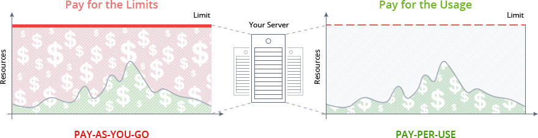
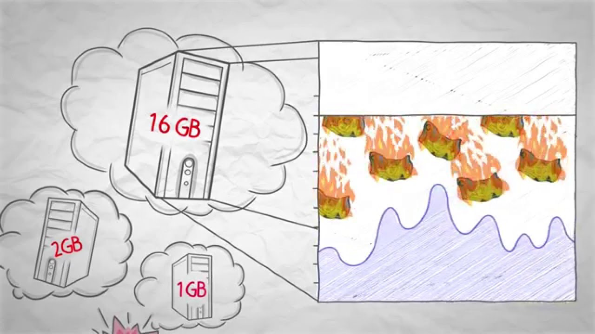
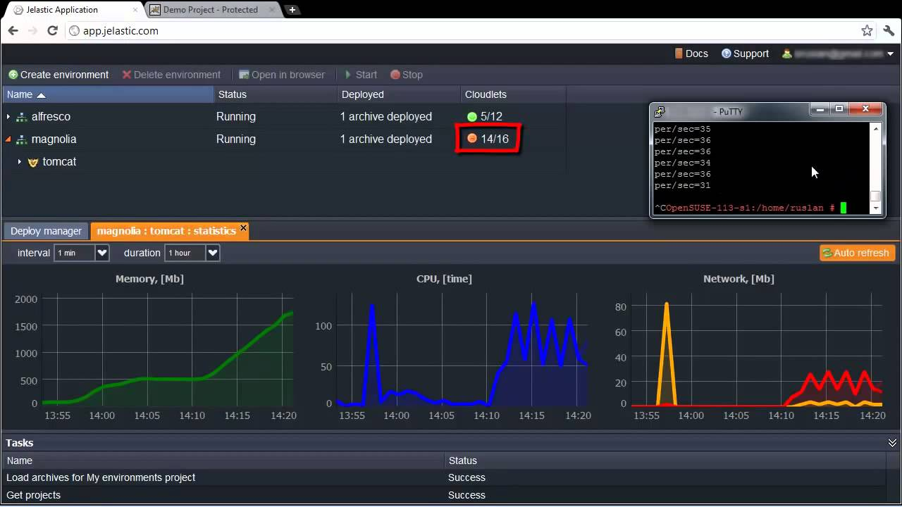
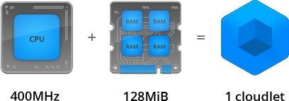

## Automatic Vertical Scaling

The platform is the only Cloud PaaS which can automatically **scale any application**, both vertically and [horizontally](/docs/ApplicationSetting/Scaling%20And%20Clustering/Automatic%20Horizontal%20Scaling), making hosting of your applications truly flexible.

**Automatic vertical scaling** is made possible by the platform’s ability to dynamically change the amount of allocated to server resources (RAM and CPU) according to its current demands, with no manual intervention required. This feature guarantees you never overpay for unused resources and saves your time due to eliminating the necessity of handling the load-related adjustments or architectural changes.

You simply decide the maximum limit you are ready to consume and the platform automatically defines the optimal amount of resources required for your app, tracking the incoming load in real time.

## How It Works

So, the key idea of automatic scaling is fairly simple - as soon as an application’s load grows, the platform simply makes additional resources available to it; and when the load goes down again, the resources get reduced by the platform automatically.

Herewith, the resources are allocated immediately without delays or negative impact on your application, which can be seen within the next video:

:::tip

The vertical scaling feature is applicable for any type of instance in environment (i.e. application server, database, load balancer, Docker container, Elastic VPS, cache instance and build node).

:::

As you could observe within the video above, the platform measures resources in special units called **cloudlets**, which provide you with a superior granularity while scaling. A [cloudlet](/docs/PlatformOverview/Cloudlet) is roughly equivalent to 128 MiB RAM and 400Mhz CPU core.

There are two types of cloudlets available: **reserved** and **dynamic**.

- The Reserved ones are used to define the amount of resources you expect your application will certainly consume and you pay for them irrespective of actual usage. However, they are charged with lower price compared with dynamic ones.

- Dynamic cloudlets defines the amount of resources your application can access, based on necessity. You pay for them only in the case of real consumption.

Automatic vertical scaling is performed within the confines of the stated dynamic cloudlets number. You are able to choose your scalability limits with the appropriate settings and, in such a way, effectively put caps on the budget you are ready to spend, preventing unexpected or high bills.

You can combine the usage of both cloudlet types in different ways, following the most suitable for you [pricing model](https://cloudmydc.com/).

## Adjusting Resource Limits

A newly created environment receives a certain amount of cloudlets. Resource consumption depends on the type and quantity of your software stacks. Upon being added to the environment, each stack receives the default number of allocated cloudlets according to the optimal resource amount, required for its proper workability.

Click to see default cloudlet values for some popular stacks.

If you would like to change these values and scale your environment, the maximum number of available resources (cloudlets) can be increased/decreased manually through the **Environment topology** wizard. For that, use the cloudlet sliders in the Vertical Scaling section of its central pane.

:::tip Note:

If changing the scaling limit (i.e. the number of the dynamic cloudlets) for the existing application server, database or cache nodes, the corresponding layer will be restarted. Herewith, the appropriate warning will be displayed directly in the topology wizard:

:::

You can use the automatically gathered [statistics](/docs/ApplicationSetting/Built-in%20Monitoring/Statistics) to check the consumption level for the last month and set the amount of resources according to it. And in the case your application becomes highly popular and a single server’s capacity is not enough, feel free to scale it horizontally by means of increasing the number of nodes [manually](/docs/ApplicationSetting/Scaling%20And%20Clustering/Horizontal%20Scaling) or configure a set of [triggers for automatic horizontal scaling](/docs/ApplicationSetting/Scaling%20And%20Clustering/Automatic%20Horizontal%20Scaling) of your application server.
