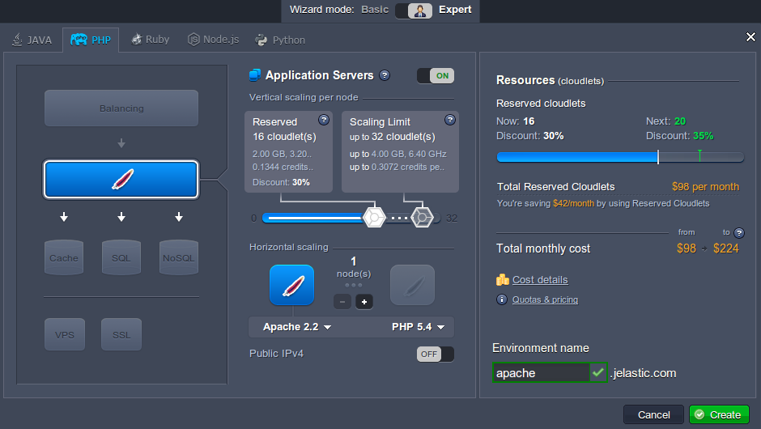
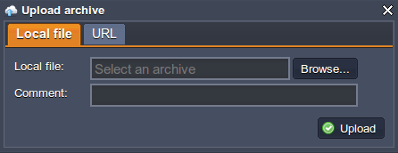
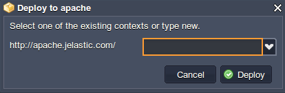
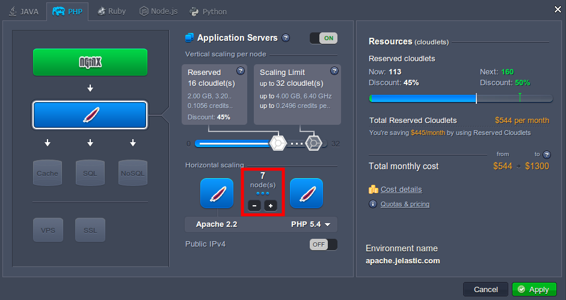

## Workaround of the Data Synchronization

If you need several PHP application servers in your environment, you can easily add them without worries about additional configurations.

The newly added instances can be synchronized with the first added node. To achieve this, you just need to follow the next workflow:

1. Log in to the platform dashboard.

2. Click **Create environment** to set up a new environment.

3. In the **Environment topology** window select one application server and other instances if you need any. Then type your environment name and click **Create**.

4. Upload your project using **Deployment Manager**.

5. Once the file is uploaded, select it in the list and click **Deploy to** drop-down menu. Choose the environment, where you want to deploy your application. In the opened window, specify the application’s target path (if you want to deploy several projects into one server). Click **Deploy**.

6. Your application will be deployed to the chosen environment in just a minute. After that you can make all necessary configurations.

7. Finally, scale your environment horizontally by adding the needed number of servers.

:::tip note

- You need to use file manager while deploying your application to achieve the effect of synchronization.
- No further data configurations and changes are synchronized, just the initial.
- Also, you can synchronize your data with a help of WebDav module. See the detailed information on activating and using [WebDav module](https://cloudmydc.com/) at the platform.
- If it is needed to synchronize something in already existing environment, you can scale it in to a single node and then up to a needed number of instances. Also, you can use WebDAV module or perform manual synchronization via [configuration manager](https://cloudmydc.com/).
- You can use the initial (master) node of the layer as your [storage server](https://cloudmydc.com/) for sharing data within the whole layer.

:::
