## Horizontal Scaling inside the Cloud: Multi Node

With the platform, hosting of your applications becomes truly flexible. In addition to [automatic vertical scaling](https://cloudmydc.com/), the platform also lets you increase/decrease the number of servers in your environment manually or [automatically](https://cloudmydc.com/).

The process of manual scaling is fairly simple - open the environment topology wizard and use the appropriate “**+**” and “**-**” buttons or type the required number in the central panel. Also, you can use the slider, which automatically appears upon making any adjustment.

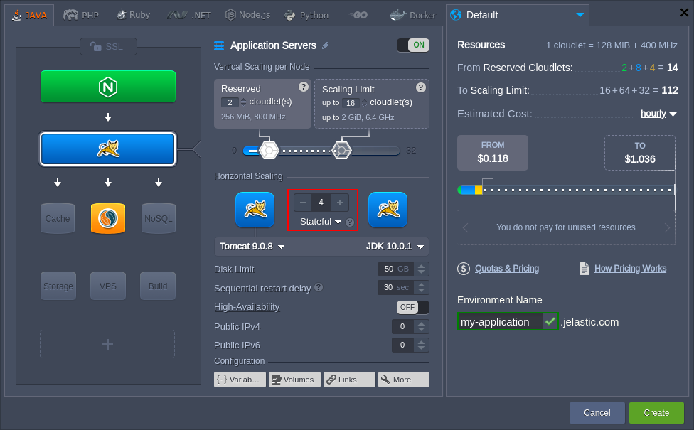

:::tip

- you can automate horizontal scaling based on incoming load with the help of [tunable triggers](https://cloudmydc.com/)
- you can use the initial (master) node of the layer as your [storage server](https://cloudmydc.com/) for sharing data within the whole layer
- in case of scaling in (i.e decreasing the nodes number), the last container added to the layer is the first one to be removed (unless it is [selected explicitly](https://cloudmydc.com/))

:::

Next, you can select the required [scaling mode](https://cloudmydc.com/) from the appropriate drop-down list. Also, for additional details refer to the [horizontal scaling specifics](https://cloudmydc.com/) section below.

## Scaling Modes

Starting with the 5.5 platform version, the preferred scaling mode can be selected for new environments during creation, as well as adjusted for the existing ones through the topology wizard:

- **_Stateless_** - simultaneously creates all new nodes from the base image template
- **_Stateful_** - sequentially copies file system of the master container into the new nodes

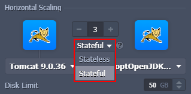

The first option is comparatively faster, while the second one automatically copies all custom configurations. Herewith, during the initial layer creation, all of the nodes are created simultaneously to speed up the process (even for the **_stateful_** mode, as no customization has been applied yet).

While using the **_stateless_** mode, be aware of the following features absence on the new nodes within the layer:

- **deployments** - the existing project contexts won’t be transferred
- **custom SSL** - SSL certificates and configs won’t be copied
- **mount points** - custom [mounts](https://cloudmydc.com/) will be moved only if the appropriate [volume](https://cloudmydc.com/) is configured
- **add-ons** - any [add-ons](https://cloudmydc.com/) installed on the layer won’t be available

:::danger tip

The transfer of custom files for the stateless mode can be done manually or configured via the [Cloud Scripting](https://cloudmydc.com/) automation (e.g. using the onBefore- and onAfterScaleOut events).

:::

Based on these peculiarities, the platform recommends (and applies by default) the **_stateful_** scaling mode for the _load balancer, application server_, and _VPS_ stacks. In case of necessity, you can manually redefine the scaling mode for your nodes at any time via topology wizard.

## Horizontal Scaling Specifics

The maximum number of the same-type servers within a single environment layer depends on a particular hosting provider settings (usually this limit stands for 16 nodes). You can check the exact value within the **_Quotas & Pricing > [Account Limits](https://www.CloudMyDc.com/application-platform-docs/quotas-system/)_** information frame.

All newly added servers are created at different hardware nodes, providing advanced reliability and high-availability.

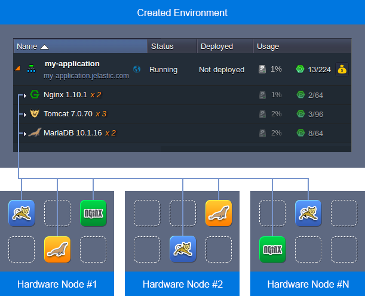

Each environment node group (layer) is provided with the dedicated name, which, if needed, can be manually adjusted. In case there are several instances inside, layer name will be complemented with the **_xN_** label (where **_N_** is the actual nodes number).

Having several same-type nodes within a layer enables their synchronous management. Thus, all containers can be simultaneously [configured](https://cloudmydc.com/), inspected for logs and statistics, [restarted or redeployed](https://cloudmydc.com/) through the corresponding icons.

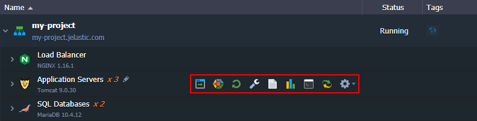

In order to operate with a particular container separately, expand the layer’s string to see the full list of its nodes. Each of these containers is an isolated instance, which has a unique **_Node ID_** and can be accessed/configured apart from others. Herewith, the layer master node can be easily located due to the dedicated icon.

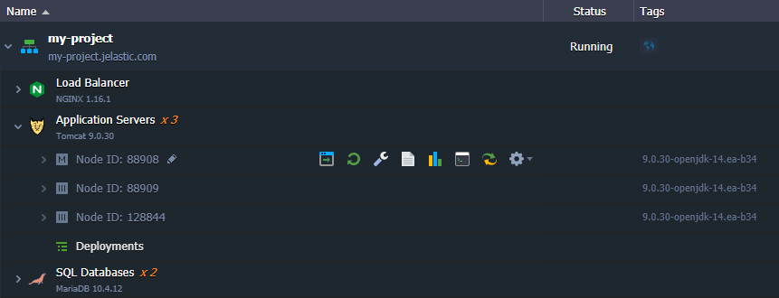

To facilitate interaction with numerous servers of the same type, the platform also allows marking a particular node with the appropriate label, e.g. to define master and slave instances in a DB cluster.

Just double-click at the default **_Node ID: xxx_** value (or hover over it to reveal a special pencil icon) and specify the desired alternative name.

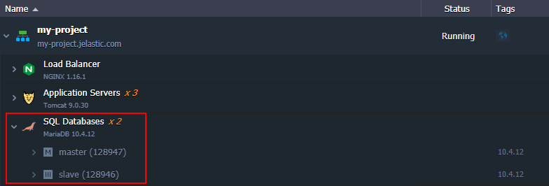

More information on this labeling feature can be found in the [Environment Aliases](https://cloudmydc.com/) document.

While scaling different types of stacks, consider the following specifics:

- upon scaling the application server instance, the load balancer node will be automatically added to the environment topology
- if enabling the [high-availability](https://cloudmydc.com/) option for application server, the obligatory required NGINX load balancer cannot be scaled horizontally (if several nodes of NGINX were available before, they will be automatically downscaled to a single instance)
- upon scaling VPS nodes, each one is provided with a separate [public IP](https://cloudmydc.com/) address attached
- [Maven](https://cloudmydc.com/) is the only node, which cannot be scaled horizontally (as there is no point in such operation)

Now, you know how easy it is to horizontally scale instances in the platform and aware of the operation specifics. Also, feel free to configure an [automatic nodes scaling](https://cloudmydc.com/) to smoothly overcome high load spikes without overpaying for unused resources.

## Managing Nodes within Layer

The platform provides a simple nodes management, where you just need to specify the required number of containers in a layer. Herewith, the removal process is done in the order opposite to the addition - i.e. the most recent containers are removed first. In case you need to delete some specific node, you can select the required one via:

- the **_Horizontal Scaling_** section in topology wizard - accessible using the **_Change Environment Topology_** button next to the required environment

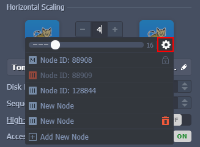

- the dedicated **_Scaling Nodes_** form in the dashboard - accessible using the **_Additionally > Scaling Nodes_** option next to the layer or **_Additionally > Delete_** next to the particular node

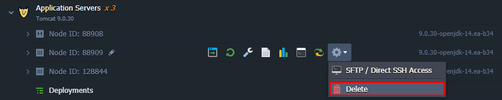

In the **Scaling Nodes** window, you can perform the following actions:

1. Add new nodes to the layer, using the **+** or **Add New Node** buttons.

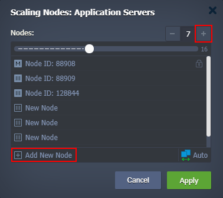

:::tip

- In case a [**high availability**](https://cloudmydc.com/) option is enabled for the layer (available for the _Tomcat_ and _TomEE_ application servers only), the nodes are added and removed in pairs.
- The new nodes' icons represent the scaling mode of the layer - empty container for _stateless_ and filled one for _stateful_.

:::

2. Remove instances with the - and **Delete** (upon hovering over particular node) buttons.

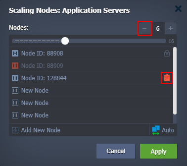

:::tip

- The first node in the list is a so-called _“master”_ of the layer (highlighted with a special icon) and can only be removed alongside the whole layer.
- You can **Undo Deletion** of the existing node during configuration. However, after applying changes, the instance will be deleted permanently.

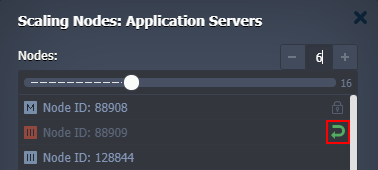

:::

3. At the bottom of the frame, a redirect to the [Automatic Horizontal Scaling](https://cloudmydc.com/) section can be found.

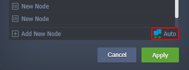

If any adjustments are made in the form, you’ll need to confirm the redirect via pop-up (as any unsaved changes are discarded).

4. When applying changes, the platform automatically notify you about all the potentially harmful actions that will be performed with your environment (if any). The list includes:

- nodes restart notice
- layers and separate nodes removal reminder
- impact on existing NFS mounts

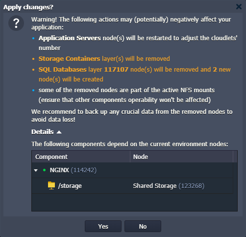

Before proceeding, ensure that the listed points won’t affect your application, and any crucial data (from the removed nodes) is safely backed up.
