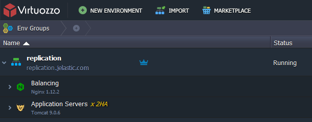

## High Availability with Sticky Session Replication

The platform provides automated session replication between [Tomcat](/docs/Java/Java%20App%20Servers/Tomcat%20and%20TomEE/Tomcat%20Server), [GlassFish](/docs/Java/Java%20App%20Servers/GlassFish/GlassFish%20Server) and [Jetty](/docs/Java/Java%20App%20Servers/Jetty/Jetty%20Server) servers to gain web application high availability within Java cluster.

Session replication is a mechanism used to replicate the data stored in a session between different instances, which have to be a part of the same cluster. When session replication is enabled in a cluster environment, the entire session data is copied on a replicated instance. The session replication operation does not copy the attributes that cannot be serialized in a session and any instance specific data. Session replication provides high reliability, scalability, and perfect failover capabilities.

In the PaaS, the process of replication takes place with a help of multicast. In such a way we have the next benefits:

- session exchange between the nodes through the local net;
- there is no need to use additional programmes of memcache type and that’s why there are less destruction points in the system.

## How to Enable Session Replication

To use replication in the platform you have to come through the next steps:

Log into the platform and click **New Environment**.

Pick application server you need and turn on **High-Availability** as shown on the picture below:

While environment is creating all actions are displayed in the task manager:

When the environment is installed, you can see that replication is enabled as shown on the picture below:

## How It Works?

When the user makes his first request to the web application load balancer (NGINX), it redirects the request to one of the servers within the cluster. Throughout the session user continues to work with that same instance of application server (so called Sticky Sessions). Obviously the other instance in the cluster is also working serving its half.

If one of the instances fails, the users, who were on that instance get automatically switched to the other instance in this cluster. Thanks to the replication, the other instance already has all the sessions of the failed instance, so end-users never notice any change. In the highly unlikely event of both instances in a cluster failing, users get redirected to another cluster (if there areseveral).

Also, users can turn on/off replication within already created environment by changing its topology.
