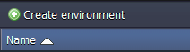
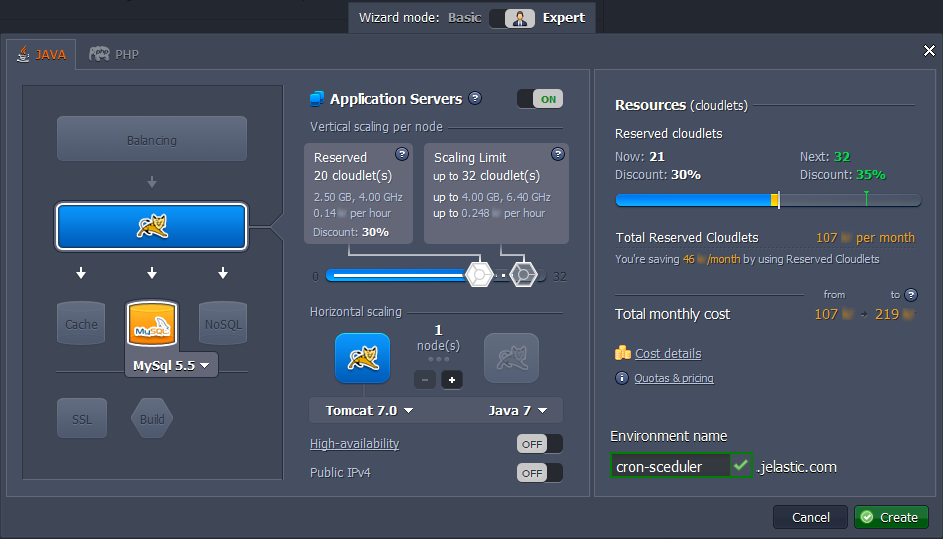
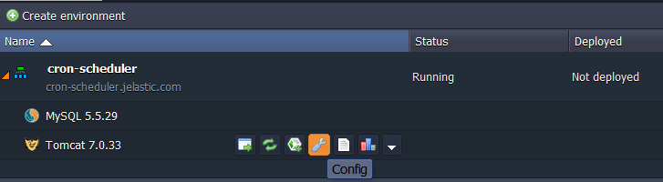
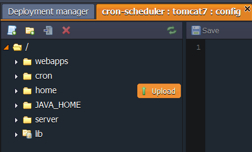
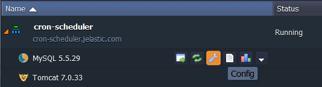
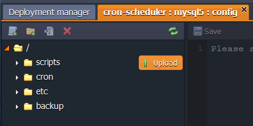
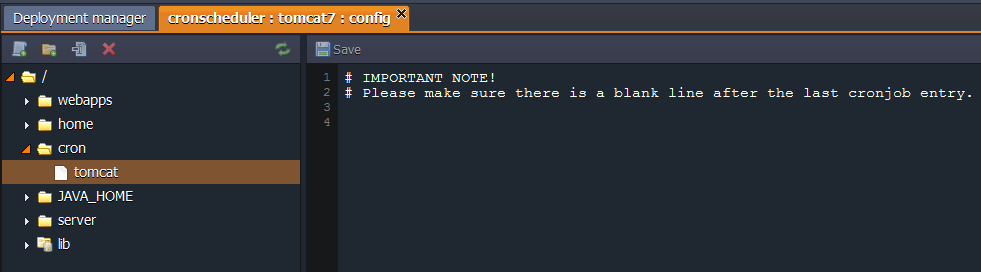
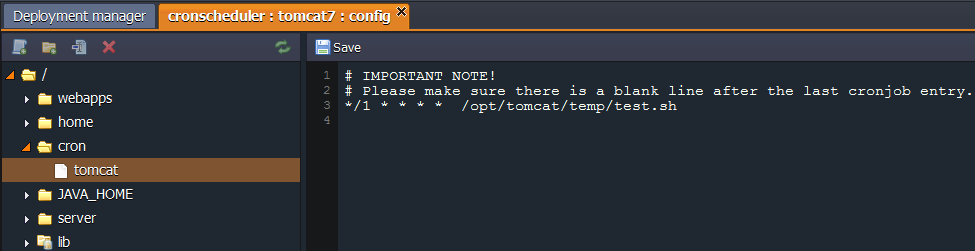
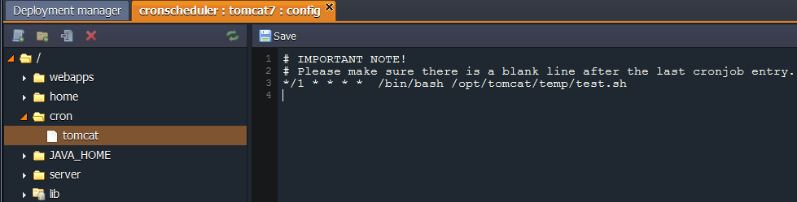

import obj from './SettingUpCronjob.json'

## Setting Up Cronjob

**Cron** is the time-based job scheduler in Unix-like computer operating systems. Cron enables users to schedule jobs (commands or shell scripts) to run periodically at certain times or dates. It is commonly used to automate system maintenance or administration, though its general-purpose nature means that it can be used for other purposes, such as connecting to the Internet and downloading emails.

The platform gives you a possibility to run your programs at specified time with a help of **cron**, which receives your instructions and performs any tasks following the derived scenarios. You can use this opportunity to perform periodic tasks, e.g.:

- logs clearing
- backing up
- scripts running

Check out the example below.

## Create Environment

1. Log into the platform dashboard.

2. Click **Create environment**.

<div style={{
    display:'flex',
    justifyContent: 'center',
    margin: '0 0 1rem 0'
}}>



</div>

3. In the **Environment topology** window choose the application server and database you want to use (for example, *Tomcat* and *MySQL*). Type the name of the environment and click **Create**.

<div style={{
    display:'flex',
    justifyContent: 'center',
    margin: '0 0 1rem 0'
}}>



</div>

In a minute your environment with both Tomcat and MySQL nodes will be created.

## Upload Script
## Application Server

1. Click the **Config** button for your application server.

<div style={{
    display:'flex',
    justifyContent: 'center',
    margin: '0 0 1rem 0'
}}>



</div>

2. Upload scripts you want to run to the following folder:

- **home** - if you use Jaba server in your environment (as we do in this instruction)
- the folder where your application is stored - if you use PHP server in your environment

<div style={{
    display:'flex',
    justifyContent: 'center',
    margin: '0 0 1rem 0'
}}>



</div>

## Database
1. Click the **Config** button for your database (MySQL or MariaDB).

<div style={{
    display:'flex',
    justifyContent: 'center',
    margin: '0 0 1rem 0'
}}>



</div>

2. Upload the scripts you want to perform to the **scripts** folder.

<div style={{
    display:'flex',
    justifyContent: 'center',
    margin: '0 0 1rem 0'
}}>



</div>

:::danger Note

Script you want to perform should be an executable file. If it isn’t, you can use built-in interpreters, such as *Bash, Perl, Python, SED, AWK*, or *Expect* (depending on the script you use).

:::

## Cron Event Scheduler

1. In the already opened configurations tab navigate to the **cron** folder and open the *{nodeName}* file.

<div style={{
    display:'flex',
    justifyContent: 'center',
    margin: '0 0 1rem 0'
}}>



</div>

2. Here you can write all necessary commands to schedule your tasks. They should be composed in a way so that crontab will understand them. The basic format of a **crontab** schedule consists of 6 fields separated by spaces.

```bash
{minute} {hour} {day} {month} {day-of-week} {command-line-to-execute}
```


<div style={{
        width: '100%',
        margin: '0 0 3rem 0',
        borderRadius: '7px',
        overflow: 'hidden',
    }} >
    <div>
        <div style={{
            width: '100%',
            height: 'auto',
            border: '1px solid var(--ifm-toc-border-color)',
            display: 'grid', 
            fontWeight: '500',
            color: 'var(--table-color-primary)',
            background: 'var(--table-bg-primary-t2)', 
            gridTemplateColumns: '0.5fr 1fr',
            overflow: 'hidden',
        }}>
            <div style={{
                display: 'flex', 
                alignItems: 'center', 
                justifyContent: 'center',
                padding: '20px',
                borderRight: '1px solid var(--ifm-toc-border-color)',
                wordBreak: 'break-all'
            }}>
               Field
            </div>
            <div style={{
                display: 'flex', 
                alignItems: 'center', 
                justifyContent: 'center',
                padding: '20px',
                borderRight: '1px solid var(--ifm-toc-border-color)',
                wordBreak: 'break-all'
            }}>
               Range of values
            </div> 
        </div>
        {obj.data1.map((item, idx) => {
            return <div key={idx} style={{
            width: '100%',
            height: 'auto',
            border: '1px solid var(--ifm-toc-border-color)',
            display: 'grid', 
        gridTemplateColumns: '0.5fr 1fr',
            fontWeight: '400',
        }}>
            <div style={{
                padding: '20px',
                borderRight: '1px solid var(--ifm-toc-border-color)',
                background: 'var(--table-bg-primary-t1)',
                display: 'flex', 
                alignItems: 'center', 
                justifyContent: 'flex-start',
                wordBreak: 'break-all',
                padding: '20px',
            }}>{item.Field}
            </div>
            <div style={{
                padding: '20px',
                wordBreak: 'break-all'
            }}>{item.RangeOfvalues}
            </div>
        </div> 
        })}
    </div> 
</div>

While stating these values you need to follow the next standards:

- The fields have to be in that exact order, with no empty or missing fields.
- If needed you can use a *wildcard character* - “*” (the asterisk). In a crontab file it represents every possible value for the field. For example, specifying “*” in the “hour” field means “*to run every hour*”.
- The “/” character is used to specify additional frequency assignments. For example, “* / 3” in the “hour” means “*every three hours*”.
- For each individual parameter, you can specify multiple values separated by commas. For example, if in the “hour” you type “1,6,19”, the job will run “at *1:00*, at *6:00*, and *19 hours*”. You can also specify the interval, for example, “8-17” would mean that the program will be run “*every hour from 8 to 17 inclusive*”.

:::danger Note

**Pay attention** that you should specify a ***full path to your script*** in the cron command. Depending on the location of your script the path can be as one of the following:

- **home** folder for Java compute nodes:
  - */opt/tomcat/temp/{scriptName}* - Tomcat, TomEE
  - */opt/jetty/home/{scriptName}* - Jetty
  - */opt/glassfish3/temp/{scriptName}* - GlassFish
- folder with your application files & scripts for PHP compute nodes:
  - */var/www/webroot/{appFolder}/{scriptName}*
- **scripts** folder for MySQL/MariaDB databases:
  - */var/lib/jelastic/bin/{scriptName}*

:::

3. For example, if your script is located in the **home** folder of Tomcat and you want it to be performed every minute, your command line can look like this example:

```bash
*/1 * * * *  /opt/tomcat/temp/test.sh
```

<div style={{
    display:'flex',
    justifyContent: 'center',
    margin: '0 0 1rem 0'
}}>



</div>

:::tip Tip

If your script does not have executable flag and you use built-in interpreters, such as Bash, Perl, Python, SED, AWK or Expect (depending on your script), you should add the following paths after time settings for explicit specifing the interpreter:

- */bin/bash* - for Bash
- */usr/bin/python* - for Python
- */usr/bin/perl* - for Perl
- */bin/sed* - for SED
- */bin/awk* - for AWK
- */usr/bin/expect* - for Expect
- */usr/bin/php* - for php-interpreter

In this case your command will be as following:

```bash
*/1 * * * *  /bin/bash /opt/tomcat/temp/test.sh
```

<div style={{
    display:'flex',
    justifyContent: 'center',
    margin: '0 0 1rem 0'
}}>



</div>

:::

4. ***Please make sure there is a blank line after the last cronjob entry.***

5. **Save** the changes in order to apply the settings.

That’s all. As you can see, it is pretty easy to schedule your tasks with the platform. Enjoy!