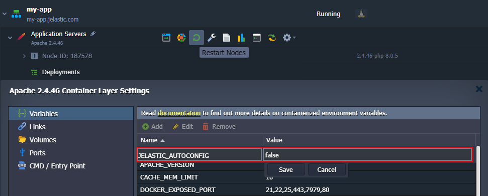
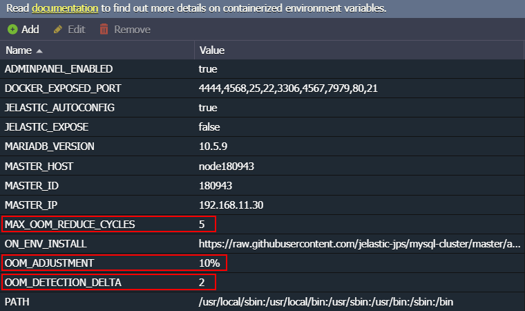

## Smart Auto-Configuration of Containers

In order to ensure efficient utilization of the resources, the platform can automatically configure some of the managed stacks in accordance with the scaling limit ([cloudlets number](https://cloudmydc.com/)). Currently, the following templates can benefit from this **Smart Auto-Configuration** feature:

- [**_Databases_**](https://cloudmydc.com/): _MySQL, MariaDB, Percona_
- [**_PHP_**](https://cloudmydc.com/): _Apache, NGINX_
- **LiteSpeed**: [_Web Server_](https://cloudmydc.com/), [_ADC_](https://cloudmydc.com/), [_LLSMP_](https://cloudmydc.com/)

:::tip

Follow the links to view which settings are adjusted in each case.

:::

The above-listed stacks have some peculiarities to support the implementation.

1. Templates utilize a modern **_systemd_** initialization program, which contains multiple features and tools required for the auto-configuration implementation.

2. A special **_JELASTIC_AUTOCONFIG_** [environment variable](https://cloudmydc.com/) defines if the auto-configuration feature should be enabled (_true_, by default) or disabled (_false_).

If you want to disable _Smart Auto-Configuration_, add (or edit if it already exists) this variable with the false value via the dashboard.

Don’t forget to **Restart Node(s)** to apply changes.

3. Smart recovery after the OOM error causes automatic configurations re-adjustment to decrease the container’s default memory consumption.

:::danger note

Smart OOM recovery works on containers with the **_JELASTIC_AUTOCONFIG_** enabled and, currently, for the following database stacks only:

- _MySQL 8.0.26; 5.7.35_
- _MariaDB 10.3.30; 10.4.20; 10.5.11; 10.6.3_
- _Percona 5.7.33; 8.0.23_

:::

If [OOM killer](https://cloudmydc.com/) actions make a container inoperable (due to some critical process being killed), we automatically restart this node and, due to smart recovery, decrease the **_innodb_buffer_pool_size_** parameter value. In case the situation occurs again, the mentioned reduction cycle is repeated.

You may customize the [environment variables](https://cloudmydc.com/) to adjust system behavior related to the OOM kills issue:

- **_OOM_DETECTION_DELTA_** - sets a period (two seconds by default) for the platform to analyze the **_/var/log/messages_** log after each service restart to decide if it was caused by OOM killer
- **_OOM_ADJUSTMENT_** - defines a value in %, MB, GB (10% by default) that the current innodb_buffer_pool_size parameter should be reduced after each OOM-caused restart
- **_MAX_OOM_REDUCE_CYCLES_** - configures a maximum number of cycles for innodb_buffer_pool_size reduction (5 times by default)

Increase cloudlets limit for the container to reset adjustments due to OOM recovery.
