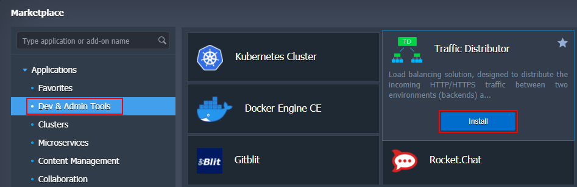
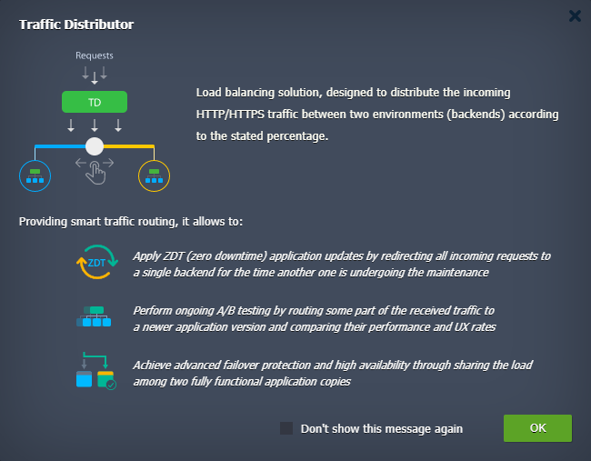
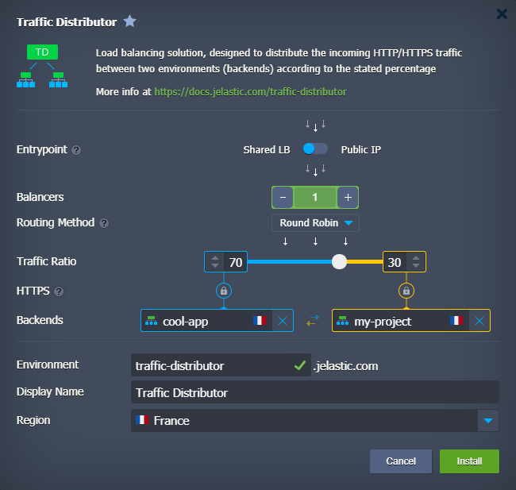
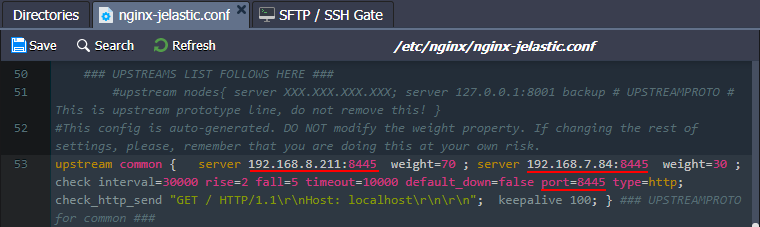
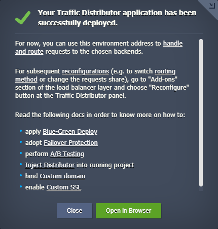
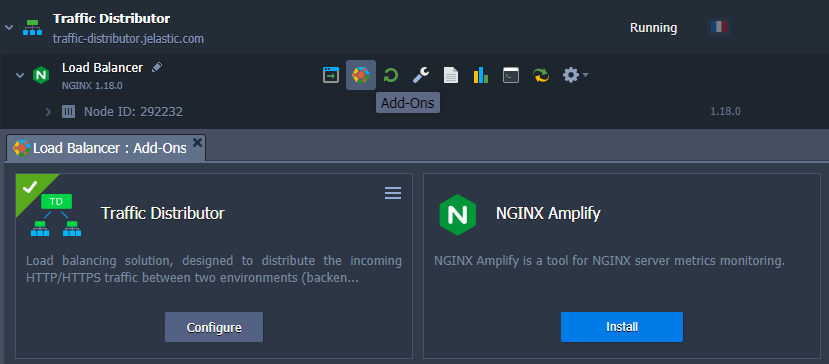
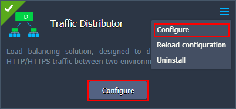
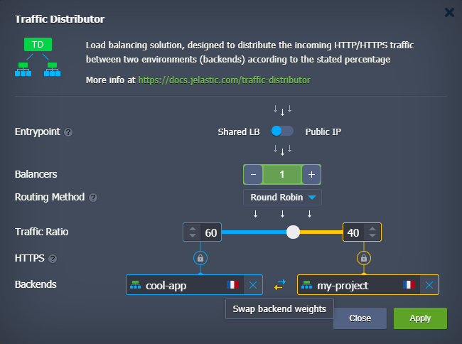
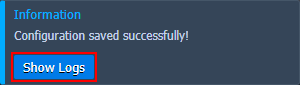
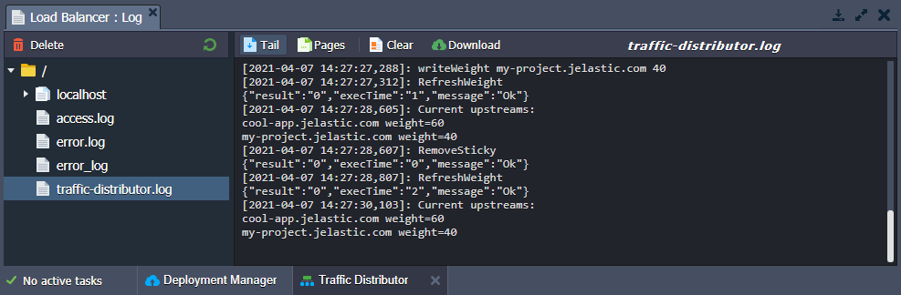

## Traffic Distributor Installation

The process of [Traffic Distributor](https://cloudmydc.com/) installation is fairly simple with the PaaS - being specially packed for the [Marketplace](https://cloudmydc.com/), it can be created in a few clicks and start working in just a matter of minutes. Herewith, the configurability of the solution is great, so let’s walk through the installation steps below to learn about all of the available functionality and hidden nuances.

:::tip Note

The described flow is suitable for the installation from scratch, i.e. in case you want to route traffic for the new environments. In order to be applied to the already running and loaded applications in production, follow the [Inject Traffic Distributor into Running Project](https://cloudmydc.com/) guide.

:::

1. Open the **Marketplace** frame by clicking on the appropriate button at the top of the dashboard.

2. Within the **Apps** tab of Marketplace, navigate to the **Dev & Admin Tools** section to locate the **_Traffic Distributor_** package (or use the Search field at the top) and click the **Install** button for it.

3. On the very first installation, you’ll be shown a frame with a brief solution overview and some of its key benefits highlighted:

:::tip Tip

Tick the corresponding _Don’t show this message again_ check-box to skip this information window in the future.

:::

Click **OK** to proceed.

4. At the appeared interactive installation frame, you can adjust some parameters to configure your Traffic Distributor topology and set up the desired routing for backends.

The following data should be specified:

- **_Entrypoint_** - switcher with either [Shared Load Balancer or Public IP](https://cloudmydc.com/) position
- **_Balancers_** - the number of the NGINX instances that will be added to the Traffic Distributor topology
- **_Routing Method_** - select from the three available [types of traffic distribution](https://cloudmydc.com/): _Round Robin, Sticky Sessions_, and _Failover_
- **_Traffic Ratio_** - set backend’s weight (priority) to control the distribution of the requests
- **_HTTPS_** - enable this option if backends are serving traffic via HTTPS
- **_Backends_** - select two environments to be balanced, either from the automatically fetched list of available ones from your account or type in the required IP address/domain name (for a custom host)

:::tip Note

[Jelasic endpoint](https://cloudmydc.com/) URLs can’t be specified as backends for traffic distribution as they presuppose operating via external _Public_ ports, while interaction in the confines of a single platform is built on _Private_ ports usage.

In this case, you need to set custom port redirects for your backends. For that, switch to the **_upstream_** section of the **_/etc/nginx/nginx-jelastic.conf_** file inside the load balancer server of your Traffic Distributor environment.

Here, you need to add the required internal containers' port number to the appropriate backend IP addresses and, additionally, define it within the [health check](https://cloudmydc.com/) parameters.

:::

- **_Environment_** - domain name for your environment (e.g. _traffic-distributor_)
- **_Display Name_** - optionally, an [alias](https://cloudmydc.com/) to be shown for the environment (_Traffic Distributor_ by default)
- **_Region_** - a drop-down list of the available [environment regions](https://cloudmydc.com/)

When all of the required data is specified, click the **Install** button. The platform will do everything else automatically.

5. After a couple of minutes, you’ll see an installation success window with some advice on the Traffic Distributor usage.

:::tip Note

As Traffic Distributor loading depends only on the number of incoming requests, it does not require a lot of resources. Thus the default one fixed cloudlet with [vertically scale](https://cloudmydc.com/) ability (up to 16 cloudlets) will be enough to handle even a huge amount of simultaneous requests.

:::

Using the links at the end of the frame, you can learn how to:

- apply [Blue-Green Deploy](https://cloudmydc.com/)
- adopt [Failover Protection](https://cloudmydc.com/)
- perform [A/B Testing](https://cloudmydc.com/)
- [Inject Distributor](https://cloudmydc.com/) into running project
- bind [Custom Domain](https://cloudmydc.com/)
- enable [Custom SSL](https://cloudmydc.com/)

## Traffic Distributor Reconfiguration

After the Traffic Distributor installation, you’ll get a dedicated environment with the NGINX load balancer(s) and a special add-on attached. It ensures quick and simple reconfiguration possibility for this solution and providing access to some additional options:

1. Hover over the NGINX instance in your Traffic Distributor environment and click the **Add-Ons** button to open the corresponding tab.

2. In order to change the configurations for your add-on, click the **Configure** button in the center of the frame or select the appropriate option from the menu list in the top right corner.

:::tip Tip

The **Reload configuration** option is required to apply manual changes to the Traffic Distributor configuration files without restarting the node (i.e. without downtime).

:::

3. Within the opened form, you can reconfigure any Traffic Distributor option just as during the installation process:

Options available for configuration are:

- **_Entrypoint_** - switcher with either [Shared Load Balancer or Public IP](https://cloudmydc.com/) position
- **_Balancers_** - the number of the NGINX instances that you would like to have in the Traffic Distributor topology
- **_Routing Method_** - select from the three available [types of traffic distribution](https://cloudmydc.com/): _Round Robin, Sticky_ _Sessions_, and _Failover_
- **_Traffic Ratio_** - set backends' weight (priority) to control the distribution of the requests
- **_HTTPS_** - enable this option if backends are serving traffic via HTTPS
- **_Backends_** - select two environments to be balanced, either from the automatically fetched list of available ones from your account or type in the required IP address/domain name (for a custom host)

:::tip Tip

Using the **Swap backends weights** button, see in the image above, you can quickly exchange the server’s _Traffic_ Ratio values.

:::

Confirm changes with the **Apply** button.

4. After a while, you’ll see the corresponding success notification at the top right corner of the dashboard.

Here, you can click on the **Show Logs** button to open the dedicated file.

5. Within the opened **_traffic-distributor_** log, you can find information on the actions applied to your add-on with the corresponding operations timestamps and current distribution values:

You can access this log file manually at any time.

So, using the described steps, you can apply changes to Traffic Distributor and easily track them via logs.
