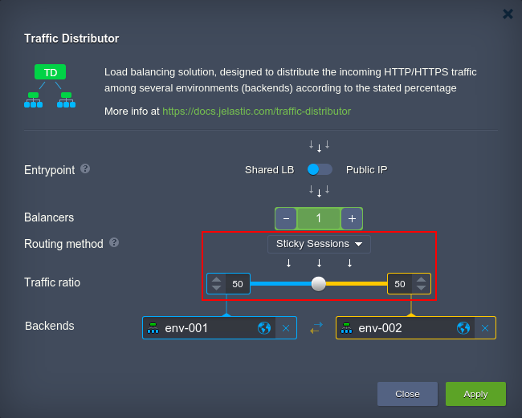

## A/B Testing with TD

Each commercial web-site or application has the embedded options of product purchase, sign up, conversion to paid version, subscription, etc. The amount of such actions, initiated by end-users (which, if being measured in percents, is called [_conversion rate_](https://en.wikipedia.org/wiki/Conversion_marketing#Conversion_rate)), is highly dependent on app’s visual appeal, advertising texts and other marketing ploys used. Comparison of different application versions, aimed to designate which app version is better in confines of user’s conversion rate, is named [A/B testing](/docs/ApplicationSetting/Traffic%20Distributor/Use%20Cases/A-B%20Testing). Such procedure can help you to find out the best combination of attractions and other product characteristics, that will allow to receive the highest revenue.

With the help of [Traffic Distributor](/docs/ApplicationSetting/Traffic%20Distributor/Traffic%20Distributor%20Overview), you can easily apply such kind of testing to your projects - find the details below.

1. To perform A/B testing, you’ll need two different application examples to analyze, and any preferable type of monitoring to track the desired actions' calling (e.g. when a user clicks on the required button).

:::tip Tip

You can use any tool that allows to compare conversion rates, from a simple piece of code to count server’s “score” (e.g. through just a variable incrementation) to some dedicated third-party testing utilities with a comfortable interface, analysis in graphs, automatic rates calculation, etc.

:::

2. Next, [install](/docs/ApplicationSetting/Traffic%20Distributor/Traffic%20Distributor%20Installation) your Traffic Distributor or just [configure](/docs/ApplicationSetting/Traffic%20Distributor/Traffic%20Distributor%20Installation#traffic-distributor-reconfiguration) it correspondingly (if having one already created):

The obligatory points here are:

- **Routing method** - select _Sticky Sessions_
- **Traffic ratio** - set _50 to 50_ to get the fair analysis

:::danger Notes

- DO NOT use [Round Robin](/docs/ApplicationSetting/Traffic%20Distributor/Routing%20Methods/Round%20Robin) routing for A/B testing, as this procedure assumes provision of different content on your backends, so some project elements may not be available on a particular server upon the request.
- In case you have the already-run production project, learn how to smartly [inject Traffic Distributor](/docs/ApplicationSetting/Traffic%20Distributor/Traffic%20Distributor%20Integrate) in front of it without interrupting application normal work.

:::

3. Everything is set up now, i.e. new incoming requests are evenly routed to both application versions with monitored conversion score. So just share your Traffic Distributor entry point link (i.e. environment domain or your [custom](/docs/ApplicationSetting/Domain%20Name%20Management/Custom%20Domain%20Name) one) among users and wait for some period of time for your customers to try out the given app versions and collect some data on conversions.

4. Finally, analyse the results you’ve gathered to choose which project branch is more preferable for usage. Obviously, environment with higher _Conversion Rate_ will win the race and can be boldly used in production, while the other one can be removed or just modified for another testing.

:::tip Tip

After you’ve revealed which app version is better, consider to follow the [Inject Traffic Distributor](/docs/ApplicationSetting/Traffic%20Distributor/Traffic%20Distributor%20Integrate) guide to start using it in a bundle with Traffic Distributor for achieving high availability and [failover protection](/docs/ApplicationSetting/Traffic%20Distributor/Use%20Cases/Failover%20Protection).

:::
