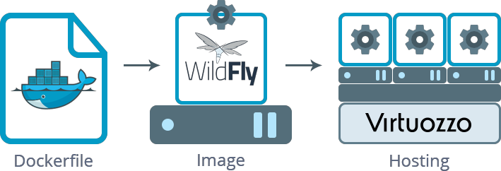

!incomplete

import obj from './BuildingCustomContainer.json'

With the platform, the process of preparing your own Docker image can be greatly simplified by building it on the basis of the already existing one (namely - on the top of the platform **CentOS 7** base template). This allows to skip all the steps, that are already accomplished within that “parent” template, and add the required adjustments only. We’ll consider this procedure on the example of preparing custom [WildFly](https://cloudmydc.com/) image - flexible and lightweight Java application server, which is a direct successor of the popular JBoss one.

The most common way of building Docker images is composing a **_Dockerfile_** - special manifest, which allows achieving the additional automation through listing the desired commands into a simple text file, which will be read and executed by Docker daemon. In such a way, a new template will be created automatically basing on the comprised instructions (while otherwise, you need to call every necessary operation manually, one by one).

Below, we’ll consider all the specifics of a custom image running at our platform, and, as a result, you’ll get the ready-to-work dockerized version of the WildFly server right inside the platform.

So, let’s walk through the required operations step-by-step:

- [composing dockerfile](https://cloudmydc.com/)
- [adding image to repository](https://cloudmydc.com/)
- [deploying image at the platform](https://cloudmydc.com/)

## Composing Dockerfile

To start with, create an empty text file - we’ll declare all the appropriate operations directly in it - and proceed with the following instructions.

:::tip Note

This sections is exploratory in its nature and includes just the required basis for your dockerfile preparation. However, if you’d like to dive into the specifics of the process and get more detailed guidance, you can examine the official [dockerfile references](https://cloudmydc.com/).

Also, you can [download](https://cloudmydc.com/) the already prepared dockerfile (with our WildFly image example) in advance and just look through this section for the performed actions explanations, skipping the manual file creation.

:::

1. The initial step is specifying the base template for our image building - we’ll use the jelasticdocker/jelastic-centos7-base one with the already configured **CentOS 7** operating system inside. In order to set this within dockerfile, the FROM instruction should be used:

    

        

            1
        

        

            FROM jelasticdocker/jelastic-centos7-base:latest
        

    

2. Next, you can specify the general image information (like metadata or some internal variables), which will be required during the further configurations. Use the example below to set the needed values:

    {obj.data1.map((item, idx) => {
        return 

        

            {idx+1}
        

        

            {item}
        

    

    })}

where:

- **LABEL**- allows you to set image metadata via the appropriate key-value pairs (e.g. the author of the Docker image, its version, etc.)
- **ENV**- sets the main environment variables, i.e.:
  - _WILDFLY_VERSION_ - version of WildFly to build; can be changed to another release if necessary (get the list of the currently [available versions](https://cloudmydc.com/))
  - _ADMIN_USER_ - the arbitrary administrator name for the subsequent accessing WildFly admin panel
  - _ADMIN_PASSWORD_- the desired password for the specified user

3. Now, you can declare the required configurations using the shell commands - the RUN operator should be used for this purpose.

First of all, you need to install the Java Development Kit (**OpenJDK** of the 8th version in our case) and the tar archiver (which will be used for decompressing the downloaded files):

    

        

            1
        

        

            RUN yum -y install java-1.8.0-openjdk-devel tar && yum -y update;
        

    

This command ends with calling the installed packages' general update.

4. Next, let’s declare a few additional operations for downloading the WildFly source code from the official website and extracting it to the **/opt** folder.

    {obj.data2.map((item, idx) => {
        return 

        

            {idx+1}
        

        

            {item}
        

    

    })}

5. At this step, you need to create a symlink in order to shorten the path to the WildFly main directory and, as a result, to make it easily accessible:

    

        

            1
        

        

            RUN ln -s /opt/wildfly-$WILDFLY_VERSION /opt/wildfly
        

    

6. Let’s proceed with creation of the main configuration file for our WildFly server and putting all the needed options to it:

    {obj.data3.map((item, idx) => {
        return 

        

            {idx+1}
        

        

            {item}
        

    

    })}

7. CentOS 7 is started using the Systemd initiation script by default, but WildFly server requires the more traditional SystemV Init one, thus you need to copy the default initscript to the **/etc/init.d** folder and edit the appropriate configs to avoid the systemd redirect:

    {obj.data4.map((item, idx) => {
        return 

        

            {idx+1}
        

        

            {item}
        

    

    })}

8. Next, we’ll state WildFly to be run on container startup by adding the corresponding system user and changing files' ownership for him:

    {obj.data5.map((item, idx) => {
        return 

        

            {idx+1}
        

        

            {item}
        

    

    })}

9. Also, let’s add the user credentials we’ve defined within the 1st instruction step for accessing the server’s admin panel:

<!-- 

    

        

        

            1
        

        

            RUN /opt/wildfly/bin/add-user.sh --user $ADMIN_USER --password $ADMIN_PASSWORD --silent --enable
        

    

 -->

10. Now, we can correct a link to the admin panel itself at the default index.html page by defining the corresponding redirect (as in case our image will be deployed to a container without the external IP attached, port 4949 and HTTP connection should be used here):

<!-- 

    {obj.data6.map((item, idx) => {
        return 

        

            {idx+1}
        

        

            {item}
        

    

    })}

 -->

11. Add the English locale settings to the container.

<!-- 

    

        

        

            1
        

        

            RUN localedef -i en_US -f UTF-8 en_US.UTF-8 
        

    

 -->

12. Another required action is to set our Docker image to listen to the required ports at the runtime. The EXPOSE instruction is intended for this:

<!-- 

    

        

        

            1
        

        

            EXPOSE 22 80 443 8080 8743 9990 9993 8009 4848 4949 
        

    

 -->

13. Lastly, you need to set the ENTRYPOINT for defining a container to be run as executable. In our case, the bash shell should be specified:

<!-- 

    

        

        

            1
        

        

            ENTRYPOINT ["/ bin / bash"]
        

    

 -->

That’s all! Just don’t forget to save all the declared settings to get the ready-to-go dockerfile.

## Adding Image to Repository
Once the proper dockerfile is prepared, you are ready to build your WildFly image on its base and, subsequently, push it to the repository.

:::tip Note

Before starting, ensure you have the appropriate Docker CE version (according to the used OS type) [installed](1) for executing the below described commands at the currently used machine.

:::

<!-- So, follow the next steps to accomplish that:

1. Run the docker build command with the required parameters to create a new image locally:

1
sudo docker build -t {image_name} {dockerfile_location}
where

{image_name} - image repository appellation; optionally, a version tag could be added after the “:” separator (e.g. jelastic/wildfly:latest)
{dockerfile_location} - either local path or an URL to your dockerfile (could be set as “.” if the file is located in the current directory) 2. You should receive the build success message with the ID of your new image alongside. To ensure it is available at your workstation, you can request the list of all local templates to be output with:

1
sudo docker images 3. Finally, you need to push (upload) your image to a registry with the corresponding command:

1
sudo docker push {image_name}
Here, {image_name} should be stated the same to the one you’ve specified during the image building in the 1st step.

You’ll be additionally requested to confirm your account ownership (by specifying the corresponding username, password and email address) in order to complete this operation.

Tip: You can log into the registry in advance using the corresponding docker login command (as a result, your credentials will be stored in the ~/.docker/config.json file at your local user’s home directory).
Deploying Image at Platform
As soon as your image is successfully stored at the repository, it becomes available for usage at the platform and can be added to an environment through the dedicated Docker board integrated to the topology wizard dashboard sections.

So, select the New Environment button at the top of the dashboard, move to the Docker tab within the opened environment wizard and click on the Select Image button.

1. Here, you can use either the Search tab (for adding an image from Docker Hub repository) or switch to the Custom section, where you can operate images of any type (i.e. including the private ones) and store your templates for being easily accessible.

add new custom image

We’ll consider the latter one, so, once inside, choose the necessary environment layer to the left (App. Servers in our case) and click the Add New Image button.

2. At the opened Add New Image frame, type your image identifier within the Name field, i.e.:

{registry_hostname}(can be skipped for official Hub Registry)/{account}/{image_name}

Also, in case of a private repository usage, the appropriate Username and Password credentials should be specified.

custom image repository

We use the public Docker Hub repository, located within the central Registry Hub, so only the short repository name is required. Click Add when ready.

3. After that, your image will appear in the list. Out of here, it could be added to the topology with just a single click. Moreover, this template will be remembered and remain listed here so it can be easily found during the consequent container selections (until you remove it from the Custom list manually).

create custom WildFly image

Set the rest of the necessary configurations on your own (the details on the available options can be read in the linked guide) and finish the environment creation.

4. Once your environment with the appropriate image inside appears on the dashboard, it can be accessed using the corresponding Open in Browser button:

WildFly open in browser

Note: In case you haven’t placed your template to the App. Servers or Balancing environment layer, you’ll need to use the same-named button next to a particular container to open it.
As a result, you’ll see the default WildFly start page, which means everything is correctly configured and your newly created container is fully operational.

custom WildFly home page

Similarly to the described above, you can create any other preconfigured image due to your purposes and, consequently, easily run it within the platform! -->
