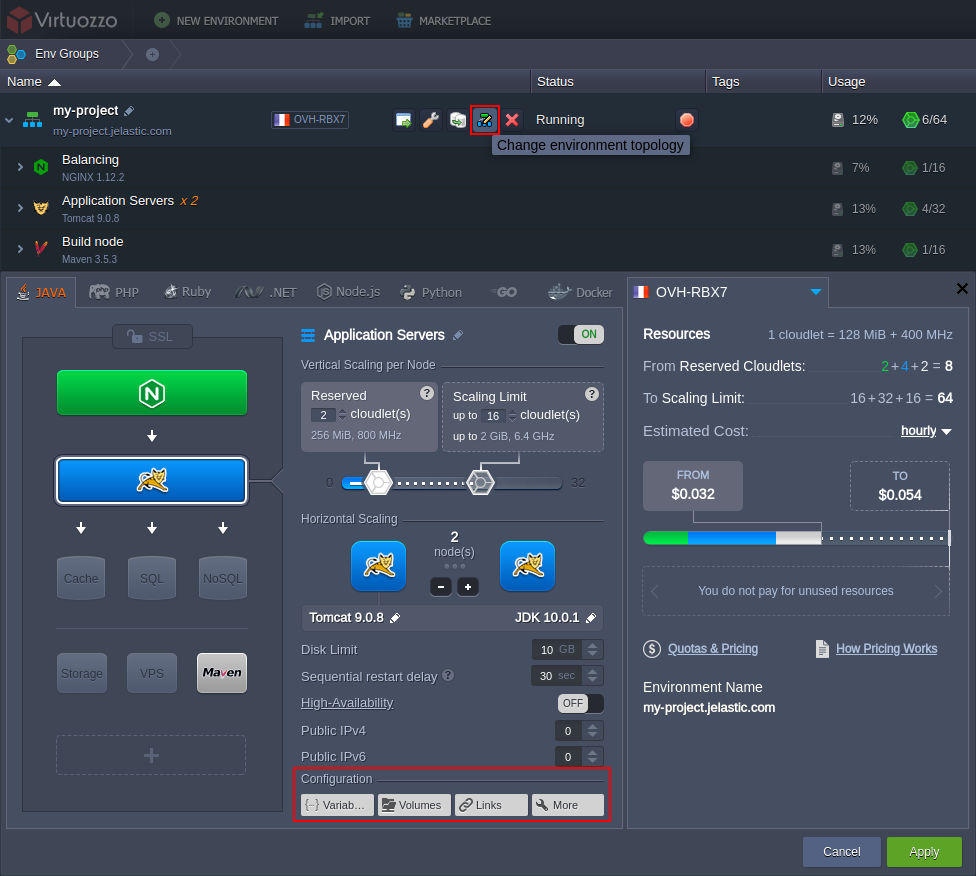
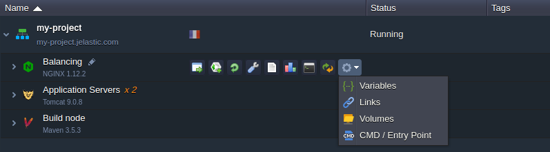
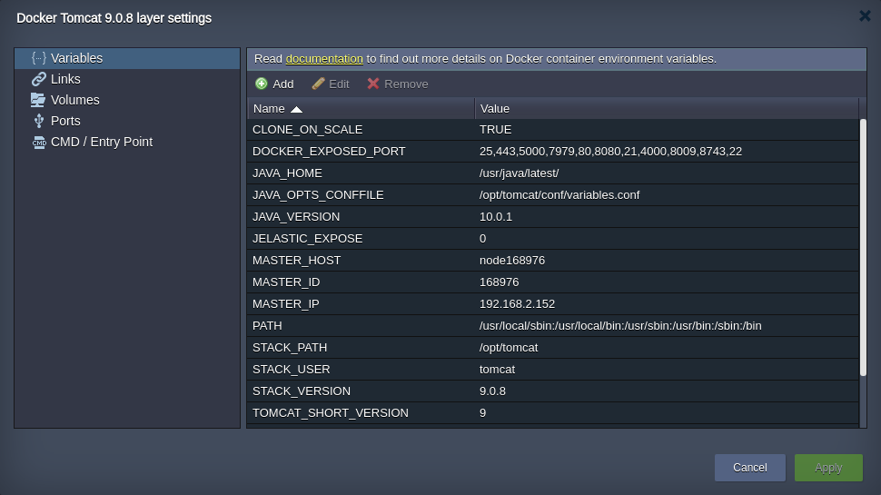
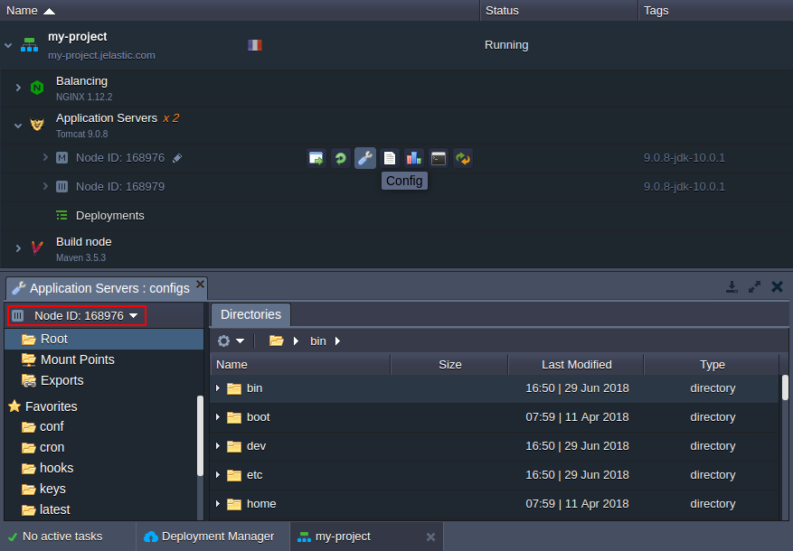
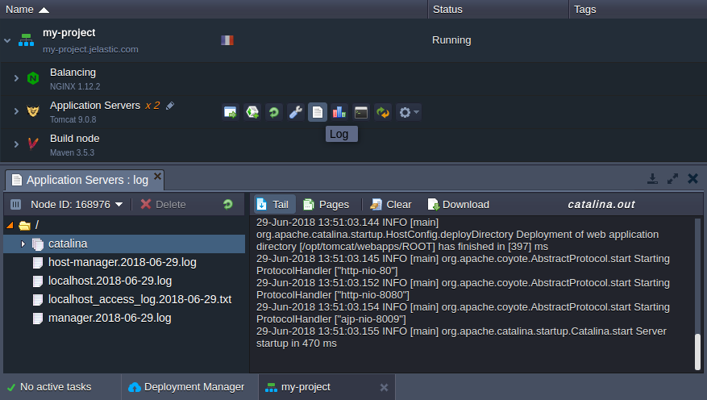

## Container Configuration

The platform provides a possibility to manage all main aspects of containers lifecycle directly through a [dashboard](http://localhost:3000/docs/QuickStart/Dashboard%20Guide). It supports a number of various tools, intended to help you to configure your environments:

- [settings wizard](http://localhost:3000/docs/Container/Container%20Configuration/Configuration%20Tools#container-layer-settings-wizard)
- [embedded file manager](http://localhost:3000/docs/Container/Container%20Configuration/Configuration%20Tools#configuration-file-manager)
- [log files](http://localhost:3000/docs/Container/Container%20Configuration/Configuration%20Tools#log-files)
- [SSH access](http://localhost:3000/docs/Container/Container%20Configuration/Configuration%20Tools#ssh-access-to-container)

## Container Layer Settings Wizard

The platform integrated the special **Docker layer settings** dialog frame to the topology wizard to adjust some of the most commonly required container settings without the necessity to access it via SSH. Simultaneously powerful and user friendly, it gives you the ability to configure your containers in the most easy and comfortable way.

So, to start with, you need to access the above-mentioned frame. There are two ways this can be done through:

via topology wizard - click on the **New Environment** button and [add the needed container(s)](http://localhost:3000/docs/EnvironmentManagement/Setting%20Up%20Environment) or hit the **Change Environment Topology** button for the already created environment.

Then choose a container that needs to be tuned and select the appropriate **_Configuration_** section at the bottom (circled in the image above).

:::tip Tip

With the platform, any container can be preconfigured even before being created - the necessary data is automatically fetched from image manifest upon accessing the configuration wizard.

:::

- _directly from the dashboard_ - hover over your environment layer, click on the gear icon and pick one of the quick access options from the expanded listdashboard layer settings

After that, the **Docker layer settings** window will appear:

As you can see, it contains 5 separate sections with the next settings options (follow the appropriate guide below for the section you are interested in):

- [Variables](http://localhost:3000/docs/Container/Container%20Configuration/Variables)
- [Links](http://localhost:3000/docs/Container/Container%20Configuration/Links)
- [Volumes](http://localhost:3000/docs/Container/Container%20Configuration/Volumes)
- [Ports](http://localhost:3000/docs/Container/Container%20Configuration/Ports)
- [Run Config](http://localhost:3000/docs/Container/Container%20Configuration/Run%20Configuration)

## Configuration File Manager

The in-built **[configuration file manager](http://localhost:3000/docs/ApplicationSetting/Configuration%20File%20Manager)** is designed to manage the files inside your container (including the ones, that are available and/or exported by means of [Shared Storage Container](http://localhost:3000/docs/Data%20Storage%20Container/Data%20Storage%20Overview) functionality). The appropriate tab can be opened by clicking on the **Config** button next to the necessary node (or the whole layer):

It includes 4 main sections:

- **Root** (File Manager) - gives you an easy access to container local filesystem, where you can operate the comprised data and instance settings within the corresponding configuration files
- **Mount Points** - list of folders, that are physically stored on a remote node but can be used at a current container through [mounting the directories](http://localhost:3000/docs/Data%20Storage%20Container/Data%20Sharing/Mount%20Points) with required data
- **Exports** - list of folders, which are shared with other nodes, i.e. are [exported](http://localhost:3000/docs/Data%20Storage%20Container/Data%20Sharing/Exporting%20Data%20for%20Sharing) to be available at the remote instances whilst being stored locally
- **Favorites** - commonly used files and folders to have a quick and simple access to (you can manually mark any custom ones as favorites)

:::tip Tip

In case the appropriate environment layer includes multiple same-type containers, you can easily switch between them directly inside the manager by choosing the required one within the corresponding drop-down list at the top pane (circled in the image above).

:::
In such a way file manager, allows to take the full control over container file system with no extra tools required. However, be aware of what you are modifying, as in case something will get broken, the changes you’ve applied couldn’t be automatically reverted.

## Log Files

Another section of the platform dashboard, which may help you to manage your projects, is **Logs**. Here, the data on all aspects of your containers lifecycle is gathered, which may come in handy while troubleshooting and/or debugging your applications or services.

:::tip Note

The list of shown log files and directories depends on a particular [software stack](http://localhost:3000/docs/QuickStart/Software%20Stack%20Versions) and can vary.

:::

The log files inside a container are automatically rotated, so when any of them reaches the size of 50 MB, it is automatically compressed and moved to the dedicated **_rotated_logs_** directory. To view such archives (if necessary), you need to enter the appropriate container [via SSH](http://localhost:3000/docs/Deployment%20Tools/SSH/SSH%20Access/Overview) and download them for examining locally. The compressed logs are stored for 7 days, after which they will be automatically removed, being considered as an obsolete data.

## SSH Access to Container

If you prefer to manage your containers via terminal, you can easily connect to any of them [via SSH](http://localhost:3000/docs/Deployment%20Tools/SSH/SSH%20Access/Overview), no matter whether has it the external IP address attached or not. Once connected, you get a true freedom for managing your instances through executing the necessary operations directly from your local machine.

In addition, the platform is supplied with the dedicated [CLI client](http://localhost:3000/docs/Deployment%20Tools/API%20&%20CLI/Platform%20CLI/Platform%20CLI%20Overview), which allows to handle the vast majority of operations, required for your applications lifecycle management, by means of a set of special scripts. Herewith, the structure of the commands this could be accomplished through is completely similar to the [platform API](https://cloudmydc.com/) hierarchy, so you can easily get used to the client.
