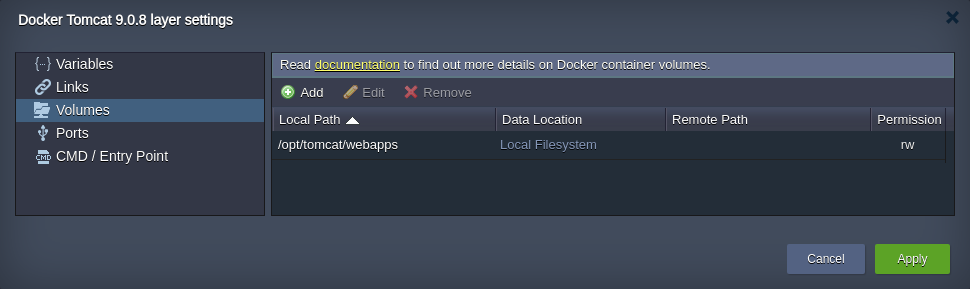
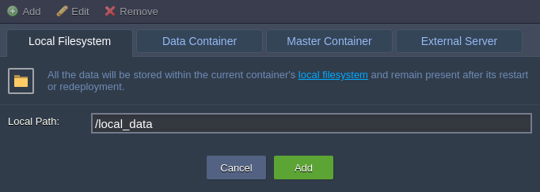
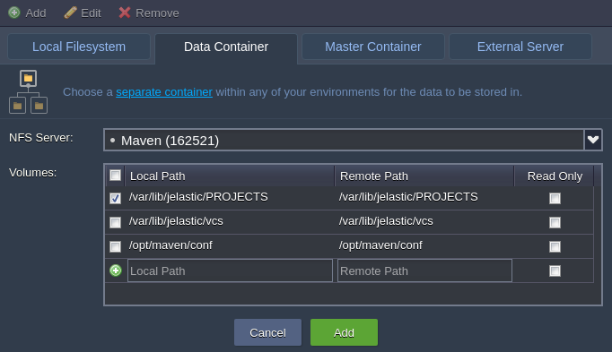
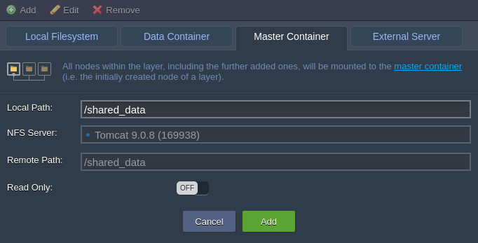
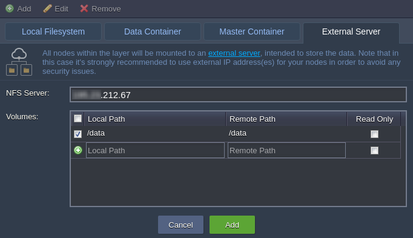
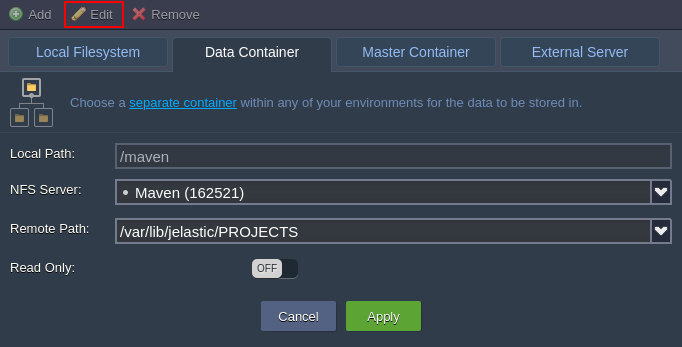
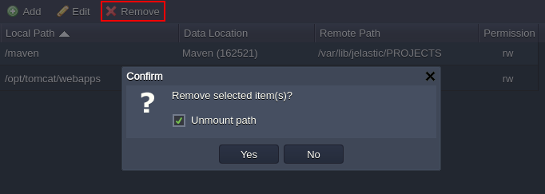

Volumes
The **Volumes** tab contains the list of mounted at the current container data volumes, which are designed to persist the data independently of the container lifecycle. They are displayed in a view of paths to the appropriate mounted points inside a node:

Storing data within volumes allows different internal operations (e.g. [SSH Gateway](/docs/Container/Container%20Redeploy) the container to another tag version) to be performed without affecting or losing the data. Such volume content preservation provides a high level of integrity for your data.

Below, we’ll consider how to add a custom volume for your container and types of [data mounting](/docs/Data%20Storage%20Container/Data%20Sharing/Mount%20Points) the platform provides - at a **Local Filesystem**, separate dedicated **Data Container**, layer **Master Container** or **External NFS Server**.

## Operating Custom Volumes

By default, the predefined volumes (i.e. which are determined within the appropriate template settings and are automatically set during container creation) are shown in the **Docker layer settings > Volumes** frame.

Beside that, you have an ability to mount and manage your custom volumes, placed either locally, at other instance on a platform or any external server. For that, follow the steps below.

1. Select the **Add** button above the list to see four tabs, named in accordance to the types of volumes you are able to create:

- **[Local Filesystem](/docs/Data%20Storage%20Container/Use%20Cases/Local%20Filesystem)** - the specified directory will be used as a local storage, intended to persist the data independently of the current container lifecycle (as well as by any other node)

- **[Data Container](/docs/Data%20Storage%20Container/Data%20Sharing/Mount%20Points)** - this type of volume allows to mount data from any other layer within your accountadd data container volume

- **[Master Container](/docs/Data%20Storage%20Container/Use%20Cases/Master%20Container)** - data, stored within such volume, is physically placed at the initially created node of the layer (so-called “master node”) and is automatically shared with all of the rest instances within this layer.

- **[External Server](/docs/Data%20Storage%20Container/Use%20Cases/External%20Server)** - this option is intended to mount data from the external NFS server (either your custom third-party storage or [container at another platform](/docs/Data%20Storage%20Container/External%20NFS%20Server%20Configuration))

When all the parameters for the chosen mount type are specified (the details can be observed within the linked guides), click **Add** to finish the configuration.

2. With the **Edit** option at the top pane (or through double-clicking on the corresponding record), you can change some settings for the already existing volumes:

Here, the **Local Path** is unchangeable value, but you still can switch the mounting method (by moving to a different tab) and/or adjust the access permissions (with the **Read Only** switcher).

Do not forget to **Apply** the changes you’ve made.

3. In case your custom volume is not needed anymore, it can be easily unmounted by choosing the corresponding string and clicking on the **Remove** button above.

:::danger Notes

- before deletion, make sure the appropriate volume does not contain any substantial data, as it will be permanently removed
- the predefined (i.e. default) volumes can’t be deleted (whilst still being available for editing)
- if you want to remove volume but keep the [SSH Gateway](/docs/Data%20Storage%20Container/Data%20Sharing/Mount%20Points), untick the Unmount path checkbox

:::

Confirm your decision within the appeared pop-up frame.

After that, don’t forget to **Apply** all your changes with the corresponding button at the general Docker layer settings window and, if required, within the topology wizard (in case of modifying the already existing environment).
