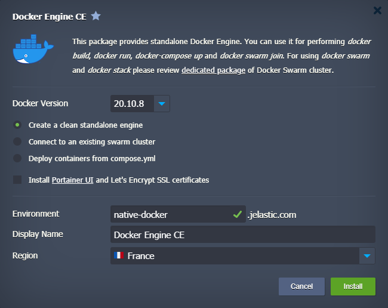

The platform provides support for the **Docker Engine Community Edition** with full compatibility to the native Docker ecosystem. Such integration makes it possible to work with the core tools of Docker container technology, namely:

- **Docker Engine** - processes Dockerfile manifests or runs pre-built container images
- **Docker Registry** - stores and provides access to numerous public and private images that are intended for deployment within Docker Engine
- **Docker Compose** - helps assemble applications consisting of multiple components with all the required configurations declared in a single compose file
- **Docker Swarm** - represents several independent Docker nodes interconnected into a cluster

1. **Docker Engine CE** is delivered as the pre-packaged solution available through the [platform Marketplace](1). Use the search field at the top or locate the package under the Dev & Admin Tools category:

:::tip Tip

You can also install **Docker Engine CE** via the topology wizard - search for the stack or locate manually in the *More > Extra* Services section.

:::

2. In addition to the **Docker Version** selection, you can choose from several deployment options when installing from Marketplace:

- **Create a clean standalone engine** - sets up a bare node with just a Docker daemon inside. If needed, you can additionally install **Portainer UI** - a web-based management tool
- **Connect to an existing swarm cluster** - automatically includes this new Docker Engine into the existing [Docker Swarm](1) cluster (the appropriate cluster’s Join Token and Host IP are required)
- **Deploy containers from compose.yml** - automatically deploys an application from the linked custom repository

Confirm installation by providing general info (Environment, Display Name, Region) and clicking the **Install** button.

:::tip Tip

Learn more about **Docker Engine CE** [installation](1) and [management](1) via the relevant articles on our blog.

:::