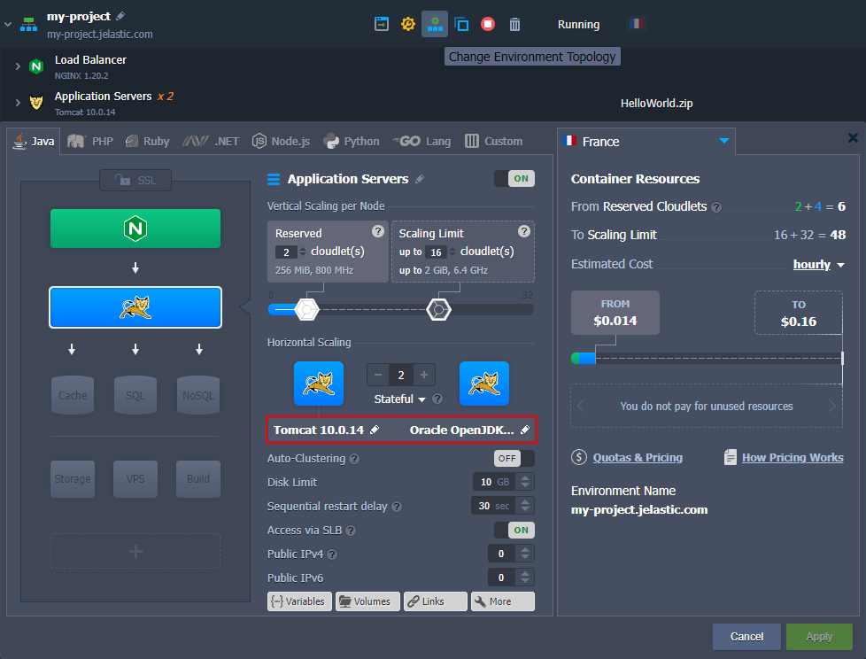
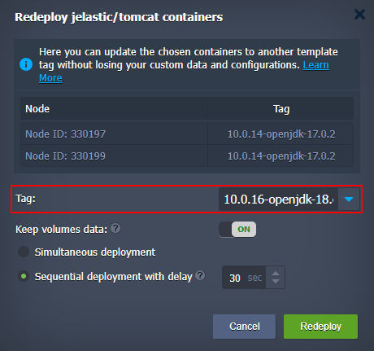
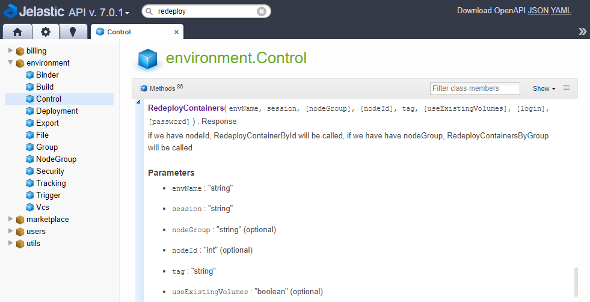
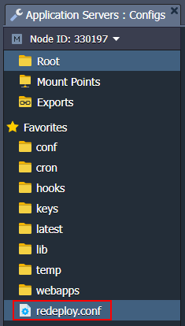
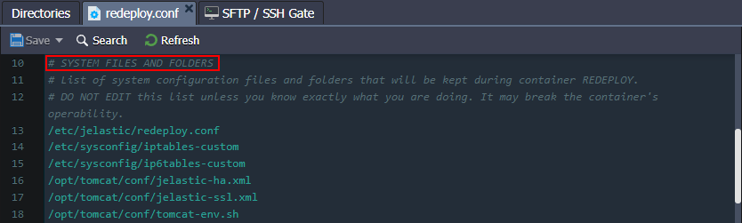
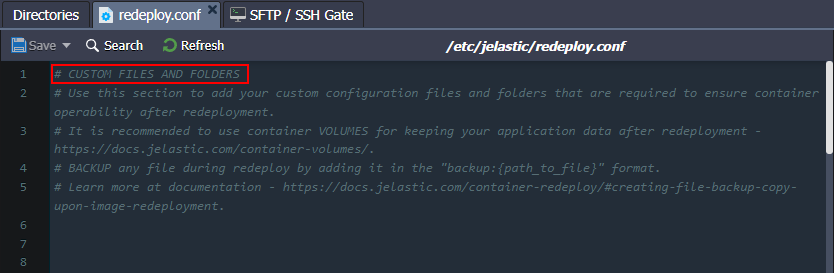

import obj from './ContainerRedeploy.json'

The majority of Docker-based solutions (including platform-managed [stacks](https://cloudmydc.com/)) are continuously developed, delivering new product versions and fixes. Thus, it is recommended to regularly update your templates to their latest tags, i.e. releases.

Such an operation is called **redeploy** and has the following specifics when managed on the platform:

- the custom user data and sensitive system files are preserved during the update:

  - content of the **[volumes](https://cloudmydc.com/)** (default and custom ones)
  - files listed in **[/etc/jelastic/redeploy.conf](https://cloudmydc.com/)** (specific configs of the stacks), which are required to ensure container operability
  - **AutoFS and NFS** related configurations (_/etc/autofs.jelastic, /etc/auto.master, /etc/exports_)
  - **firewall configurations** (_/etc/sysconfig/iptables-custom, /etc/sysconfig/iptables4-jelastic, /etc/sysconfig/iptables6-jelastic, /etc/iptables/rules.v4_)
  - **SSH access data** (_/root/.ssh/authorized_keys, /root/.ssh/authorized_keys2, /root/.ssh/id_rsa_)

- all the previously specified custom [configurations](https://cloudmydc.com/) (like run commands, links, variables, etc.) won’t be affected
- if operating with [multiple](https://cloudmydc.com/) (horizontally scaled) instances, the update can be performed on containers one by one, i.e. implicitly with no downtime

In such a way, you are able to update your Docker-based container to a new tag (version) without affecting the application inside. With the platform, container redeployment can be performed in just a few clicks via the [dashboard UI](https://cloudmydc.com/) or easily automated [via API](https://cloudmydc.com/).

:::danger Note

When working with the MySQL, MariaDB, or Percona databases, downgrading (i.e. redeploying to the lower version) is not supported. In case the operation is necessary, we recommend creating a backup and restoring a database after redeploy (or in a separate container altogether).

:::

To learn about [saving or backing up custom data](https://cloudmydc.com/) during redeploy, refer to the appropriate section below.

## Update Container via Dashboard

The most straightforward and user-friendly way to redeploy a template tag is to use the platform dashboard. The instruction below will walk you through the required steps:

1. The dedicated redeployment dialog frame can be accessed in two different ways:

- select the **Redeploy Container(s)** button next to the required node or layer (for updating all the comprised containers at once)

- click the pencil icon next to the layer tag version in the topology wizard (when Changing Environment Topology of the existing environment)

2. As a result, the **_Redeploy containers_** frame will be opened, where you can select a new **Tag** for your container(s).

Also, you can adjust some additional options:

- **Keep volumes data** - if enabled, data in the [volumes](https://cloudmydc.com/) will be protected from erasing and will remain available after redeploy
- for [horizontally scaled](https://cloudmydc.com/) containers, you can choose between two deployment options:
  - **Simultaneous deployment** - redeploys all nodes at once, which is comparatively quicker but causes a brief downtime of your application
  - **Sequential deployment with delay** - redeploys instances one-by-one with a specified delay between operations. This option ensures that there is always a running node to process incoming requests (i.e. no downtime)

After all the configurations are set, click the **Redeploy** button and confirm within the pop-up.

3. Once the update is completed, you’ll see the corresponding notification in the top right corner of the dashboard.

Click the **Show Logs** button to open the appropriate tab with information on the updated container - _Node ID, name:tag, and Duration._

Now, you know how to redeploy a container via the platform dashboard.

## Update Container via Platform API/CS/CLI

The update process can be automated using [platform API](https://cloudmydc.com/), [Cloud Scripting](https://cloudmydc.com/), and [CLI](https://cloudmydc.com/) (command-line interface).

:::tip Tip

A detailed example on [container redeploy via CLI](https://cloudmydc.com/) is provided in the linked guide.

:::

Container redeploy is performed with the **[environment.Control.RedeployContainer](https://cloudmydc.com/)**s method, which is managed with the following parameters:

- **envName** - name of the environment, where container(s) should be redeployed

- **session** - user session (or token) identifier, used for authentication

- **nodeGroup** - identifier of the environment layer to update (optional)

- **nodeId** - identification number of the particular container to be redeployed (optional)

:::tip Tip

A detailed example on [container redeploy via CLI](https://cloudmydc.com/) is provided in the linked guide.

:::

:::danger Note

Since each instance within the platform represents an isolated container, it can’t be reached from You need to state either nodeGroup or nodeId parameter to define the operation target. The method ignores nodeGroup if both are provided and fails if neither is specified.

:::

- **tag** - image version to be deployed

- **useExistingVolumes** - set it to true to keep data in the mounted volumes present within the updated container(s) (optional)

- **login** and **password** - credentials to access an image from the private registry (optional)

The following constructions can be used to define container update within your [automation scripts](https://cloudmydc.com/):

1. Redeploying the whole layer of containers.

    {obj.arr1.map((item, idx) => {
        return 

        

            {idx+1}
        

        

            {item}
        

    

    })}

Here:

- **{nodeGroup}** - [environment layer (or node group)](https://cloudmydc.com/) where all containers should be updated
- **{myImage}** - name of the image to be deployed
- **{newTag}** - the required version of the image above

2. Updating a particular container.

    {obj.arr2.map((item, idx) => {
        return 

        

            {idx+1}
        

        

            {item}
        

    

    })}

Here, the **{nodeId}** value should be substituted with the ID number of the required node (other placeholders are the same as for the example above).

## Saving Custom Data during Container Redeploy

Each [platform-managed container](https://cloudmydc.com/) is provided with a special **/etc/jelastic/redeploy.conf** file, storing a list of critical container configs. These settings are automatically preserved by the platform during the container redeploy. The file can be easily accessed via the [embedded file manager](https://cloudmydc.com/) through the Favorites shortcut.

The **redeploy.conf** file is divided into two [system](https://cloudmydc.com/) and [custom](https://cloudmydc.com/) sections and can be used to [backup system files](https://cloudmydc.com/).

## System Files and Folders

:::danger Tip

Do not edit the “system files and folders” list unless you know exactly what you are doing.

:::

Here, container-specific configurations that are required for the correct redeploy operation are listed. Some of the common files are provided on all of the stacks:

- **/etc/jelastic/redeploy.conf** - the current redeployment config itself (to store the list of required for saving files and directories during each further container redeploy)
- **${home}/.bash_profile** - contains the default SSH shell settings (e.g. shell introduction message, the required configuration files to be fetched, etc.)
- **/etc/sysconfig/iptables** - keeps the default firewall rules
- **/etc/sysconfig/iptables-custom** - contains c[ustom firewall rules](https://cloudmydc.com/)
- **/var/lib/jelastic/keys** - stores [uploaded SSH private keys](https://cloudmydc.com/), which are necessary to access the container via SSH and for interaction with other containers

<u>
Also, <b>redeploy.conf</b> for each particular node type include different stack-specific files.
</u>

## Custom Files and Folders

:::danger Tip

When providing “**custom files and folder**”, only add system configuration files that are required to ensure container operability during redeployment. Use [container volumes](https://cloudmydc.com/) for other cases (e.g. to keep your application data).

:::

You can supplement the default list of “**_system files and folders_**” configurations with your custom files and folders (if needed). Open the **_redeploy.conf_** file and add an entry with a full path to the required item (each entry should be stated in a separate line).

## Creating File Backup Copy Upon Image Redeployment

The platform provides a convenient and simple way of creating backups for configuration files during the container update. Namely, when replacing the specified config with its version from the new tag, a copy of the file from before the redeploy will be preserved.

To create a backup, you need to specify a path to the necessary file in **_redeploy.conf_** and add the “backup:” prefix to the record:

    

        

            1
        

        

            backup: `{` path_to_file `}` 
        

    

:::danger Note

This operation is available for files only (not directories).

:::
After redeploy, the config from the old container can be easily recognized by the appropriate “backup” or “time stamp” extensions. They can be used for an instant rollback upon incompatibility with the new configs or for analysis of the changes.

For example, all platform-managed PHP application servers create a backup for the **_/etc/php.ini_** config by default.

After the container update, you’ll see new and previous versions of the **_php.ini_** or any other backed up files:

- **{file_name}** - file from the redeployment target image (from the new tag)
- **{file_name}.{time_stamp}** - backup version of the file created just before the redeploy operation (a separate file for each redeployment to a different tag)
- **{file_name}.backup** - the latest backup of the file (automatically replaces the previous same-named backup)

This way, you can easily switch to the previously used settings by substituting the **_php.ini_** file with its backup (e.g. through the renaming or content copying).

Now, you know how to manage template versions (Docker tags) of the containers inside the platform.
