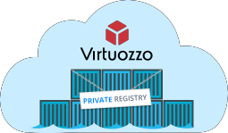
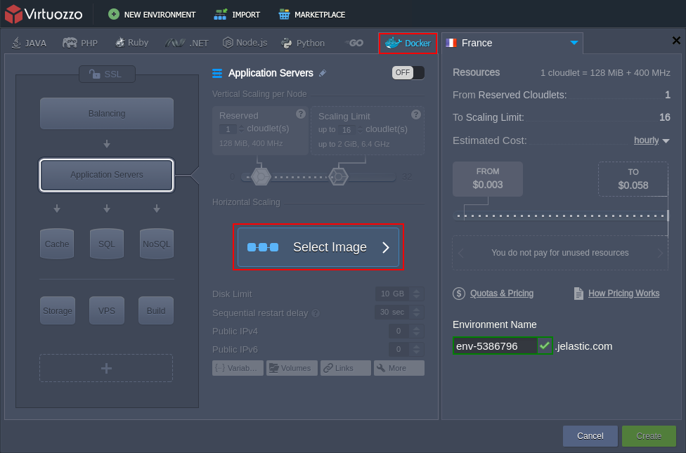
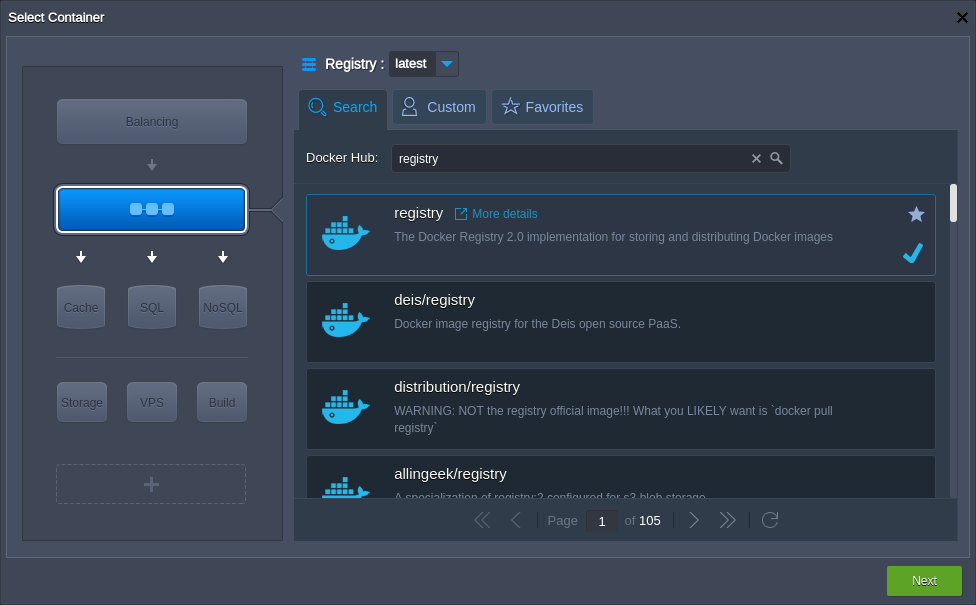
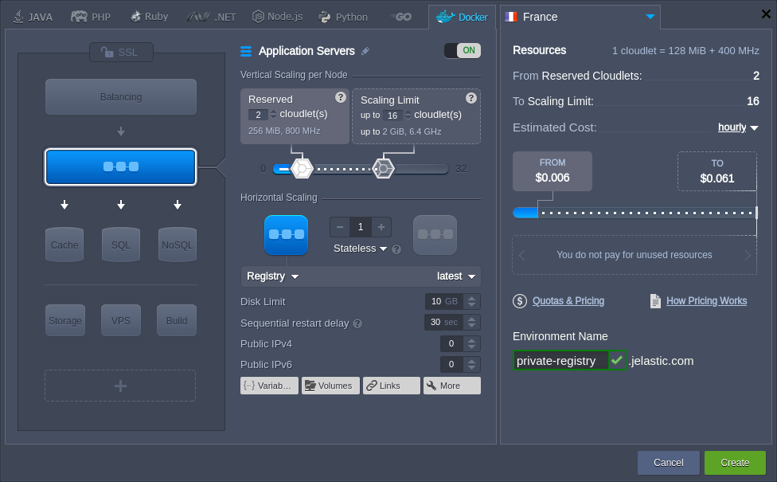
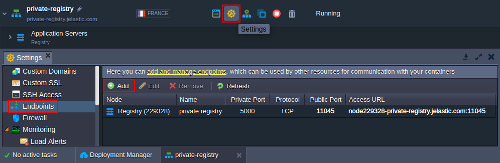
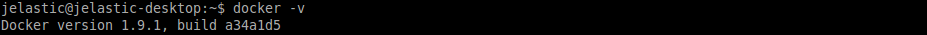
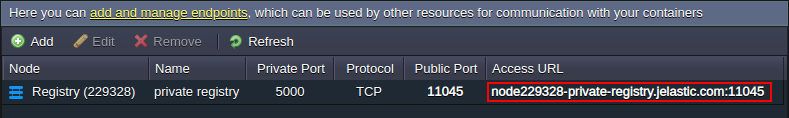
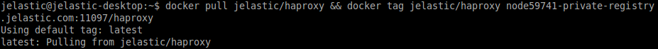
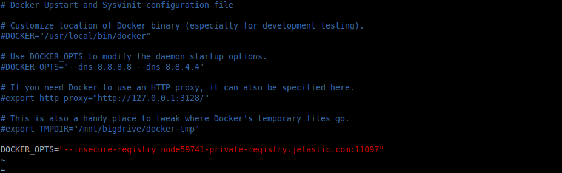
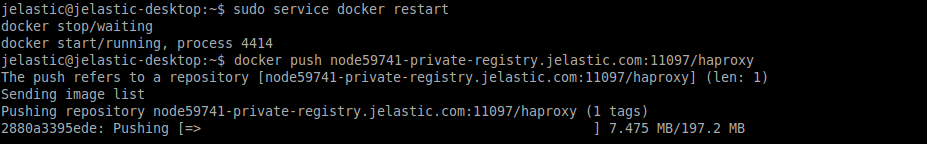

<div style={{
    display: 'flex',
    alignItems: 'center',
    gap: '15px',
}}>

<span style={{
minWidth: '30%',
maxWidth: '30%',
}}>



</span>

[Docker solution](https://www.docker.com/why-docker/) is designed for comfortable application distribution using fast and lightweight templates, which allows running your projects almost everywhere. Thus, it is a perfect technology for for those developers and sysadmins, who look for speeding up the application delivery workflow and avoiding the constant adjustment issues.

</div>

In order to handle your own Docker image, the appropriate registry is needed. The vast majority of dockerized solutions are stored at public registries so that anyone can use them. However, sometimes, it becomes necessary to hide your repository content from the rest of the world, e.g. in case it contains some proprietary code or confidential information. For this purpose, you can create your isolated private registry.

So, let’s discover how to get it at the platform in a matter of minutes through following the next steps:

- [deploying private registry](/docs/Container/Private%20Registry%20inside%20PaaS#deploy-private-registry)
- [adding image to registry](/docs/Container/Private%20Registry%20inside%20PaaS#add-image-to-registry)

Subsequently, you’ll be able to easily deploy the added image from your [private registry](/docs/Container/Container%20Deployment/Custom%20Containers%20Deployment) to the platform.

## Deploy Private Registry

The base template for the private registry can be found among other open-source images at Docker Hub. Thus, you can comfortably host it inside any preferable [PaaS installation](https://cloudmydc.com/) by creating the appropriate custom container:

1. Log in to your PaaS account and click the **New Environment** button at the top pane.



In the opened topology wizard, switch to the **Docker** tab and click **Select Image**.

2. Here, use **Search** to find the registry image and add it.



:::tip Tip
You can select the required tag for your Docker image at the top of this frame or during the next step.

:::

Click **Next** to proceed.

3. Provide all other [configurations](/docs/EnvironmentManagement/Setting%20Up%20Environment) for the environment (disk limit, name, [region](/docs/EnvironmentManagement/Environment%20Regions/Choosing%20a%20Region), etc.) up to your needs.



:::danger Note

The instruction below is written for the [newest registry](https://github.com/distribution/distribution) versions (i.e. starting with **2.x** tag and higher). For [deprecated registries](https://github.com/docker-archive/docker-registry), the configuration & interaction flow may vary in details.

:::

Click **Create** and wait a minute for the environment to be configured.

4. Now, you need to configure an entry point for external access. We’ll create one, leveraging the platform [endpoints](/docs/ApplicationSetting/External%20Access%20To%20Applications/Endpoints) feature, in order to expose the container’s port 5000.

:::tip Note

Alternatively, you can attach and work over [public IP](/docs/ApplicationSetting/External%20Access%20To%20Applications/Public%20IP) (a paid option) without any additional configurations.

:::



Click on the **Settings** button next to your environment, navigate to the **_Endpoints_** section, and Add a new endpoint. Within the opened frame, specify the desired parameters, stating the 5000 **Private Port** number within the same-named field.

As a result, you should receive a record similar to the one shown in the image above. Now, you can start filling your registry with Docker images.

## Add Image to Registry

In order to show how a Docker template can be added to your registry, we’ll take an existing image from the central Hub registry and push it to our private repository (however, you can use your own, i.e. locally composed, one).

However, before that, you need to apply some slight adjustments to your local machine configs in order to be able to operate with it properly.

1. To start with, [install](https://docs.docker.com/get-docker/) Docker CE (if you haven’t done this previously) according to the linked guide from the official website.

:::tip Note

Make sure the installed daemon version is 1.6.0 or higher (as registries usage is not compatible with its prior versions). The actual Docker daemon version can be checked by executing the following command at your terminal:

```bash
docker -v
```



:::

2. Next, choose any preferable image at Docker Hub, get it using the pull command and tag the received template so that it points to your private registry (or, in case of a local template usage, just skip the first command part).

```bash
docker pull  {image} && docker tag  {image}  {entry_point}/{repository}
```

where:

- **`{`image`}`** - a name of the Docker template you’d like to pull and tag (e.g. jelastic/haproxy)

- **`{`entry_point`}`** - private registry entry point, i.e. either endpoint (which was created at the end of the previous section) or external IP address. We’ll use the first one:



- **`{`repository`}`** - a name of a repository at your remote private registry (e.g. haproxy) for the image to be stored in



3. Now, you should pay attention to one more detail - while using a remote private registry, it’s required to secure interaction with it by means of TLS. For that, you need to place the corresponding [SSL certificate files](https://docs.docker.com/registry/#running-a-domain-registry) (i.e. server key and domain certificate), issued by a known CA, to your registry.

:::tip Tip

A [self-signed](/docs/ApplicationSetting/SSL/Self-Signed%20Custom%20SSL) certificate can be applied as well - in this case, you’ll need to manually instruct your Docker daemon to [trust](https://docs.docker.com/registry/#docker-still-complains-about-the-certificate-when-using-authentication) it.

:::
However, for testing purposes, you can apply a relatively simpler configuration, that allows bypassing this requirement - run your registry in an [insecure mode](https://docs.docker.com/registry/#deploying-a-plain-http-registry), so all the communication will be performed over the plain HTTP (which, although, is <u>highly unrecommended</u> in confines of production usage).

For that, add the following line to the **_/etc/default/docker_** configuration file of your daemon (or the similar one according to your OS distribution), e.g. using the **_vim_** editor with sudo permissions:

```bash
DOCKER_OPTS="--insecure-registry  {entry_point}"
```



Don’t forget to save the changes.

:::danger Note

In case of using self-signed certificates or insecure option, the same extra configurations will be required for being applied to every Docker daemon, which needs to access your registry.

:::

4. Now, you can restart your local Docker daemon and push the prepared image to your remote repository:

```bash
sudo service docker restart
docker push  {entry_point}/{repository}
```



That’s all! Shortly, your image will be uploaded to the registry (the exact time depends on image size and the internet connection speed) and will become available for use throughout the Internet.

As a result, you can easily [deploy it within the platform](/docs/Container/Container%20Deployment/Custom%20Containers%20Deployment) just in the similar way we’ve done this at the beginning of the instruction.

:::tip
In case you face any issues while deploying your own registry or adding an image to it, feel free to appeal for our technical experts' assistance at [Stackoverflow](https://stackoverflow.com/questions/tagged/jelastic).

:::
