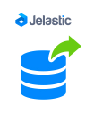
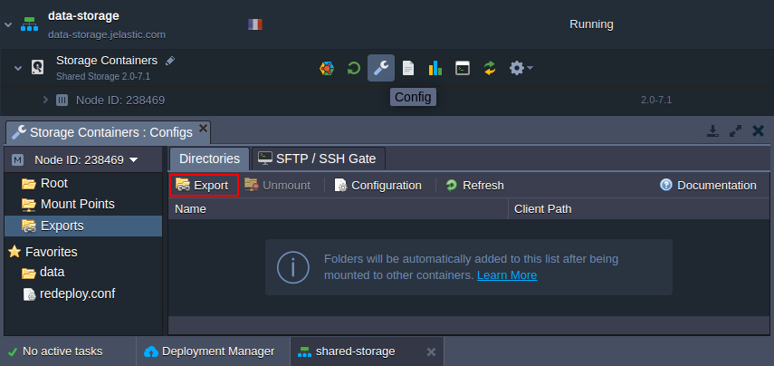
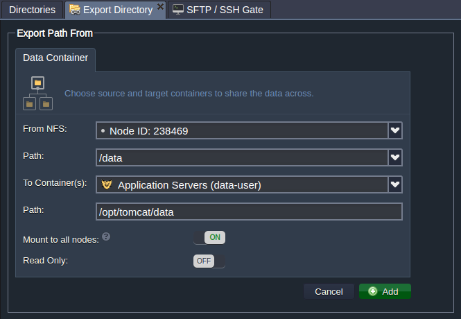
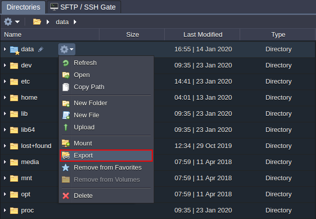
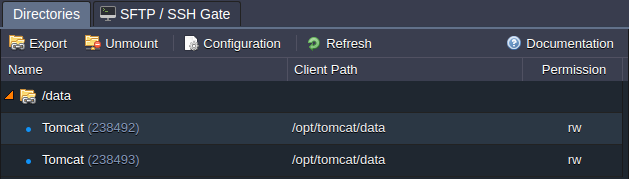
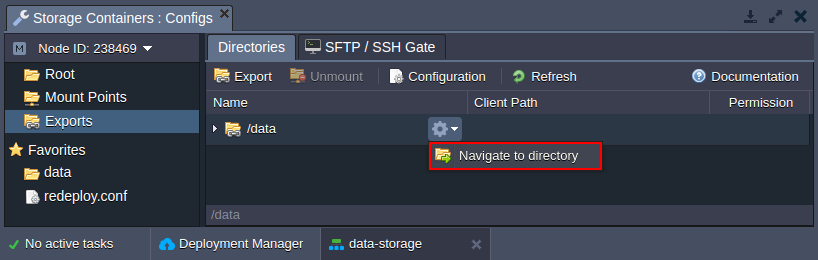
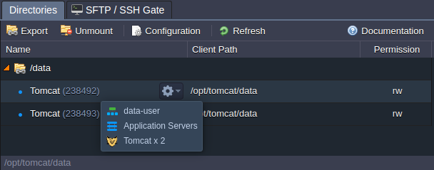
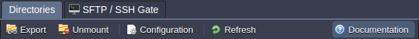
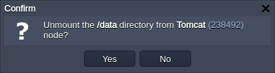
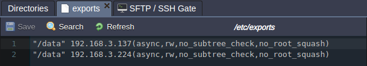

The platform provides extended support for [data sharing](/docs/Data%20Storage%20Container/Data%20Storage%20Overview) between instances inside of the same account. The dedicated UI panels are available in the dashboard to simplify the required export from a server (described in this guide) and [mount on client](/docs/Data%20Storage%20Container/Data%20Sharing/Mount%20Points) operations. You only need to perform either of these actions, and the platform will automatically apply the correlated configuration on the appropriate second instance.

So, let’s overview how you can [share directories](/docs/Data%20Storage%20Container/Data%20Sharing/Exporting%20Data%20for%20Sharing#directory-export) on your containers and how to manage all of the [container’s exports](/docs/Data%20Storage%20Container/Data%20Sharing/Exporting%20Data%20for%20Sharing#managing-exports).

## Directory Export

You can share any directory inside your container with any other node at your account.

:::tip Note

In case you need to [export data externally](/docs/Data%20Storage%20Container/External%20NFS%20Server%20Configuration) (i.e. to the server outside of your PaaS account), follow the linked guide to configure exports manually.

:::

1. Open the [Configuration Manager](/docs/Container/Container%20Configuration/Configuration%20Tools#configuration-file-manager) for your storage (i.e. where files are physically located), switch to the **_Exports_** section, and click the **Export** button at the top pane.

2. The appropriate **_Export Directory_** tab will be opened.

Here, you’ll need to specify the following information:

- **From NFS** - choose the required node inside the current environment layer via the drop-down list
- **Path** - type an absolute path to the exported folder (or choose it from your favorites)
- **To Container(s)** - select target layer from the automatically fetched list of environments on your account
- **Path** - provide a path to the location through which the shared data should be available on the target node(s)
- **Mount to all nodes** - use this switcher to set the same mount for the whole layer (disable to mount to a single node)
- **Read Only** - turn the switcher on to restrict editing of the exported data at client node(s) (by default, the read & write permissions are provided)

Click **Add** to proceed.

:::tip Tip

The same form can be accessed directly from the node’s [file manager](/docs/ApplicationSetting/Configuration%20File%20Manager), using the appropriate
**Export** option in the folder’s context menu:

:::

<!-- export folder from file manager -->

3. In a moment, this exported folder will appear in the list.

That’s all! During the operation, the appropriate [mount point](/docs/Data%20Storage%20Container/Data%20Sharing/Mount%20Points) on the target node(s) is configured automatically by the platform so that you can immediately start working with your shared data without any additional steps required.

## Managing Exports

Beside [exporting directories](/docs/Data%20Storage%20Container/Data%20Sharing/Exporting%20Data%20for%20Sharing), the **Exports** section allows managing existing records.

1. All directories shared from this container to any node on the same platform are displayed here (the [externally](/docs/Data%20Storage%20Container/External%20NFS%20Server%20Configuration) exported data won’t be shown).

You can quickly jump to any of the exported folders by hovering over the required record and selecting the **Navigate to directory** option from the **_Additionally_** list.

2. In order to get the exact location and target node details for the exported directories, expand the appropriate record.

The following information can be found here:

- **Name** - shows stack name and ID of the node(s), where the exported folder is mounted (hover over for additional details on the appropriate environment or to unmount this record via the **_Additionally_** list)
- **Client** Path - provides a path to the folder, where shared data can be accessed at the remote node
- **Permission** - displays access permissions for the corresponding client (rw - read-write; ro - read-only)

3. At the tools panel above the list, you can find several buttons, which are intended to help you with managing your exports on the current container.

- with the **Export** option, you are able to [share any directory](/docs/Data%20Storage%20Container/Data%20Sharing/Exporting%20Data%20for%20Sharing#directory-export) inside the container with any other node at your account
- the **Unmount** button stops data sharing with the selected client node

After confirmation, the corresponding record will be removed from the list, and the appropriate data will become unavailable at the chosen instance.

- the **Configuration** button redirects to the **_etc/exports_** file, where you can check and, if needed, manually edit the list of exports (shared folders, client addresses, additional parameters)

:::danger Note

If working in the confines of your PaaS account, all of the required export configurations are automated. Manual adjustment of this file is only needed for [external exports](/docs/Data%20Storage%20Container/External%20NFS%20Server%20Configuration).

:::

- you can **Refresh** the list with the same-named button to get the most recent shares state
- the **Documentation** button on the far right of the panel redirects to the current documentation page
  For any additional configuration, you can use the built-in [file manager](/docs/ApplicationSetting/Configuration%20File%20Manager) or connect to a node over [SSH](/docs/Deployment%20Tools/SSH/SSH%20Overview).

:::tip Note

If you face any issues while exporting data for sharing, feel free to appeal for our technical experts' assistance at [Stackoverflow](https://stackoverflow.com/questions/tagged/jelastic).

:::
