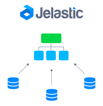
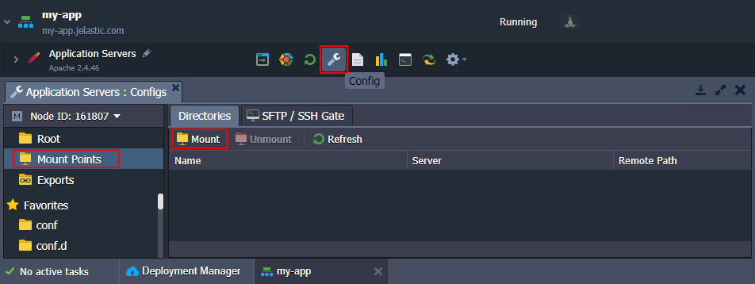
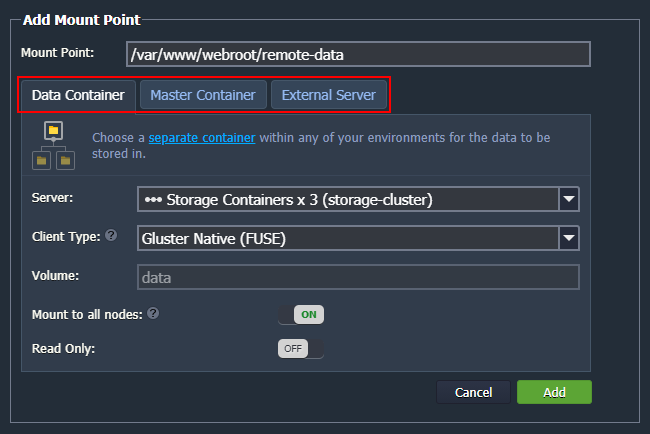
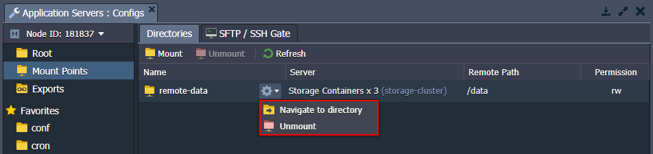
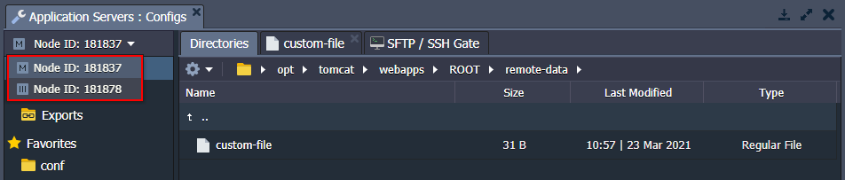
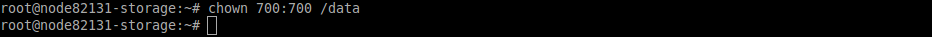

<div style={{
    display: 'grid',
    gridTemplateColumns: '0.15fr 1fr',
    gap: '10px'
}}>
<div>



</div>

<div>

**Mount points** is a data-sharing functionality between instances inside of the same account. It is initiated <u>from the client</u> and creates a connection that allows accessing and operating <u>data on the server</u> as if it were local files. The platform provides a comfortable UI for this operation directly in the built-in [Configuration Manager](/docs/Container/Container%20Configuration/Configuration%20Tools#configuration-file-manager). Just in a few clicks, define remote directories that are physically located on other nodes but should be accessible at the current container.

</div>

</div>

:::tip Tip

The same operation can be initiated <u>from the server</u>. It is called **[Exporting Data](https://cloudmydc.com/)** - learn more in the linked document.

:::
When creating a mount point, the platform supports two client protocols - **[NFS](https://cloudmydc.com/)** and **[GlusterFS Native](https://cloudmydc.com/)**. The first one is available for all containers on the platform and is relatively faster. In contrast, the second one is a unique feature of the [GlusterFS cluster](https://cloudmydc.com/), which is recommended for high concurrency, high performance of the write operations, and failover.

1. So, in order to mount data to a container, click the **Config** button next to the chosen container or layer. In the opened tab, switch to the **_Mount Points_** section within the menu to your left and click the **Mount** button.

<div style={{
    display:'flex',
    justifyContent: 'center',
    margin: '0 0 1rem 0'
}}>



</div>

2. The opened form provides the following three operation types:

- **Data Container** - accessing data from the node on the same account
- **Master Container** - sharing data across nodes of the same layer within the current environment
- **External Server** - accessing data from the remote server outside of the PaaS account

<div style={{
    display:'flex',
    justifyContent: 'center',
    margin: '0 0 1rem 0'
}}>



</div>

3. After selecting the necessary operation type, provide other details as follows:
   - **Mount Point** - path to a local folder the mounted content will be displayed at

:::danger Notes

- if the specified directory doesn’t exist, it will be created automatically
- path can’t start with _/proc, /dev, /sys, /run_ or be equal to the following: _/, /bin, /lib, /lib64, /lib32, /usr, /usr/bin, /usr/sbin, /usr/lib_, or _/usr/lib64_ (this list may vary based on your provider’s settings)

:::

- **_Data Container_**
  - **NFS Server** - expandable list of nodes on your account which can be used as a data storage container
  - **Remote Path** - the required directory location at a remote container (you can either type it manually or choose one of the favorite paths on that node from the automatically fetched drop-down list)

:::tip Note

If GlusterFS cluster is selected as a **Server**, you can also choose the preferred **Client Type** protocol for the mount. _[NFS](https://cloudmydc.com/)_ is recommended for the performance-oriented topologies, while _[Gluster Native](https://cloudmydc.com/)_ ensures data safety through backups and replication.

:::

- **_Master Container_**

  - **NFS Server** - the master node of the layer is selected automatically
  - **Remote Path** - same folder as specified in **Mount Point** field is used (will be shared among all nodes of a layer)

- **_External Server_**

  - **NFS Server** - external IP of the data storage server or its [custom domain](https://cloudmydc.com/) name
  - **Remote Path** - exported files location on NFS server

- **Mount to all nodes** - switcher to set the same mounts to be added for all nodes within a layer, including those that could be added in the future (automatically enabled for the **Master Container** type)

- **Read Only** - turn the switcher on to restrict the mounted data editing at client nodes (by default, the read & write rights are provided)

Click **Add** to proceed.

:::tip Note

If not a dedicated [Shared Storage Container](/docs/Data%20Storage%20Container/Data%20Storage%20Overview) has been chosen as a data container, a brief one-time delay (up to a few minutes) may occur due to the required NFS software installation.

:::

4. In a moment, your mount point will be created and added to the list. So, you can either **Navigate to directory** (double click on the corresponding record) or **Unmount** it when it becomes unnecessary.

<div style={{
    display:'flex',
    justifyContent: 'center',
    margin: '0 0 1rem 0'
}}>



</div>

5. Upon navigating inside, you’ll see the same content as on your remote server.

<div style={{
    display:'flex',
    justifyContent: 'center',
    margin: '0 0 1rem 0'
}}>



</div>

Based on the mount configurations, the remote content can be editable from the client or not, as well as available for all layer’s nodes or just one. You can switch between nodes using the drop-down list at the left-hand menu (circled above).

:::danger Note

**Take into consideration** that in order to be editable (i.e. if clients are granted RW rights), the folder on the server should have the appropriate permissions for the client’s user (the default user names may vary for different servers - e.g. root and jelastic).

If needed, connect to your storage server via [SSH](/docs/Deployment%20Tools/SSH/SSH%20Overview) and execute the following commands to adjust the rights:

```bash
chown {uid}:{gid} {path}
```

Here:

- **_{uid}_** - user ID, which can be found in the **_/etc/passwd_** file
- **_{gid}_** - group identifier, that is shown within the **_/etc/group_** file
- **_{path}_** - path to the directory or file you’d like to change the permissions for

<div style={{
    display:'flex',
    justifyContent: 'center',
    margin: '0 0 1rem 0'
}}>



</div>
:::

The platform mount points provide a great number of [scenarios and possibilities](https://cloudmydc.com/) for advanced data structuration and control.
