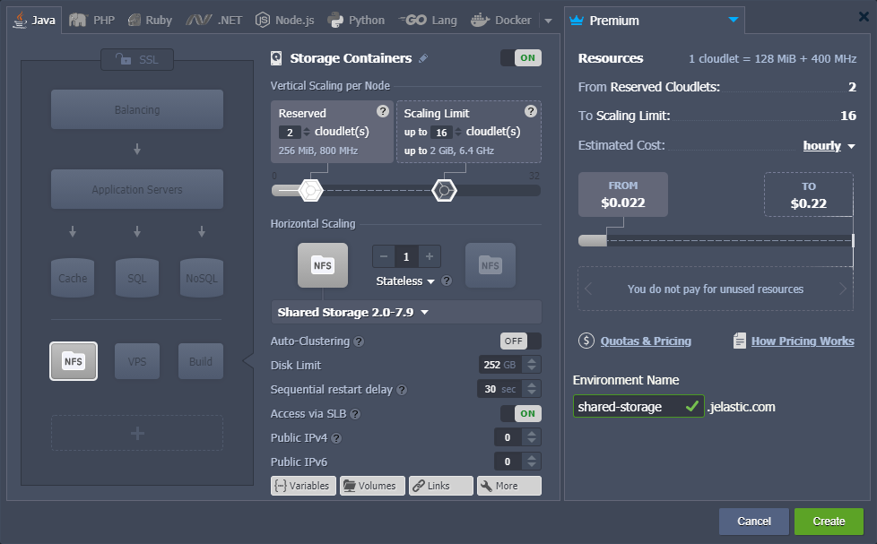
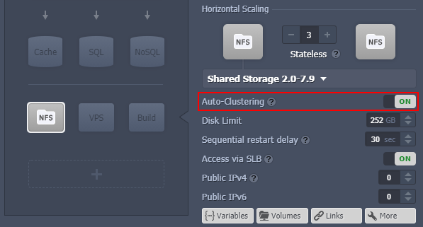
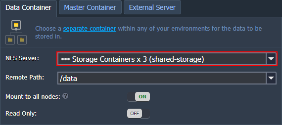

**Shared Storage Сontainer** is a special type of node, designed for data storing. Compared to other managed containers, it provides a number of the appropriate benefits:

- **_NFS and Gluster Native (FUSE) client types_** for data mounting
  - **[NFS]( /docs/Data%20Storage%20Container/Data%20Sharing/Mount%20Protocols/NFS)** - straightforward file system protocol, designed for accelerated processing and high performance
  - **[Gluster Native (FUSE)]( /docs/Data%20Storage%20Container/Data%20Sharing/Mount%20Protocols/GlusterFS)** - reliable file system protocol with automatic replication of the mounted data, designed for data backup and failover (consumes more CPU/disk than NFS)
- **_NFSv4 Support_** instead of NFSv3 on other managed stacks, ensures improved performance (especially for a large number of files), stronger security, support of the FUSE directories export, and more.

:::tip Note

Any platform-managed container can receive mounts over the fourth version of the protocol, but only Shared Storage Container can export data over NFSv4.

:::

- **_[Auto-Clustering](/docs/ApplicationSetting/Scaling%20And%20Clustering/Auto-Clustering%20of%20Instances)_** option automatically configures a reliable storage cluster, ensuring data safety. In case of failure of one or several nodes, the AutoFS client automatically switches to the working instances on the next read/write operation attempt.
- **_Enlarged Disk Space_** compared to other common-purposed nodes is provided for Shared Storage Container, allowing to work with bigger data volumes. The particular value depends on your service provider’s settings and can vary based on the account type.
- **_Optimized Performance_** due to all the necessary software being preinstalled (e.g. NFS & RPC for NFSv4, _[GlusterFS](https://www.gluster.org/)_ for auto-clustering) and the default features of the platform (elastic vertical and horizontal scaling, efficient pay-as-you-use pricing model, comfortable UI with file exports and mount points support, etc.)

And below we’ll consider how to set up such Shared Storage server inside the platform, some tips on its management, and use case specifics:

- [Storage Container Creation]( /docs/Data%20Storage%20Container/Shared%20Storage%20Container#storage-container-creation)
- [Shared Storage Auto-Cluster]( /docs/Data%20Storage%20Container/Shared%20Storage%20Container#shared-storage-auto-cluster)
- [Storage Container Management]( /docs/Data%20Storage%20Container/Shared%20Storage%20Container#storage-container-management)

## Storage Container Creation

To create a new Shared Storage Container, enable the corresponding **_Storage_** section at the topology wizard. This option is available for all engine types, including Docker containers.

In the middle part of the wizard, you can provide additional configurations for your Shared Storage. The exact amount of provided storage space can be adjusted via the Disk Limit field. The platform can automatically configure a [reliable storage cluster]( /docs/Data%20Storage%20Container/Shared%20Storage%20Container#shared-storage-auto-cluster  ) (instead of separate nodes) if you enable the **_Auto-Clustering_** switcher. Also, in case of necessity, [public IP](/docs/ApplicationSetting/External%20Access%20To%20Applications/Public%20IP) addresses can be attached to the nodes (both IPv4 and IPv6).

:::tip Tip

Since this container type was specially developed to be used as a data storage server, you need to consider some specifics about its configuration:

- although RAM & CPU are not the primary resources of the storage, they are still consumed by the node due to operating over networks (the particular amount depends on load)
- if the maximum value of disk space per storage node is not enough, please contact your hosting provider’s support team and request the corresponding account limit enlargement
- node pricing mainly depends on the amount of disk space in use (not the limit) and external network traffic (check these resources cost at **[Quotas & Pricing](/docs/Account&Pricing/Resource%20Charging/Pricing%20FAQ#how-much-do-resources-cost)\*\***> Pricing > Disk Space** or **Traffic\*\*)

Click **Create** when ready.

## Shared Storage Auto-Cluster

Upon enabling **[Auto-Clustering](/docs/ApplicationSetting/Scaling%20And%20Clustering/Auto-Clustering%20of%20Instances)** switcher for the Shared Storage Container in topology wizard, the platform automatically configures a replicated volume (replicates files across bricks in the volume). Such a solution is implemented based on the pre-installed _[GlusterFS](https://www.gluster.org/)_ RPM packages and is intended for environments where high-reliability is critical.

:::tip Tip

Consider the following specifics:

- Currently, automatic conversion of the existing standalone storage into the GlusterFS cluster is not supported. Follow the manual [migration guide]( /docs/Data%20Storage%20Container/Migrating%20to%20GlusterFS%20Cluster).
- Shared Storage auto-clustering requires the latest [CloudMyDc 7](https://cloudmydc.com/) virtualization used on the [environment region](/docs/EnvironmentManagement/Environment%20Regions/Choosing%20a%20Region) (depends on your hosting provider)
- storage auto-cluster requires 3 or more nodes and cannot be disabled after creation
- scaling is performed with two nodes step to maintain working quorum

:::

During creation, the GlusterFS volume is mounted into the **/data** folder and is accessible over NFSv4 protocol. Consequently, when [mounting]( /docs/Data%20Storage%20Container/Data%20Sharing/Mount%20Points) from/to your storage cluster, it is managed as a single component (i.e. not a collection of separate storage containers). In case of failure of one or several nodes, the AutoFS client (that is used in application containers by default) automatically switches to the working instances on the next read/write operation attempt.

:::tip Tip

If facing the [split-brains error](https://docs.gluster.org/en/latest/Troubleshooting/resolving-splitbrain/) (i.e. storage cannot determine which copy in the replica is the correct one), follow the linked troubleshooting guide to resolve the issue.

:::

## Use Cases Peculiarities

The storage cluster based on the Gluster software is [suitable for the most solutions](https://docs.gluster.org/en/latest/Install-Guide/Overview/#is-gluster-going-to-work-for-me-and-what-i-need-it-to-do). However, some cases benefit from the GlusterFS & NFS usage more than others.

<u>Recommended</u> use cases:

- when the GlusterFS storage is mostly used to read data (not write), e.g. WordPress or Magento websites, shared resource for media content data
- if the application that performs write operations to GlusterFS storage can handle exceptions and perform retry attempts in case of an error

<u>Not recommended</u> use cases:

- Gluster does not support so-called “structured data”, so do not use Shared Storage for SQL databases. However, using GlusterFS to backup and restore a database would be fine
- NFS is not suitable for applications with heavy IO operations and, in case of a node failure during the write operation, can even lead to data corruption

Some general examples of the storage usage are described in the [Dedicated Storage]( /docs/Data%20Storage%20Container/Use%20Cases/Dedicated%20Container) documentation.

## Storage Container Management

Right after creation, you can immediately proceed to the container configuration. Below, we’ll show several basic actions that may be useful for you to get started:

1. For the most common operations with your storage, the built-in [configuration file manager](/docs/ApplicationSetting/Configuration%20File%20Manager) can be used. For more complex management, you may prefer to work with some third-party tool (use the connection details from the **SFTP / SSH Gate** tab circled in the image below).

:::tip Tip

For files sharing with other instances within the platform or external servers, the appropriate **_[Mount Points]( /docs/Data%20Storage%20Container/Data%20Sharing/Mount%20Points)_** and **_[Exports]( /docs/Data%20Storage%20Container/Data%20Sharing/Exporting%20Data%20for%20Sharing)_** tabs can be used.

:::

2. [SSH access]( /docs/Deployment%20Tools/SSH/SSH%20Access/Overview) (either via the web or local SSH client) can be established to get full control over your storage server.

3. If you want to use your Shared Storage Container as an external server (i.e. not only within the current PaaS installation) - enable the [public IP](/docs/ApplicationSetting/External%20Access%20To%20Applications/Public%20IP) option to make it accessible from outside. Follow instructions in the dedicated [NFS server configurations]( /docs/Data%20Storage%20Container/External%20NFS%20Server%20Configuration) guide.

The IP address(es) attached to Shared Storage can be viewed through expanding the appropriate node in the dashboard.

4. When stopping or deleting an environment, the platform automatically checks for the mounts configured on the comprised nodes and provides **Details** on instances affected by the action in the confirmation frame.

:::tip Note

The live migration option is not available for [migration of environments]( /docs/EnvironmentManagement/Environment%20Regions/Migration%20between%20Regions) with Shared Storage containers. So, to check the nodes affected by the temporary unavailability of the storage, use the appropriate availability of the components link circled in the image below.

:::

That’s all! For now, as you know the main points on your Shared Storage Container handling, feel free to proceed and fill it with the required content.

:::tip Note

If you experience any problem with Shared Storage Container deployment, configuration or usage, feel free to appeal to our technical expert’s assistance at [Stackoverflow](https://stackoverflow.com/questions/tagged/jelastic).

:::
