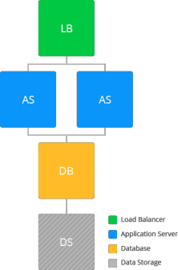
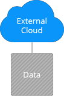

## Dedicated Storage Container

For more complex and loaded applications, it is worth to centralize your shared data within a single container to get more simple and flexible exports' management (including access permission control - e.g. read-only for one node type and read-write for another).

In confines of the platform, a [Shared Storage Container](/docs/Data%20Storage%20Container/Data%20Storage%20Overview) is recommended to be used for sharing files across multiple layers or even environments of a single account. It is specially optimized for data storing (i.e. is focused on performance and provides the enlarged disk space amount).

Apart of that, upon using a separate Shared Storage Container, you get the following benefits:

- Since storage here represents an independent container, its occasional high loading can be properly handled without influence on general application performance (as it might happen during load peaks in case a single node fulfils several “roles”).
- Upon the necessity, you can painlessly remove everything except the required data (i.e. leaving just a storage being included to environment) and start over with your project from the scratch. The majority of common environment settings (e.g. internal domain and sharing permissions) will be left unchanged, which highly simplifies project re-integration.
- Storing data apart makes it easier to handle several [project clones](/docs/EnvironmentManagement/Cloning%20Environment) (i.e. environments), dedicated for different application lifecycle stages (e.g. separate ones for development, testing and production).
- Mount folder with your DB’s [scheduled backups](/docs/Database/Database%20Hosting/Manual%20Database%20Backups) to your storage container for making backups automatically kept on the remote server and, in such a way, improve the overall data safety during software upgrades.

In addition to actually data storing, such a structure can be also efficiently utilized in case you need to share some common configuration files, that are to be used by nodes on different layers and/or environments.

Your Shared Storage Container can be also used as an external storage, i.e. you can export data from the platform to be available over the Internet.

In such a way, you can share some content for the required third-party service or another developer (providing him with personal access permissions) or, generally, get a quick access to your data from any point with the platform-hosted NFS server.

By using this option, you can even build your own intercloud sharing solution and/or operate with the same data from different PaaS installations - find out the required [NFS server configurations](/docs/Data%20Storage%20Container/External%20NFS%20Server%20Configuration) for such an implementation within the linked guide.
