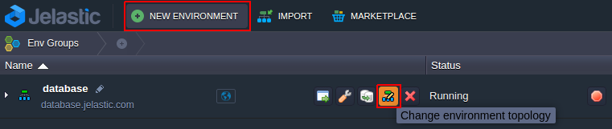
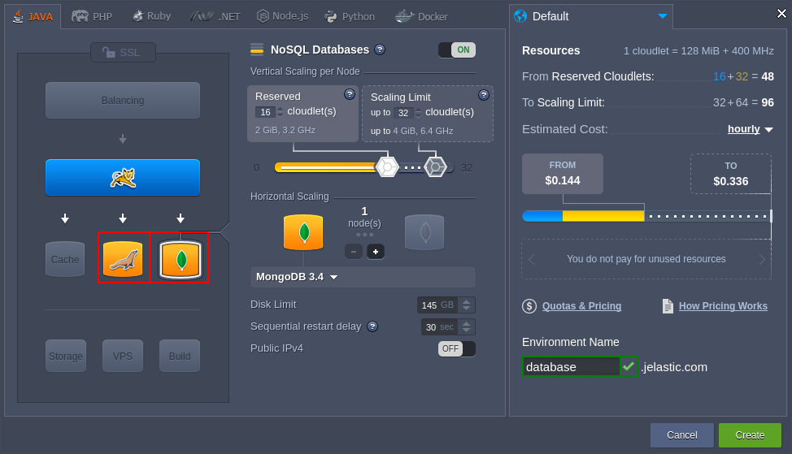
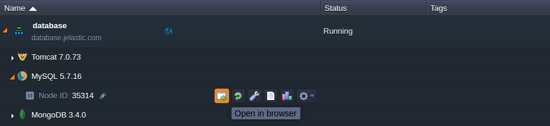
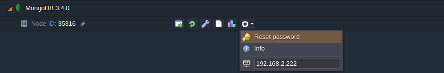
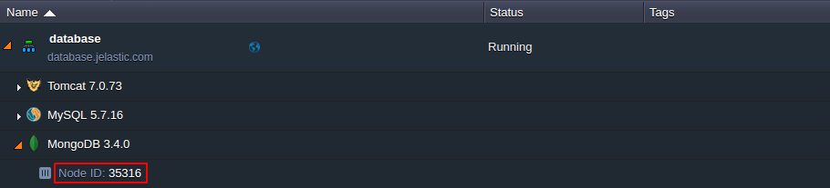

## Database Hosting

Platform provides a set of scalable and fully manageable database servers that you can easily install and operate with. The process of a new database creation is fairly simple and can be accomplished in just a few minutes.

1. Open the Topology wizard through either clicking **New environment** (to set up a new environment) or selecting the **Change environment topology** button (to add database to the already existing environment).

2. Then refer to the **SQL** or **NoSQL** wizard section to select database server of the corresponding type.

Use the drop-down list to choose among the available DB management systems:

- for **SQL** - MySQL 5.6 / 5.7, MariaDB 5.5 / 10.1, PostgreSQL 9.5, PerconaDB 5.6, MSSQL 2012
- for **NoSQL** - MongoDB 2.6 / 3.4, CouchDB 1.6, Redis 2.8 / 3.2, Neo4j 1.9 / 2.3 / 3.0, Cassandra 2.2.4 / 3.0, OrientDB 1.7.4 / 2

:::tip Note

The list of available [database servers](https://cloudmydc.com/) can vary and depends on your hosting provider settings. If some of these servers are not available in your wizard, please, contact your hosting provider for activation.

:::

When the corresponding database server is created, you’ll receive an email notification with credentials (access URL, login and password) to the database administration panel.

3. To launch your database admin panel, click the **Open in Browser** button next to the target database node at the dashboard (or compose the admin panel URL [manually](https://cloudmydc.com/)).

In the opened page, use credentials from the email to log in and start applying configurations required by your application.

:::tip Tip

For containers without [public IP](/docs/ApplicationSetting/External%20Access%20To%20Applications/Public%20IP) address attached, the database admin console is available via https:// by default.

:::

When your database server is up and ready, you can [Connect your application to DB](https://cloudmydc.com/).

## Database Password Reset

To **Reset password** for a database node, click the same-named button next to it at the dashboard (or for a set of scaled DB instances to get new credentials for all of them at once).

As a result, you’ll receive email with a new password to access your database admin console.

## Database Admin Panel URL

The administration panel URL for DB servers should consist of the following parts:

_node{node_id}-{environment_name}.{hoster_domain}_

where

- _{node_id}_ - ID of the target database container that can be located at the dashboard (e.g. 35316 for MongoDB)

- **{environment-name}** - name of the environment you’ve added the server to (e.g. database)
- **{hoster_domain}**- your hosting provider domain; can be found within the last column of the appropriate table in the [Hosters Info](https://cloudmydc.com/) page

:::tip Note

In case your hosting provider platform has several [environment regions](/docs/EnvironmentManagement/Environment%20Regions/Choosing%20a%20Region) to choose, the _{hoster_domain}_ value for your environment can differ from the general platform’s one.

:::

In such a way, the whole access URL for the database administration panel will be the following in our case:

*https://node35316-database.jelastic.com*
