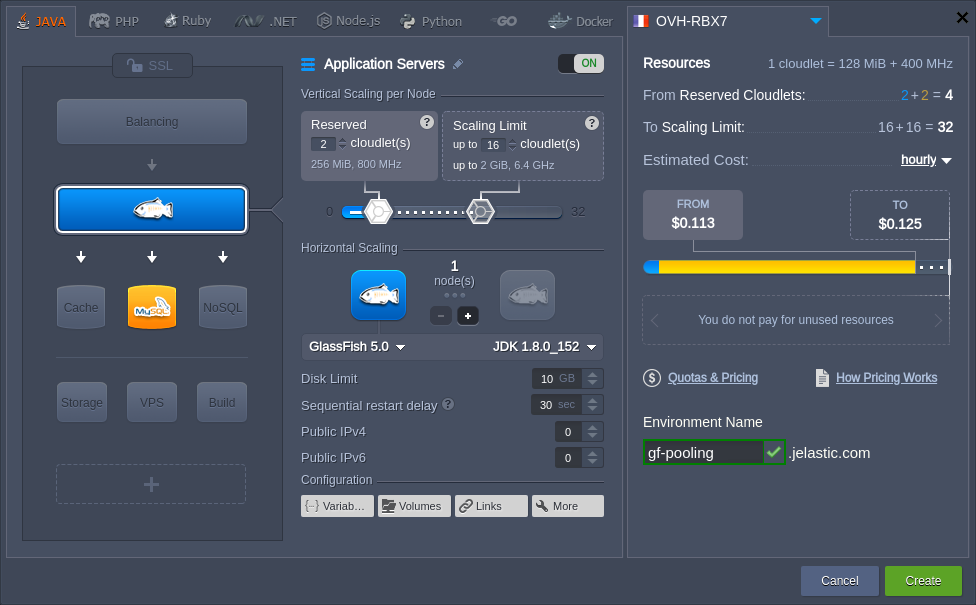
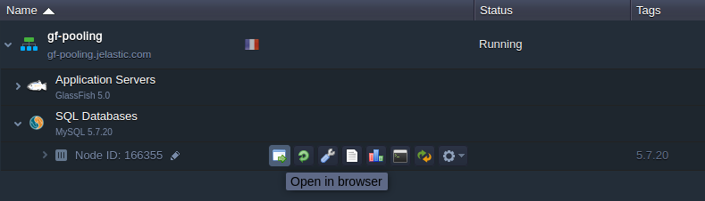
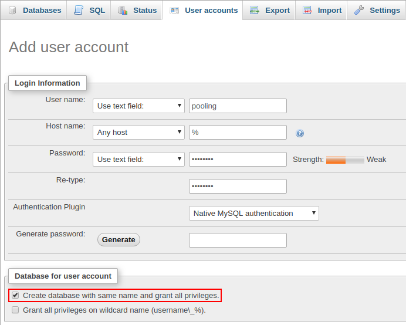
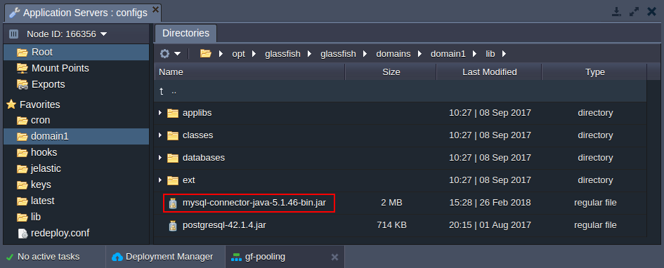
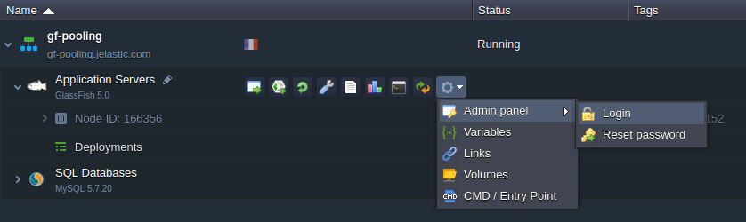
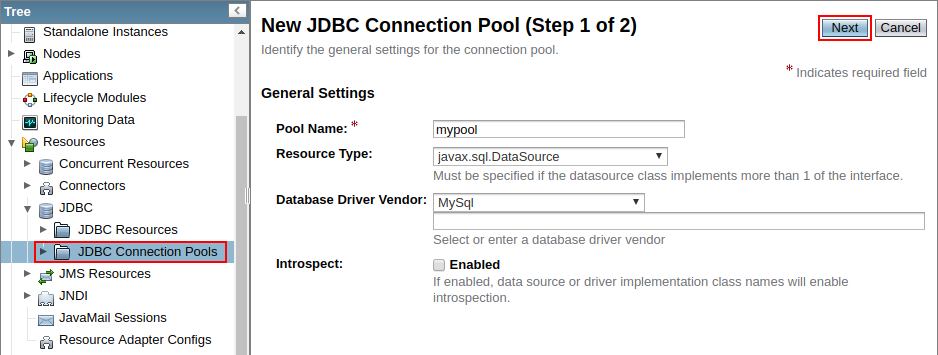
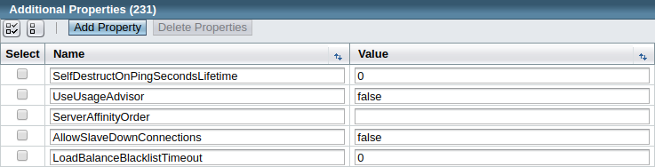
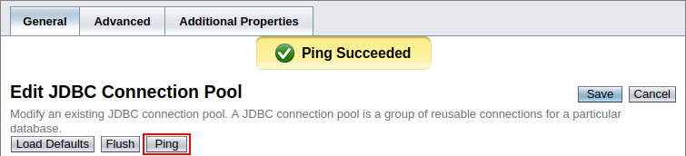
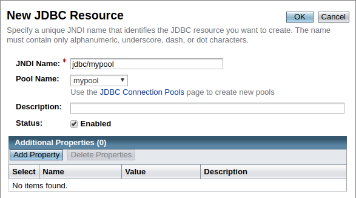

## JDBC Connection Pool

**Connection pooling** in JDBC (Java Database Connectivity) is an optimization feature, which caches database connections. Such implementation allows to reuse them, rather than spawning and closing one for each request, namely:

- _without JDBC connection pool_ - opens connections to database services as required and closes when the page is done processing a particular request
- _with JDBC connection pool_ - maintains open connections in a pool, so if a page requires access to the database, it just uses an existing connection (a new one is established only if no pooled connections are available)

Configuring JDBC pool connection for your application server can reduce delays and resource consumption compared to servicing each individual request. In such a way enhancing the performance of a database (especially for requests made to a dynamic database-driven applications).

Herewith, both GlassFish and Payara Java application servers provide a native support of the connection pooling mechanism to enhance a database access. Follow the simple steps below to configure JDBC connection pool:

- [Create Environment](/docs/Database/Database%20Hosting/JDBC%20Connection%20Pool#create-environment)
- [Prepare Database](/docs/Database/Database%20Hosting/JDBC%20Connection%20Pool#prepare-database)
- [Configure Application Server](/docs/Database/Database%20Hosting/JDBC%20Connection%20Pool#configure-application-server)
- [Connect from Java Code](/docs/Database/Database%20Hosting/JDBC%20Connection%20Pool#connect-from-java-code)

## Create Environment

1. Log into your PaaS account.
2. Click the **New environment** button.

<div style={{
    display:'flex',
    justifyContent: 'center',
    margin: '0 0 1rem 0'
}}>


</div>

3. In the topology wizard, switch to the **_Java_** tab, pick **GlassFish** or **Payara** as your application server and add the required database (as an example, we use GlassFish and MySQL pair). Next, set the resource limits for your containers and type any preferred environment name.

<div style={{
    display:'flex',
    justifyContent: 'center',
    margin: '0 0 1rem 0'
}}>



</div>

Click **Create**, wait for a few minutes to get your new environment and proceed to creating JDBC connection pool.

## Prepare Database

1. Click the **Open in Browser** button for your MySQL node.

<div style={{
    display:'flex',
    justifyContent: 'center',
    margin: '0 0 1rem 0'
}}>



</div>

Use the received email with database credentials to login into the opened **_phpMyAdmin_** panel.

2. Once inside, switch to the **_User accounts_** tab and click on the **Add user account** link. Within the opened form, specify all of the required data and tick the Create database with same name and grant all privileges option.

<div style={{
    display:'flex',
    justifyContent: 'center',
    margin: '0 0 1rem 0'
}}>



</div>

Click **Go** at the bottom of the page to initiate addition of a database and user for connection pooling.

## Configure Application Server

1. The JDBC MySQL connector is provided by default with the stack (located in the **_/opt/glassfish/glassfish/domains/domain1/lib_** directory on your GlassFish server or **_/opt/payara/glassfish/domains/domain1/lib_** on Payara), so you don’t need to upload one manually.

<div style={{
    display:'flex',
    justifyContent: 'center',
    margin: '0 0 1rem 0'
}}>



</div>

2. Login to the GlassFish (or Payara) **Admin panel**, using credentials from the appropriate email.

<div style={{
    display:'flex',
    justifyContent: 'center',
    margin: '0 0 1rem 0'
}}>



</div>

3. Navigate to the **Resources > JDBC > JDBC Connection Pools** section and click the **New** button on the tools panel. Within the appeared form, fill in the following fields:

- _Pool Name_ - type any prefered name
- _Resource Type_ - select the _javax.sql.DataSource_ item from the drop-down list
- _Database Driver Vendor_ - choose the _MySQL_ option

<div style={{
    display:'flex',
    justifyContent: 'center',
    margin: '0 0 1rem 0'
}}>



</div>

Click the **Next** button to continue.

4. Find and modify the following **_Additional Properties_**:

- **User** - provides your database login (pooling in our case)
- **ServerName** - specifies your database host without the protocol (e.g. _node166355-gf-pooling.jelastic.com_)
- **Port** - sets port number to _3306_
- **DatabaseName** - provides your database name (pooling in our case)
- **Password** - stores a password for the specified user
- **URL** and **Url** - sets a JDBC connection string in the _jdbc:mysql://**{db_host}**:3306/_ format; the **_{db_host}_** placeholder can be substituted with either node hostname (node166355-gf-pooling.jelastic.com) or IP address (_192.168.2.57_)

<div style={{
    display:'flex',
    justifyContent: 'center',
    margin: '0 0 1rem 0'
}}>



</div>

After these properties are specified, click **Finish**.

5. In order to verify accessibility, select your just created connection pool and click the **Ping** button. If everything is OK, you should see the _Ping Succeeded_ pop-up message.

<div style={{
    display:'flex',
    justifyContent: 'center',
    margin: '0 0 1rem 0'
}}>



</div>

6. Go to the **Resources > JDBC > JDBC Resources** section and click the **New** button to create JDBC resources for pooling. Within the opened window, provide any desired JNDI Name and choose your Pool Name from the drop-down list.

<div style={{
    display:'flex',
    justifyContent: 'center',
    margin: '0 0 1rem 0'
}}>



</div>

Confirm resources creation with the **OK** button at the top.

## Connect from Java Code

Put the following strings into the Java class of your application code:

```bash
InitialContext ctx = new InitialContext();
DataSource ds = (DataSource)ctx.lookup("{resources}");
Connection conn = ds.getConnection();
```

Here, substitute the **_{resources}_** placeholder with the your JNDI name from the previous section (i.e. jdbc/mypool in our case).

Now, you can deploy your Java application to the platform and enjoy the benefits of GlassFish and Payara Micro connection pooling!