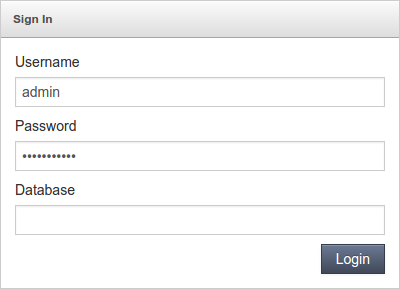

## Java Connection to MongoDB

**MongoDB** is one of the most popular NoSQL databases, which can be easily used within the platform. In this guide we’ll show you how to connect this instance with your app and perform some simple operations.

## Create Environment

1. Log in to your PaaS account.
2. [Create an environment](/docs/EnvironmentManagement/Setting%20Up%20Environment) with **MongoDB** instance (available within the NoSQL section). The preferred application server for your app to be deployed to can be located in the same or separate environment (as an example, we’ve added Tomcat 7):

<div style={{
    display:'flex',
    justifyContent: 'center',
    margin: '0 0 1rem 0'
}}>


</div>

Click **Create** and wait a couple of minutes for your environment to appear at the dashboard.

## MongoDB Configurations

1. Check your email inbox - it should contain a message from Robot@Jelastic with the database details:

<div style={{
    display:'flex',
    justifyContent: 'center',
    margin: '0 0 1rem 0'
}}>


</div>

2. Click the **Open in browser** button for the MongoDB node within your dashboard or use the Access URL from the email to access the database admin panel.

<div style={{
    display:'flex',
    justifyContent: 'center',
    margin: '0 0 1rem 0'
}}>



</div>

Log in using the abovementioned credentials.

3. Create a new database by switching to the **Databases** tab and typing a Name for it (e.g. mongodb-connect) within the **_Create Database_** form.

<div style={{
    display:'flex',
    justifyContent: 'center',
    margin: '0 0 1rem 0'
}}>


</div>

Click **Save** to continue.

4. Next, you need to create a user for this DB - thus, navigate to the **Execute** tab and choose your newly created database via the corresponding drop-down list.

<div style={{
    display:'flex',
    justifyContent: 'center',
    margin: '0 0 1rem 0'
}}>


</div>

Then type the following command within the input frame above:

db.createUser({ user: **_“user_name”_**, pwd: **_“password”_**, roles:[{ role: “readWrite”, db: “db_name"}]})

where:

- **_user_name_** - desired name of your new DB user
- **_password_** - password for this user
- **_db_name_** - name of the database the newly created user will get the read/write permissions for
  After that, click the **Execute** button and wait for the success response.

5. Now, return to the dashboard and create a separate file for storing database connection information.

:::tip Note

that you can specify all the required for connection data directly in your code (application). In the given example we put these settings to the file, which is read by our test application (presented within the next guide section).

:::

Click the **Config** button next to your application server in the corresponding environment (Tomcat 7 in our case).

<div style={{
    display:'flex',
    justifyContent: 'center',
    margin: '0 0 1rem 0'
}}>


</div>

In the opened tab, create a new **_mydb.cfg_** file inside the **home** directory and specify the following strings there:

```bash
host={db_access_url}
dbname={db_name}
user={user_name}
password={password}
```

<div style={{
    display:'flex',
    justifyContent: 'center',
    margin: '0 0 1rem 0'
}}>


</div>

where

- **_{db_access_url}_** - link to the database admin panel (find it within the corresponding email or click **Open in browser** next to your MongoDB node and copy it from the address bar) without https:// part
- **_{db_name}_** - name of the created database (mongodb-connect in our case)
- **_{user_name}_** - name of the DB user you’ve assigned to this database (dbuser in our case)
- **_{password}_** - the corresponding user’s password
  Do not forget to **Save** the changes.

## Application Deployment

1. Now you can deploy your project to the prepared environment.

As an example, here is the code of our application, intended to test the connection to our MongoDB node.

MongoManager.java :

```bash
package example;
import com.mongodb.*;
import com.mongodb.client.MongoDatabase;
import org.bson.Document;

import java.io.FileInputStream;
import java.io.IOException;
import java.util.Arrays;
import java.util.Date;
import java.util.Properties;

public class MongoManager {

    static String host, dbname, user, password;

    public void addData(int repeats) {
        try {

            Properties prop = new Properties();
            prop.load(new FileInputStream(System.getProperty("user.home") + "/mydb.cfg"));

            host = prop.getProperty("host").toString();
            dbname = prop.getProperty("dbname").toString();
            user = prop.getProperty("user").toString();
            password = prop.getProperty("password").toString();

            System.out.println("host: " + host + "\ndbname: " + dbname + "\nuser: " + user + "\npassword: " + password);

            MongoCredential credential = MongoCredential.createCredential(user, dbname, password.toCharArray());
            MongoClient mongoClient = new MongoClient(new ServerAddress(host), Arrays.asList(credential));

            MongoDatabase db = mongoClient.getDatabase(dbname);

            try {
                db.getCollection("mycollection");
            } catch (Exception e) {
                db.createCollection("mycollection", null);
                System.out.println("Repeats: " + repeats);
                for (int i = 1; i &lt;= repeats; i++) {
                    Document document = new Document("data", new Date());
                    db.getCollection("mycollection").insertOne(document);
                    System.out.println("INFO: row added " + document);
                }
            } finally {
                mongoClient.close();
            }
        } catch (IOException ex) {
        }
    }
}
```

2. Any application can be deployed using either platform [Deployment Manager](/docs/Deployment/Deployment%20Guide) (with a local file/URL as a source) or [Maven](/docs/Java/Build%20Node/Java%20VCS%20Deployment%20with%20Maven#java-vcs-deployment-with-maven) (for deployment from GIT/SVN).

For testing, you can try our ready-to-use [mongoclient.war](https://www.virtuozzo.com/application-platform-docs/connection-to-mongodb/mongoclient.war) project, which already contains the appropriate connector driver (or download its [sources](https://www.virtuozzo.com/application-platform-docs/connection-to-mongodb/mongoclient.zip) and adjust it in any preferred way).

<div style={{
    display:'flex',
    justifyContent: 'center',
    margin: '0 0 1rem 0'
}}>


</div>

:::tip Note

To connect your own project to your MongoDB database, you need to upload the appropriate [mongo-java-driver](https://mongodb.github.io/mongo-java-driver/) .jar library to the **webapps/{app_context}/WEB-INF/lib** folder of your app server with the deployed application.

:::

3. As a result, you’ll get an environment similar to the one below:

<div style={{
    display:'flex',
    justifyContent: 'center',
    margin: '0 0 1rem 0'
}}>


</div>

## Connection Check Up

1. Click **Open in Browser** next to your environment with our example app deployed. You’ll see a new window opened with the simple **_MongoDB Manager_** form shown.

<div style={{
    display:'flex',
    justifyContent: 'center',
    margin: '0 0 1rem 0'
}}>


</div>

Type the desired number of rows (for being added to the corresponding database) into the appropriate field and click the **Insert rows** button.

2. Wait a moment until the page stops updating and return to the MongoDB admin panel.

<div style={{
    display:'flex',
    justifyContent: 'center',
    margin: '0 0 1rem 0'
}}>


</div>

Navigate to the mongodb-connect database within the list to the left and check for the new **_mycollection_** collection inside - it should include the above stated amount of records, 5 in our case.

As you can see, everything works fine, as an application could connect to our DB. Now you can use the admin panel to perform any other required operations to your database in a similar way.

## Useful to Know

The platform documentation also contains a number of auxiliary guides for the MongoDB server, that may become useful even for the subject-familiar and experienced users:

- configure a [Replica Set](/docs/Database/MongoDB/High%20Availability%20Cluster/Replica%20Set%20Manual%20Setup#mongodb-replication-and-automated-failover-configuration-guide) with an uneven number of MongoDB nodes to simultaneously implement the master-slave replication and automated failover
- ensure information safety through adjusting the [Backups Scheduling](/docs/Database/Database%20Hosting/Manual%20Database%20Backups#manual-database-backups) - this prevents data loss and allows to restore it in case of an unexpected server failure
- learn how to establish the [Remote Access](/docs/Database/MongoDB/Remote%20Access#remote-access-to-mongodb) to your database for getting the ability to work with it via any suitable client application, even without the necessity to log in to our dashboard
- read the [Dump Import/Export](/docs/Database/MongoDB/Dump%20Import-Export#import-and-export-dump-files-to-mongodb) guide to discover how to manually backup your data within dump files and subsequently restore it from the previously created dumps if necessary
