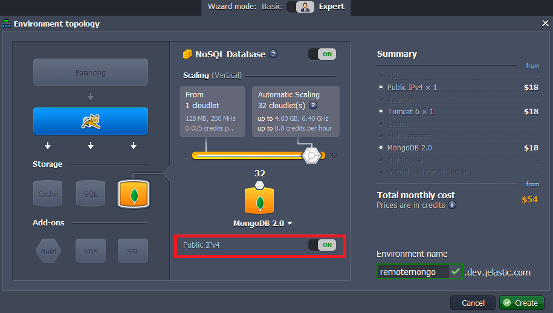
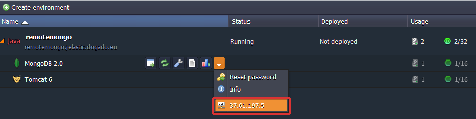
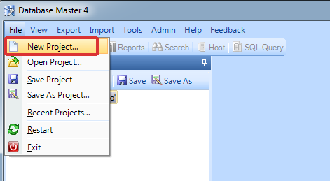
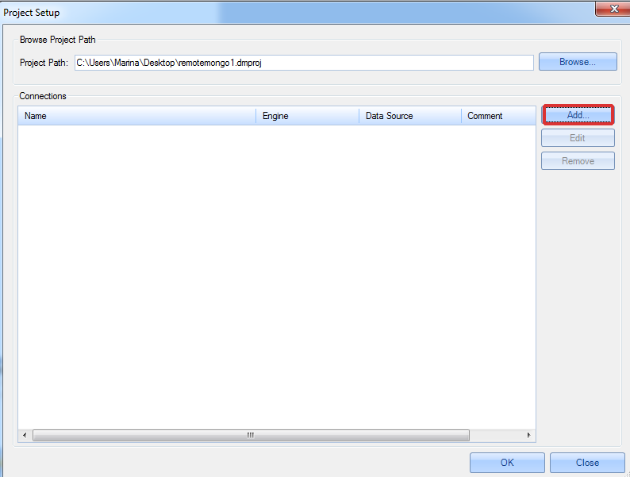
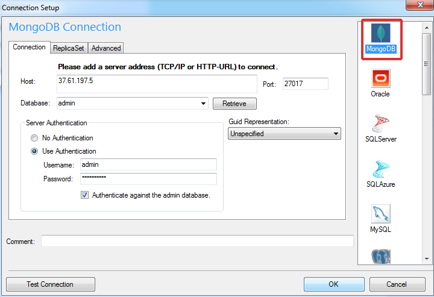
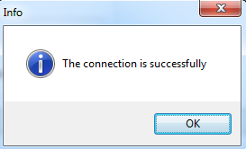
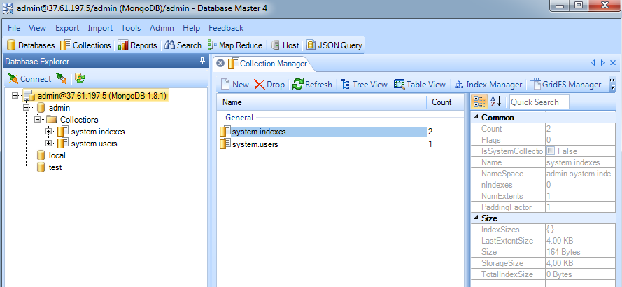

## Remote Access to MongoDB
You can work with your databases remotely from your computer without having to login to our dashboard. So here are some instructions on how to do this with MongoDB. They can be used both for Java and PHP environments.

## Create the Environment
1. Log into the platform.
2. Click the **Create environment** button at the top left.

3. In the **Environment Topology** dialog, pick your application server (for example, **Tomcat**) and **MongoDB** as the database you want to use. Switch on **Public IPv4** for **MongoDB**. Then type your environment name, for example, *remotemongo*.

Wait just a minute for your environment to be created.

4. Click the **info** button for MongoDB and you’ll see your **Public IP** at the end of the dropdown list.

## Remote Connection to MongoDB
1. Create a new project using any desktop client suitable for **MongoDB** (we use Database Master 4 as an example).

2. Specify the **host** (your public IP), **port number** (27017), **username** and **password** (when you created the environment, the platform sent you the email with credentials to the database).

Then click **Test Connection**.

As you can see the connection is successfully created.

