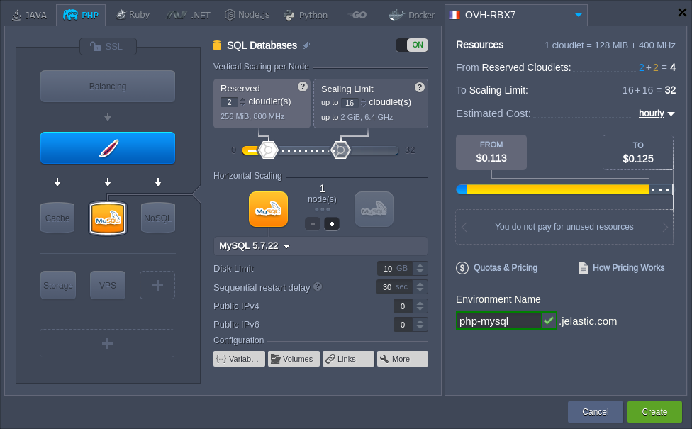
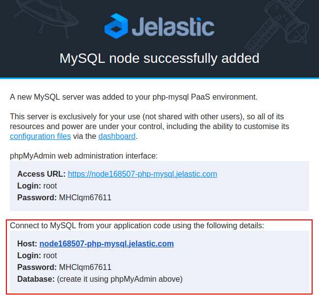
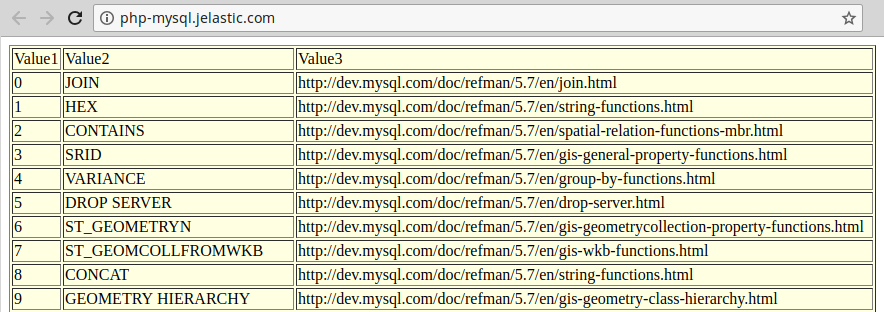

## Connection to MySQL/MariaDB/Percona for PHP

**MySQL**, **MariaDB**, and **Percona** are highly popular open source databases, used by developers all over the world. Follow the instruction below to learn how to connect your PHP application, hosted within the platform, to one of these DB servers:

- [create environment](/docs/Database/MySQL-MariaDB-Percona/Connection%20to%20Applications/PHP%20Connection#environment-creation)
- [connect to database](/docs/Database/MySQL-MariaDB-Percona/Connection%20to%20Applications/PHP%20Connection#connection-to-the-database)
- [check connection](/docs/Database/MySQL-MariaDB-Percona/Connection%20to%20Applications/PHP%20Connection#checking-the-connection)
- [execute request](/docs/Database/MySQL-MariaDB-Percona/Connection%20to%20Applications/PHP%20Connection#executing-a-simple-request)
- [additional configurations](/docs/Database/MySQL-MariaDB-Percona/Connection%20to%20Applications/PHP%20Connection#useful-to-know)

## Environment Creation

1. Log into your PaaS account and [create an environment](/docs/EnvironmentManagement/Setting%20Up%20Environment) with **MySQL** or **MariaDB** database server (both are available within the **_SQL_** wizard section).

<div style={{
    display:'flex',
    justifyContent: 'center',
    margin: '0 0 1rem 0'
}}>



</div>

In order to provide a connection example, we’ve added **Apache PHP** application server.

2. After environment creation, you’ll get an email with the MySQL (or MariaDB) administration and connection details:

<div style={{
    display:'flex',
    justifyContent: 'center',
    margin: '0 0 1rem 0'
}}>



</div>

3. Return to your dashboard and click the **Open in Browser** button for the appropriate database node (either MySQL or MariaDB).

<div style={{
    display:'flex',
    justifyContent: 'center',
    margin: '0 0 1rem 0'
}}>


</div>

Log into the opened admin panel using credentials you’ve received in the above-mentioned email.

4. Go to the **_Databases_** tab and **Create** a new database (e.g., mysqldb).

<div style={{
    display:'flex',
    justifyContent: 'center',
    margin: '0 0 1rem 0'
}}>


</div>

Now, you can [deploy](/docs/QuickStart/Dashboard%20Guide) your application (either from archive or GIT/SVN repository) to the created environment.

## Connection to the Database

Once your project is successfully deployed, you need to connect it to your database. For that, your application should be appropriately configured, for example using the inbuilt [MySQLi](https://www.php.net/manual/en/book.mysqli.php) (MySQL Improved) extension.

Refer to the linked official documentation page for the full list of available functions, while we’ll overview just the basic ones below:

1. To get a connection string for accessing your MySQL/MariaDB node:

```bash
mysqli_connect('{host}', '{user}', '{password}', '{db_name}');
```

The appropriate placeholders should be substituted with your connection data from the MySQL or MariaDB node:

- **_{host}_** - link to your DB node without protocol part
- **_{user}_** and **_{password}_** - database admin credentials (for production usage, it’s recommended to create a dedicated account with the appropriate permissions)
- **_{db_name}_** - name of required database (e.g. the previously created mysqldb one)

2. For switching to different database within the same server, use the next function:

```bash
mysql_select_db('{connect}','{db_name}');
```

Here, the **_{connect}_** should be substituted with the connection string obtained using the above-described mysqli_connect function.

3. In order to close a connection to your database, execute the following:

```bash
mysqli_close( );
```

:::danger Note

You need to specify the necessary functions in every **\*.php** page, which should be connected to the database.

:::

## Checking the Connection

In order to ensure everything works fine, you can check the connection using this code:

```bash
<?php
$link = mysqli_connect('{host}', '{user}', '{password}', '{db_name}');
//if connection is not successful you will see text error
if (!$link) {
       die('Could not connect: ' . mysql_error());
}
//if connection is successfully you will see message below
echo 'Connected successfully';

mysqli_close($link);
?>
```

:::tip Note

Do not forget to substitute **_{host}_**, **_{user}_**, **_{password}_** and **_{db_name}_** in the connection string with the corresponding values (as it is described in the [Connection to the Database](/docs/Database/MySQL-MariaDB-Percona/Connection%20to%20Applications/PHP%20Connection#connection-to-the-database) section).

:::

If everything is OK, you’ll get the following message, when this page is opened in browser.

<div style={{
    display:'flex',
    justifyContent: 'center',
    margin: '0 0 1rem 0'
}}>


</div>

## Executing a Simple Request

And here is an example on how to execute a simple request to your database and output it onto a table.

The plain PHP script below will establish a connection to your database server (do not forget to specify the appropriate hostname and credentials), connect to the default mysql database it contains, read the values from the help_topic table and display them in a self-generated table.

```bash
<?php
// Connection checking:
$link = mysqli_connect('{host}', '{user}', '{password}', '{db_name}');
if (!$link)
{
    echo "<h2>MySQL Error!</h2>";
    exit;
}

// Switch to a different database:
$db="mysql";
mysqli_select_db($link, $db);
// table header output:
echo "<table border=\"1\" width=\"100%\" bgcolor=\"#FFFFE1\">";
echo "<tr><td>Value1</td><td>Value2</td><td>Value3</td>";
// SQL-request:
$q = mysqli_query ($link, "SELECT * FROM help_topic;");
// table-result output
for ($c=0; $c<mysqli_num_rows($q); $c++)
{
    echo "<tr>";
    $f = mysqli_fetch_array($q); // Returns an array that corresponds to the fetched row and moves the internal data pointer ahead.
    echo "<td>$f[0]</td><td>$f[1]</td><td>$f[5]</td>";
    echo "</tr>";
}
echo "</table>";
?>
```

As a result, you’ll receive a kind of index for all available MySQL functions with links to the instructions on their using.

<div style={{
    display:'flex',
    justifyContent: 'center',
    margin: '0 0 1rem 0'
}}>



</div>

Great! Now you can easily connect your PHP application to the **MySQL** or **MariaDB** database.

## Useful to Know

The platform also lets you extend your MySQL/MariaDB servers functionality by following the appropriate instructions in our documentation:

- set up the preferred database replication type - [master-slave](/docs/Database/MySQL-MariaDB-Percona/High%20Availability%20Cluster/Manual%20Primary-Secondary%20Replication#mysqlmariadbpercona-database-primary-secondary-replication) or [master-master](/docs/Database/MySQL-MariaDB-Percona/High%20Availability%20Cluster/Manual%20Multi-Primary%20Replication#multi-primary-replication-for-mysqlmariadbpercona) - in order to get the increased DB performance and data loss protection
- adjust [Backups Scheduling](/docs/Database/Database%20Hosting/Manual%20Database%20Backups#manual-database-backups) for ensuring safety of the information inside your DBs in the case of unexpected server failure
- see the [Remote Access](/docs/Database/MySQL-MariaDB-Percona/Remote%20Access#remote-access-to-mysqlmariadbpercona) instruction and learn how to access your database remotely via the preferred desktop MySQL client
- use the [Dump Files Import/Export](/docs/Database/MySQL-MariaDB-Percona/Dump%20Import-Export) guide to find out how to manually backup and restore your data from the previously created dumps