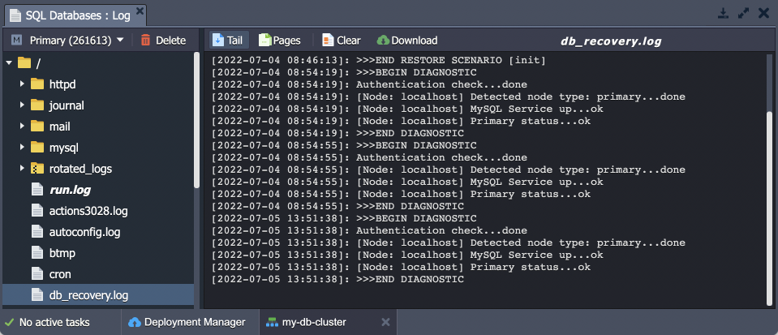

## Database Cluster Recovery Add-On

The platform has several popular out-of-box clustering options for the MariaDB/MySQL databases, which can be automatically implemented via the [auto-clustering](https://cloudmydc.com/) feature. Such database clusters offer an advanced high availability and auto-scalability while remaining accessible to any user through automation.

In order to make the solution even more alluring, the platform offers a free diagnostic and recovery add-on to help with database maintenance. Currently, the **Database Cluster Recovery** add-on supports the following database clusters:

- **Primary-Secondary Cluster** based on the MySQL/MariaDB/Percona stacks
- **Primary-Primary Cluster** based on the MySQL/MariaDB/Percona stacks
- **Galera Cluster** based on the MariaDB stack
- **XtraDB Cluster** based on the Percona stack

## Add-On Specifics

The **Database Cluster Recovery** add-on can operate in the diagnostic and recovery modes. The first one scans the database to identify if there are any problems, and the second tries to resolve the issue based on the obtained information.

During diagnostic, the add-on checks the following:

- replication for the Primary-Secondary and Primary-Primary topologies
- the cluster size for Galera/XtraDB clusters
- Galera/XtraDB clusters status
- cluster services status

In order to perform the required recovery operations, the add-on applies the following adjustments to the database cluster during the installation:

A replica user is added to perform the validation of the clusters. Also, this user is used in the ProxySQL configuration. The credentials can be viewed via the dedicated [environment variables](https://cloudmydc.com/):

- **REPLICA_USER**: repl-xxxxxx
- **REPLICA_PSWD**: xxxxxxxxxxxx

Also, SSH access is configured between the database nodes (with the dedicated set of SSH keys) to allow data coping with rsync during the restoration procedure.

## Add-On Installation

The add-on is available via the platform Marketplace. Alternatively, you can import the appropriate **_[Database Cluster Recovery](https://cloudmydc.com/)_** package from GitHub.

In the opened confirmation window, provide the required data:

- **User** and **Password** - the database admin user credentials
- **Environment name** - select an environment with the required database cluster from the list
- **Nodes** - choose a layer with the database cluster

Click **Install** and wait a few minutes for the add-on to be installed. It will appear in the list of add-ons of the appropriate layer.

## Add-On Usage

The add-on can perform two actions that can be executed by clicking the appropriate buttons:

- **_Cluster Diagnostic_** - detects problems with the database cluster (scans if nodes are accessible and databases are consistent)
- **_Cluster Recovery_** - tries resolving common problems to restore cluster operability
  The result of the **_Cluster Diagnostic_** action can be either “Cluster is OK” or “Errors discovered” dashboard notification.

For extended details, you can click the **Show Logs** button to open the **_/var/log/db_recovery.log_** file:

In case some problems are discovered, you can try to resolve them automatically with the **_Cluster Recovery_** action. It should handle most of the issues and fully restore cluster operability:

:::danger Note

We recommend [making a backup](https://cloudmydc.com/) of the database before the recovery.

:::

For additional details or in case of recovery failure, you can check the **_db_recovery_** [log](https://cloudmydc.com/) mentioned above. Also, check the **[Manual Recovery](https://cloudmydc.com/)** guide if the problem is not resolved.
