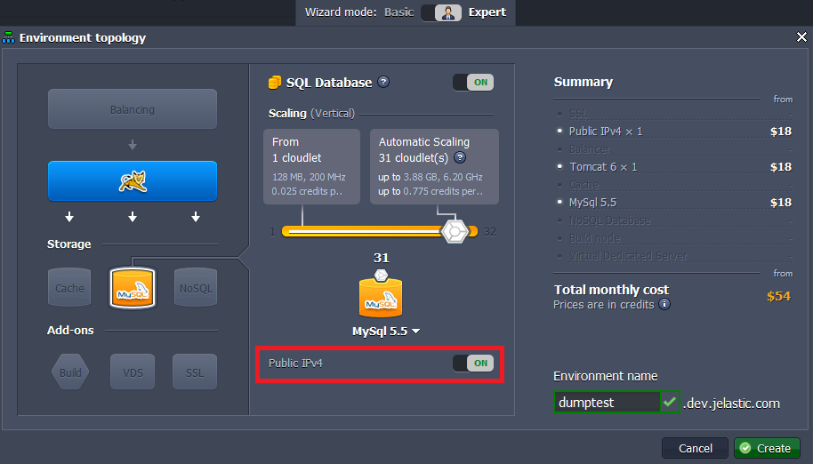
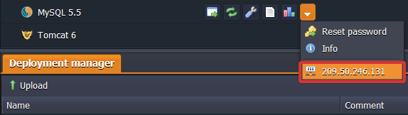
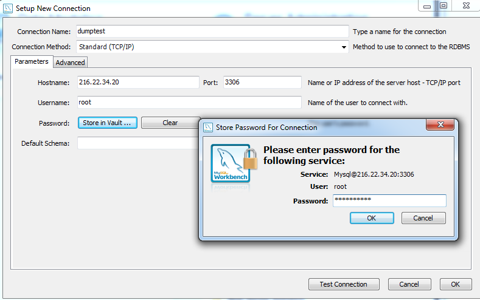
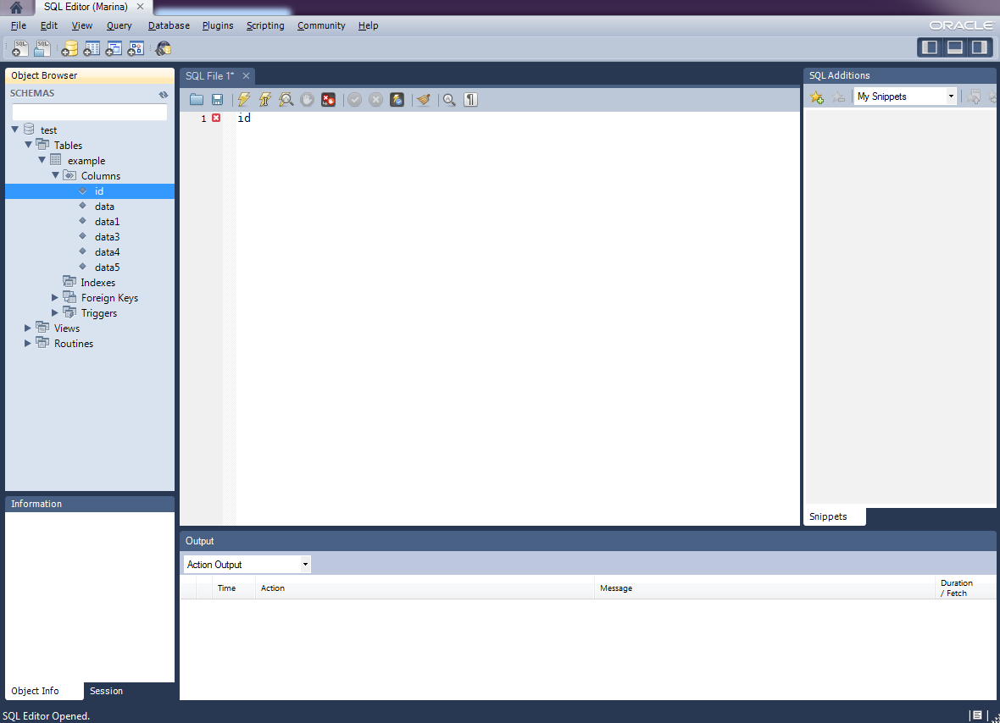

## Remote Access to MySQL/MariaDB/Percona
You can work with your databases remotely from your computer without having to login to our dashboard. So here are some instructions on how to access with **MySQL**. They can be used both for Java and PHP environments.

:::tip Tip

The same steps can be used for remote access to **MariaDB** and **Percona**.

:::

## Create Environment
1. Log into the platform.
2. Click the **Create environment** button at the top left.

3. In the **Environment Topology** dialog, pick your application server (for example, **Tomcat**) and **MySQL** as the database you want to use. Switch on **Public IPv4** for **MySQL**. Then type your environment name, for example, dumptest.

Wait just a minute for your environment to be created.

4. Click **info** button for MySQL and you’ll see your **public IP** in the end of the dropdown list.

## Remote Connection to MySQL
1. Create a new open connection to start querying using any desktop client for **MySQL** (we’ll use MySQL Workbench as an example). Specify the connection name, enter the host name (your Public IP), port number (3306), username and password (when you created the environment, the platform sent you an email with credentials to the database).

2. Now MySQL remote access is configured and you can start querying.

