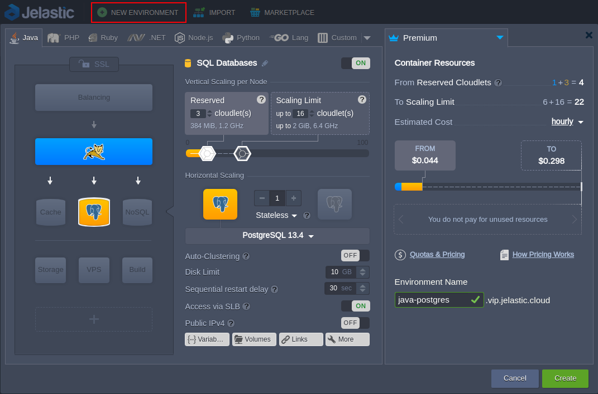
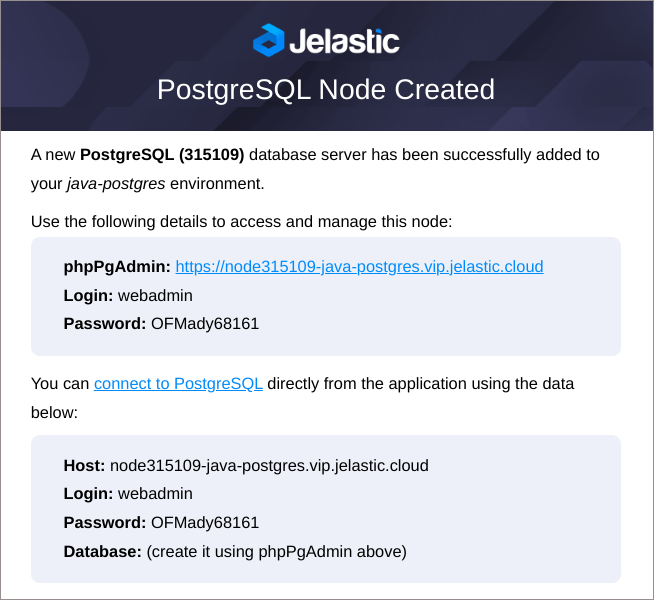
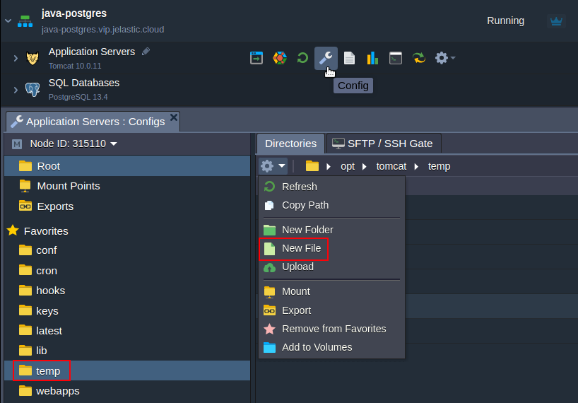
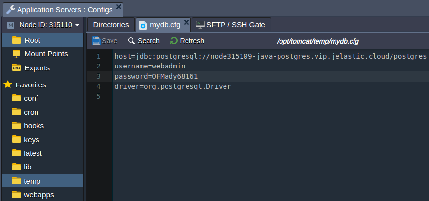
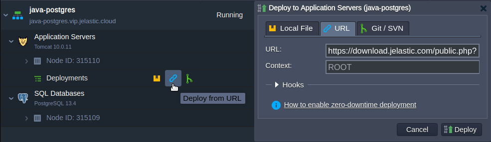
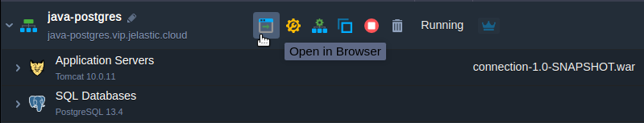
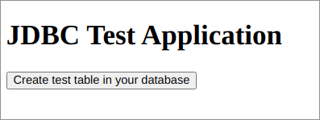
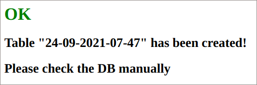
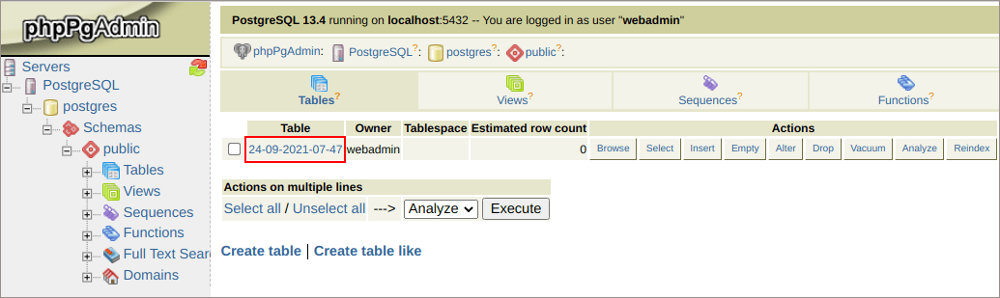

## How to Connect PostgreSQL with Java Application

PostgreSQL is a powerful, open source SQL database with the object-relational structure and numerous robust features to ensure excellent performance and reliability. In this tutorial, we’ll show how to connect [PostgreSQL](https://www.postgresql.org/?_gl=1*on0g80*_gcl_au*MTkyNTQ2Mjk4Ny4xNjk0OTczMzMx) database with Java application hosted with Jelastic PaaS.

1. Log into Jelastic dashboard, [create](/docs/EnvironmentManagement/Setting%20Up%20Environment) **New Environment** with the **_Java_** application server and the **_PostgreSQL database_**.

<div style={{
    display:'flex',
    justifyContent: 'center',
    margin: '0 0 1rem 0'
}}>



</div>

2. After creation, you’ll receive an email with your database access credentials (host, login, and password).

<div style={{
    display:'flex',
    justifyContent: 'center',
    margin: '0 0 1rem 0'
}}>



</div>

3. Click the **Config** button next to your application server (Tomcat in our case) to access the [configuration file manager](/docs/ApplicationSetting/Configuration%20File%20Manager#configuration-file-manager) and create a new **_mydb.cfg_** file in the **/opt/tomcat/temp** folder.

<div style={{
    display:'flex',
    justifyContent: 'center',
    margin: '0 0 1rem 0'
}}>



</div>

4. Provide the following connection details in the **_mydb.cfg_** file:

\*host=jdbc:postgresql://**{host}**/**{db_name}\***
\*username=**{user}\***
\*password=**{password}\***
_driver=org.postgresql.Driver_

<div style={{
    display:'flex',
    justifyContent: 'center',
    margin: '0 0 1rem 0'
}}>



</div>

Here:

- **{host}** - link to your DB node without protocol part
- **{db_name}** - name of the database (postgres in our case)
- **{user}** and **{password}** - admin user credentials

:::tip Note

Usually, for production, it is recommended defining a new restricted user via **_phpPgAdmin_** for your application with access to the dedicated database only.
However, for this example, we’ll take the default user (i.e. webadmin with full administrative access to the server) and database (postgres).

:::

5. Below, you can see the code of the application used in this tutorial.

```bash
package connection;
import java.io.IOException;
import java.sql.Connection;
import java.sql.DriverManager;
import java.sql.SQLException;
import java.sql.Statement;
import java.text.SimpleDateFormat;
import java.util.Date;
import java.util.Properties;
import java.util.logging.Level;
import java.util.logging.Logger;
public class DbManager {
public String date = new SimpleDateFormat("dd-MM-yyyy-HH-mm").format(new Date());
private final String createTable = "CREATE TABLE \"" + date + "\" (id INT, data VARCHAR(100));";
private static final int LoginTimeout = 10;
public DbManager() {
}
public Connection createConnection() throws IOException, ClassNotFoundException, SQLException {
Properties prop = new Properties();
System.out.println("\n\n=======================\nJDBC Connector Test " + date);
System.out.println("User home directory: " + System.getProperty("user.home"));
String host;
String username;
String password;
String driver;
try {
prop.load(new java.io.FileInputStream(System.getProperty("user.home") + "/mydb.cfg"));
host = prop.getProperty("host").toString();
username = prop.getProperty("username").toString();
password = prop.getProperty("password").toString();
driver = prop.getProperty("driver").toString();
} catch (IOException e) {
System.out.println("Unable to find mydb.cfg in " + System.getProperty("user.home") + "\n Please make sure that configuration file created in this folder.");
host = "Unknown HOST";
username = "Unknown USER";
password = "Unknown PASSWORD";
driver = "Unknown DRIVER";
}
System.out.println("host: " + host + "\nusername: " + username + "\npassword: " + password + "\ndriver: " + driver);
Class.forName(driver);
System.out.println("--------------------------");
System.out.println("DRIVER: " + driver);
System.out.println("Set Login Timeout: " + LoginTimeout);
DriverManager.setLoginTimeout(LoginTimeout);
Connection connection = DriverManager.getConnection(host, username, password);
System.out.println("CONNECTION: " + connection);
return connection;
}
public String runSqlStatement() {
String result = "";
try {
Statement statement = createConnection().createStatement();
System.out.println("SQL query: " + createTable);
statement.execute(createTable);
} catch (IOException | ClassNotFoundException ex) {
Logger.getLogger(DbManager.class.getName()).log(Level.SEVERE, null, ex);
System.out.println("Exception occurred: " + ex);
result = ex.getMessage();
} catch (SQLException ex) {
ex.printStackTrace();
result = ex.getMessage();
}
return result;
}
}
```

6. [Deploy](/docs/Deployment/Deployment%20Guide) our example application to your Tomcat server. Due to different version servlet specifications supported by Tomcat 9 and Tomcat 10 we have prepared the respective applications:

For Tomcat 9: [https://download.jelastic.com/public.php?service=files&t=18753849900d2461b3162bd4355f834d&download](https://download.jelastic.com/public.php?service=files&t=18753849900d2461b3162bd4355f834d&download)

For Tomcat 10: [https://download.jelastic.com/public.php?service=files&t=503e9768ee573fd452cec8a34a2215b2&download](https://download.jelastic.com/public.php?service=files&t=503e9768ee573fd452cec8a34a2215b2&download)

<div style={{
    display:'flex',
    justifyContent: 'center',
    margin: '0 0 1rem 0'
}}>



</div>

:::tip Note

Our example application already contains the jdbc-connector for the PostgreSQL database access. However, for other projects, you may need to manually upload it to the **_webapps/{app_context}/WEB-INF/lib_** folder on your application server (don’t forget to restart server afterward to apply the changes).

:::

7. After successful deployment, click **Open in Browser** next to your application server.

<div style={{
    display:'flex',
    justifyContent: 'center',
    margin: '0 0 1rem 0'
}}>



</div>

8. Within the opened browser tab, click the Create test table in your database button.

<div style={{
    display:'flex',
    justifyContent: 'center',
    margin: '0 0 1rem 0'
}}>



</div>

Your request will be processed shortly displaying the result message.

<div style={{
    display:'flex',
    justifyContent: 'center',
    margin: '0 0 1rem 0'
}}>



</div>

9. Let’s access our database via **phpPgAdmin** to ensure that a new table was created (access credentials are provided via the email described in the second step of this guide).

<div style={{
    display:'flex',
    justifyContent: 'center',
    margin: '0 0 1rem 0'
}}>



</div>

As you can see, a new table (named due to the date and time of the creation) has been successfully added by our Java application. The connection is successfully established! Try it out at one of the globally-available Jelastic service providers.